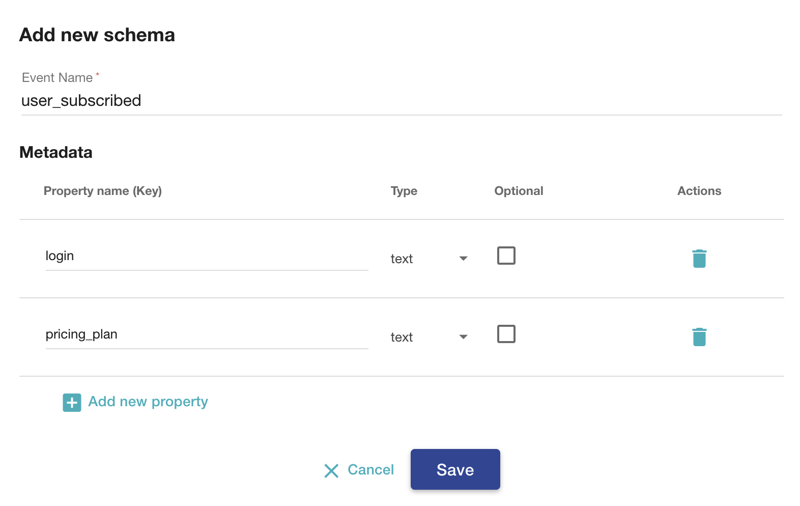

Earning rules define actions that customers must take to receive loyalty points and, as a result, redeem points for loyalty rewards. You can create three types of earning rules in Voucherify:

- customer segments,
- paid orders,
- and custom events that customers perform in your application/website.

Moreover, you can extend each earning rule with additional constraints using validation rules.

The [Earning Rule object](ref:create-earning-rule) defines an action (event) that assigns a particular number of loyalty points to a customer's account.

The loyalty campaign will detect the first two events automatically when a customer enters a segment or when any of customer’s orders will be changed to PAID.

Note that for the attribute `every` in the context of an amount, the value is multiplied by 100 to precisely represent 2 decimal places. For example, a $10 order amount is written as 1000. On the other hand, point values are written as-is, i.e. 100 points are 100 points.

To trigger the 3rd option, you need specifically tell it so. You can achieve it with the [Track Custom Event](ref:track-custom-event) endpoint. 

> 📘 Event schema
>
> To use a custom event in a loyalty program, we need to define it in the [Schema](https://support.voucherify.io/article/163-how-to-track-custom-events-and-use-them-in-referral-campaigns-events-schema) beforehand.

## Create earning rule

To [create earning rule](ref:create-earning-rule), you have the option of awarding the customer with a fixed amount of points or points calculated proportional to a value of an attribute. First, define a required event, then define the fixed or proportional calculation method for adding points and (optionally) a banner (name) of the rule.

```curl cURL
curl -X POST \
-H "X-App-Id: c70a6f00-cf91-4756-9df5-47628850002b" \
-H "X-App-Token: 3266b9f8-e246-4f79-bdf0-833929b1380c" \
-H "Content-Type: application/json" \
-d '[{
	"event": "order.paid",
	"loyalty": {
    "type": "FIXED",
		"points": 3
  },
	"source": {
		"banner": "Yopu will get 3 points"
	}
}]
' \
"https://api.voucherify.io/v1/loyalties/camp_Zgj5HFIPcb70SWJ4IjBNta2F/earning-rules"
```
### Example loyalty objects in earning rules for calculating points proportionally

```json ORDER_AMOUNT
  "loyalty": {
    "type": "PROPORTIONAL",
    "calculation_type": "ORDER_AMOUNT",
    "order": {
      "amount": {
        "every": 100,
        "points": 100
      }
    }
  }
```
```json ORDER_TOTAL_AMOUNT
  "loyalty": {
    "type": "PROPORTIONAL",
    "calculation_type": "ORDER_TOTAL_AMOUNT",
    "order": {
      "total_amount": {
        "every": 100,
        "points": 1
      }
    }
  }
```
```json ORDER_ITEMS_AMOUNT
  "loyalty": {
    "type": "PROPORTIONAL",
    "calculation_type": "ORDER_ITEMS_AMOUNT",
    "order_items": {
      "amount": {
        "every": 100,
        "points": 1,
        "object": "product",
        "id": "prod_0a9f9aeddb019a42db"
      }
    }
  }
```
```json ORDER_ITEMS_SUBTOTAL_AMOUNT
  "loyalty": {
    "type": "PROPORTIONAL",
    "calculation_type": "ORDER_ITEMS_SUBTOTAL_AMOUNT",
    "order_items": {
      "subtotal_amount": {
        "every": 100,
        "points": 10,
        "object": "product",
        "id": "prod_0a9f9aeddb019a42db"
      }
    }
  }
```
```json ORDER_METADATA
  "loyalty": {
    "type": "PROPORTIONAL",
    "calculation_type": "ORDER_METADATA",
    "order": {
      "metadata": {
        "every": 1,
        "points": 1,
        "property": "number_of_store_visits"
      }
    }
  }
```
```json CUSTOMER_METADATA
  "loyalty": {
    "type": "PROPORTIONAL",
    "calculation_type": "CUSTOMER_METADATA",
    "customer": {
      "metadata": {
        "every": 1,
        "points": 1,
        "property": "customer_life_time_value"
      }
    }
  }
```
```json ORDER_ITEMS_QUANTITY
  "loyalty": {
    "type": "PROPORTIONAL",
    "calculation_type": "ORDER_ITEMS_QUANTITY",
    "order_items": {
      "quantity": {
        "every": 1,
        "points": 100,
        "object": "product",
        "id": "prod_0a9f9aeddb019a42db"
      }
    }
  }
```

> 📘 Order amounts
> 
> Note that all amounts in API requests are multiplied by 100 to reflect decimal places. The value defined in every parameter is also multiplied by 100:

```json
"amount": {
           "every": 100, // represents 1 in your currency (eg. $1)
           "points": 100 // means 100 loyalty points
}
```

Each earning rule can have its own time frame that defines when the rule is active. If you don't define the start and expiration date for an earning rule, it'll inherit the campaign time frame (start and expiration date). All time-related limits are optional and described precisely in [this guide](https://support.voucherify.io/article/132-time-limits-for-vouchers).

Timeframe options include:

- Start date & time
-	End date & time (expiration)
-	Valid in this timeframe only (recurring)
-	Valid on particular days only

You can disable and enable earning rules in the campaign dashboard > earning rule or via API using the following endpoints:

- [Enable Earning Rule](ref:enable-earning-rule)
- [Disable Earning Rule](ref:disable-earning-rule)

### Creating an earning rule is a three-step process:

- [Required] Define the earning rule details such as the trigger event, name and the timeframe when it will be valid.

```json Define details
{
  "event": "order.paid",
  "source": {
    "banner": "Every Dollar Spent Award 100 points."
  },
  "start_date": "2022-02-02T13:00:00.000Z",
  "expiration_date": "2022-03-03T14:30:00.000Z",
  "validity_timeframe": {
    "duration": "PT1H",
    "interval": "P1D"
  },
  "validity_day_of_week": [1, 2, 3, 4, 5]
}
```

- [Required] Assign a points value.

```json Assign points
{
  "loyalty": {
    "type": "PROPORTIONAL",
    "calculation_type": "ORDER_AMOUNT",
    "order": {
      "amount": {
        "every": 1,
        "points": 100
      }
    }
  }
}
```
- [Optional] Add [validation rules](https://support.voucherify.io/article/529-validation-rules-campaign-limits) that limit earning rule usage to the predefined circumstances. Read more [here](doc:validation-rules).

```json Assign validation rule
{
  "validation_rule_id": "val_7sTiDKkHxxx4"
}
```

Let's see how each of the earning rule types are defined. We'll start with the _Order has been paid_ earning rule type.

---

## Order has been paid

Points are added to the loyalty card when a new order changes its status to PAID.&nbsp;You can assign a fixed number of points or reward customers proportionally to a metadata attribute. If you choose to calculate the points proportionally, then for every value in the selected attribute, the customer will get a defined number of points. There are five standard options to choose from such as amount spent and quantity of items in cart. Additionally, you have the option of choosing two types of metadata properties. The metadata must be defined in the Project Settings. Please read our guide on how to start with [metadata](https://support.voucherify.io/article/99-schema-validation-metadata).

### Fixed
-  **Fixed** - Awards a fixed number of points for paying an order.

```json Fixed
{
  "event": "order.paid",
  "loyalty": {
    "points": 123,
    "type": "FIXED"
  }
}
```

### Proportional
- **Pre-discount order amount** - Awards customers X points for every Y spent excluding discounts

```json Pre-discount order amount
{
  "event": "order.paid",
  "loyalty": {
    "type": "PROPORTIONAL",
    "calculation_type": "ORDER_AMOUNT",
    "order": {
      "amount": {
        "every": 100,
        "points": 100
      }
    }
  }
}
```

- **Total order amount** - Awards customers X points for every Y spent including discounts

```json Total order amount
{
  "event": "order.paid",
  "loyalty": {
    "type": "PROPORTIONAL",
    "calculation_type": "ORDER_TOTAL_AMOUNT",
    "order": {
      "total_amount": {
        "every": 100,
        "points": 1
      }
    }
  }
}
```

- **Pre-discount amount spent on items** - Awards customers X points for every Y spent on items excluding discounts

```json Pre-discount amount spent on items
{
  "event": "order.paid",
  "loyalty": {
    "type": "PROPORTIONAL",
    "calculation_type": "ORDER_ITEMS_AMOUNT",
    "order_items": {
      "amount": {
        "every": 100,
        "points": 1,
        "object": "product",
        "id": "prod_0a9f9aeddb019a42db"
      }
    }
  }
}
```

- **Amount spent on items** - Awards customers X points for every Y spent on items including discounts

```json Amount spent on items
{
  "event": "order.paid",
  "loyalty": {
    "type": "PROPORTIONAL",
    "calculation_type": "ORDER_ITEMS_SUBTOTAL_AMOUNT",
    "order_items": {
      "subtotal_amount": {
        "every": 100,
        "points": 10,
        "object": "product",
        "id": "prod_0a9f9aeddb019a42db"
      }
    }
  }
}
```

-  **Quantity of items in the cart** - Awards customers X points for every Y items excluding free items

```json Quantity of items in the cart
{
  "event": "order.paid",
  "loyalty": {
    "type": "PROPORTIONAL",
    "calculation_type": "ORDER_ITEMS_QUANTITY",
    "order_items": {
      "quantity": {
        "every": 1,
        "points": 100,
        "object": "product",
        "id": "prod_0a9f9aeddb019a42db"
      }
    }
  }
}
```

- **Order Metadata** - Awards customers X points for every Y in metadata attribute. The metadata must be defined in the **Order** schema and must be a **Number**

```json Order Metadata
{
  "event": "order.paid",
  "loyalty": {
    "type": "PROPORTIONAL",
    "calculation_type": "ORDER_METADATA",
    "order": {
      "metadata": {
        "every": 1,
        "points": 1,
        "property": "number_of_store_visits"
      }
    }
  }
}
```

- **Customer Metadata**- Awards customers for every Y in metadata attribute. The metadata must be defined in the **Customer** schema and must be a **Number**

```json Customer Metadata
{
  "event": "order.paid",
  "loyalty": {
    "type": "PROPORTIONAL",
    "calculation_type": "CUSTOMER_METADATA",
    "customer": {
      "metadata": {
        "every": 1,
        "points": 1,
        "property": "customer_life_time_value"
      }
    }
  }
}
```

Using validation rules, you can attach additional requirements that customers need to meet to earn points. Rules can define cart structure and volume, customer attributes, or specify qualified customer segments. Go [here](https://support.voucherify.io/article/529-validation-rules-campaign-limits) to learn more about validation rules.

### Earning rules examples:


- 1 point for each $0.01 spent if the total order amount is less than $50.
-	1 point for each $0.1 spent if the total order amount is more than $50.
-	2 points for each $1 spent if a customer is in the Premium Customers segment.
-	20 points if the order is paid and the payment method is Visa.
-	50 points if a customer had MacBook in their cart.

Below you can see example request and response schemas for [creating earning rules](ref:create-earning-rule) that count points proportionally. The first one gives a point to the customer for a store visit and the second one gives a point for each dollar spent.

### Example of ORDER_METADATA

```json Example Request
[
    {
        "event": "order.paid",
        "validation_rule_id": null,
        "loyalty": {
            "type": "PROPORTIONAL",
            "calculation_type": "ORDER_METADATA",
            "order": {
                "metadata": {
                    "every": 1,
                    "points": 1,
                    "property": "number_of_store_visits"
                }
            }
        },
        "source": {
            "banner": "Order paid 1 point for visiting store."
        },
        "active": true,
        "start_date": "2022-02-02T13:00:00.000Z",
        "expiration_date": "2022-03-03T14:30:00.000Z",
        "validity_timeframe": {
            "duration": "PT1H",
            "interval": "P1D"
        },
        "validity_day_of_week": [
            1,
            2,
            3,
            4,
            5
        ],
        "custom_event": null
    }
]
```
```json Example Response
[
    {
        "id": "ern_x5aSznVty4sFOTrQCv6HnnI5",
        "created_at": "2022-02-22T06:34:38.116Z",
        "updated_at": null,
        "loyalty": {
            "type": "PROPORTIONAL",
            "calculation_type": "ORDER_METADATA",
            "order": {
                "metadata": {
                    "every": 1,
                    "points": 1,
                    "property": "number_of_store_visits"
                }
            }
        },
        "event": "order.paid",
        "source": {
            "banner": "Order paid 1 point for visiting store.",
            "object_id": "camp_7s3uXI44aKfIk5IhmeOPr6ic",
            "object_type": "campaign"
        },
        "active": true,
        "start_date": "2022-02-02T13:00:00.000Z",
        "expiration_date": "2022-03-03T14:30:00.000Z",
        "validity_timeframe": {
            "duration": "PT1H",
            "interval": "P1D"
        },
        "validity_day_of_week": [
            1,
            2,
            3,
            4,
            5
        ],
        "object": "earning_rule",
        "automation_id": "auto_9jEyaOOzuK3uI2hc3ywn2yJ8"
    }
]
```

### Example of ORDER_AMOUNT

```json Example Request
[
    {
        "event": "order.paid",
        "validation_rule_id": null,
        "loyalty": {
            "type": "PROPORTIONAL",
            "calculation_type": "ORDER_AMOUNT",
            "order": {
                "amount": {
                    "every": 1,
                    "points": 1
                }
            }
        },
        "source": {
            "banner": "Order paid 1 point for 1 dollar."
        },
        "active": true,
        "start_date": "2022-02-02T13:00:00.000Z",
        "expiration_date": "2022-03-03T14:30:00.000Z",
        "validity_timeframe": {
            "duration": "PT1H",
            "interval": "P1D"
        },
        "validity_day_of_week": [
            4
        ],
        "segment": null,
        "custom_event": null
    }
]
```
```json Example Response
[
    {
        "id": "ern_apDP4sYcooAukAKZlwRo1Q6z",
        "created_at": "2022-02-22T06:34:38.116Z",
        "updated_at": null,
        "loyalty": {
            "type": "PROPORTIONAL",
            "calculation_type": "ORDER_AMOUNT",
            "order": {
                "amount": {
                    "every": 1,
                    "points": 1
                }
            }
        },
        "event": "order.paid",
        "source": {
            "banner": "Order paid 1 point for 1 dollar.",
            "object_id": "camp_7s3uXI44aKfIk5IhmeOPr6ic",
            "object_type": "campaign"
        },
        "active": true,
        "start_date": "2022-02-02T13:00:00.000Z",
        "expiration_date": "2022-03-03T14:30:00.000Z",
        "validity_timeframe": {
            "duration": "PT1H",
            "interval": "P1D"
        },
        "validity_day_of_week": [
            4
        ],
        "object": "earning_rule",
        "automation_id": "auto_m8oB2V0dKWROVMolbt3UglaK"
    }
]
```

## Custom Events

Custom events are actions taken by your customers that you track in your application or website and pass to Voucherify using our API. Using events in earning rules enables you to reward customers for custom activities of your choice, e.g., leaving a review, tagging your brand on social media, attending an event, and more.

First, define your events in the Event Schema in the Project Settings.

<!--  -->


The Schema gathers definitions of all events that you can later pass to Voucherify and use in your loyalty campaigns.

The customer gets points every time he/she performs the required action (custom event is sent to and received by Voucherify). You can assign a fixed number of points or reward customers proportionally to a metadata attribute. If you choose to calculate the points proportionally, then for every value in the selected metadata attribute, the customer will get a defined number of points. The metadata must be defined in the Project Settings. You have the option to use two types of metadata properties:

- **Customer Metadata** - Awards customers for every Y in metadata attribute. The metadata must be defined in the **Customer** schema and must be a **Number**. Please read our guide on how to start with [metadata](https://support.voucherify.io/article/99-schema-validation-metadata).    
- **Custom Event Metadata** - Awards customers for every Y in metadata attribute. The metadata must be defined as a property of the event chosen in the first step (Details). This is defined in the **Event Schema** and must be a **Number**. Please read our guide on how to start with [event schemas](https://support.voucherify.io/article/111-custom-events).

A custom `event` must be sent together with the `custom_event` object in the payload. 

```json Fixed
{
  "event": "user_subscribed",
  "loyalty": {
    "points": 123,
    "type": "FIXED"
  }
  "custom_event": {
    "schema_id": "ms_qpRZ3EmRQyszNH6Z52Gkq8au"
}
```
```json Customer Metadata
{
  "loyalty": {
    "type": "PROPORTIONAL",
    "calculation_type": "CUSTOMER_METADATA",
    "customer": {
      "metadata": {
        "every": 1,
        "points": 1,
        "property": "customer_life_time_value"
      }
    }
  },
  "custom_event": {
    "schema_id": "ms_qpRZ3EmRQyszNH6Z52Gkq8au"
  },
  "event": "user_subscribed"
}
```
```json Custom Event Metadata
{
  "loyalty": {
    "type": "PROPORTIONAL",
    "calculation_type": "CUSTOM_EVENT_METADATA",
    "custom_event": {
      "metadata": {
        "every": 1,
        "points": 1,
        "property": "volume_number"
      }
    }
  },
  "custom_event": {
    "schema_id": "ms_qpRZ3EmRQyszNH6Z52Gkq8au"
  },
  "event": "user_subscribed"
}
```

Validation rules enable you to limit the event-based earning rules to specific customer segments and customers with specific metadata. Therefore, when a custom event defined in the earning rule is sent to and received by Voucherify, the application checks if a customer linked to the event matches the segment and metadata rules.

### Earning rules examples:

- 100 points if a customer subscribes to a newsletter.
- 50 points if a customer leaves a review.
- 200 points if a customer registers to a paying plan.
- Points equal to the volume number of the newsletter that the customer subscribed to
- Points equal to the customer metadata attribute customer_life_time_value

> 📘
>
> Please note that using custom events requires help from your developers. Go to our [Events API](ref:track-custom-event) to learn more.

---

## Entered Segment

Segments group your customers using predefined criteria. When a customer matches segment rules, he/she enters the segment and earns loyalty points. While building segments, you can mix different criteria based on customer attributes (standard and custom ones) and their order history. Segment-based earning rules ensure that points are assigned only if all segment conditions are met. To build a rule, you need to select one of your existing segments created beforehand. 

The event type `customer.segment.entered` must be sent together with the `segment` object in the payload. [Read more](doc:customers#segments).

```json event
"event": "customer.segment.entered",
"segment": {
   "id": "seg_WJv55MbzQwnr56ttJ2xUrSgt"
}
```

Points are added to the loyalty card when a customer enters the segment. You can assign a fixed number of points or reward customers proportionally to a metadata attribute. The metadata must be defined in the 
**Customer** schema and must be a **Number**. Please read our guide on how to start with [metadata](https://support.voucherify.io/article/99-schema-validation-metadata).

```json Loyalty Object - Fixed Points 
  "loyalty": {
    "points": 123,
    "type": "FIXED"
  }
```
```json Loyalty Object - Proportional Points
  "loyalty": {
    "type": "PROPORTIONAL",
    "calculation_type": "CUSTOMER_METADATA",
    "customer": {
      "metadata": {
        "every": 1,
        "points": 1,
        "property": "customer_life_time_value"
      }
    }
  }
```

Validation rules define additional segments that a customer needs to belong to and segments excluded from getting the points. You can also extend the criteria for customers and define required customer's metadata. Use the advanced rule builder to define customer’s metadata rules. Read more [here](doc:validation-rules).

### Earning rules examples:

- 10 points if a customer enters the New Customer segment (criteria: Profile created less than 1 day ago).
- 250 points if a customer enters a segment Premium (criteria: Total order count more than 5 or spent more than $500).
- 50 points if a customer enters the Active Mobile App Users segment (criteria: metadata attribute *mobile_app* is true and last purchase less than 30 days ago)


## List Earning Rules

Once you create the earning rules, you can access the added earning rules and assigned numbers of loyalty points using the following two endpoints:

- [List a specific Earning Rule](ref:get-earning-rule)
- [List all Earning Rules](ref:list-earning-rules)

```json Get Earning Rule
{
    "id": "ern_CFuv1O0IDl8Jgph0ojhMu8bH",
    "created_at": "2022-02-02T13:18:32.165Z",
    "updated_at": null,
    "validation_rule_id": null,
    "loyalty": {
        "points": 1000,
        "type": "FIXED"
    },
    "event": "order.paid",
    "source": {
        "banner": "[Loyalty Earning Rule] On Wednesdays - Order Paid - Fixed",
        "object_id": "camp_Pfja7X91b1GoyH5wnpzCwlP3",
        "object_type": "campaign"
    },
    "active": true,
    "validity_day_of_week": [
        3
    ],
    "object": "earning_rule",
    "automation_id": "auto_QoRJCKwkzMEHgGjukekrbrPe"
}
```
```json List Earning Rules
{
    "object": "list",
    "data_ref": "data",
    "data": [
        {
            "id": "ern_10S9ijStRZsf65xd12aydn4f",
            "created_at": "2022-02-18T14:03:58.646Z",
            "updated_at": null,
            "validation_rule_id": null,
            "loyalty": {
                "type": "PROPORTIONAL",
                "calculation_type": "ORDER_AMOUNT",
                "order": {
                    "amount": {
                        "every": 100,
                        "points": 100
                    }
                }
            },
            "event": "order.paid",
            "source": {
                "banner": "Proportional Points",
                "object_id": "camp_7s3uXI44aKfIk5IhmeOPr6ic",
                "object_type": "campaign"
            },
            "active": true,
            "object": "earning_rule",
            "automation_id": "auto_htP6uGb52rJDNwyUWcW45EWI"
        },
        {
            "id": "ern_eiOGVoFOE4kYbYmDhfYeuMpZ",
            "created_at": "2022-02-18T14:06:15.320Z",
            "updated_at": null,
            "validation_rule_id": null,
            "loyalty": {
                "type": "PROPORTIONAL",
                "calculation_type": "ORDER_ITEMS_SUBTOTAL_AMOUNT",
                "order_items": {
                    "subtotal_amount": {
                        "every": 100,
                        "points": 10,
                        "object": "product",
                        "id": "prod_0a9f9aeddb019a42db"
                    }
                }
            },
            "event": "order.paid",
            "source": {
                "banner": "Proportional Points 2",
                "object_id": "camp_7s3uXI44aKfIk5IhmeOPr6ic",
                "object_type": "campaign"
            },
            "active": true,
            "object": "earning_rule",
            "automation_id": "auto_hgWYRPnveBdI3h4aD8XnFGzN"
        }
    ],
    "total": 2
}
```

When earning rules are ready, your customers can start collecting points. In the next step to a full-blown loyalty campaign, you need rewards that your customers can redeem in exchange for loyalty points.

If you have both earning rules and rewards ready, you can create a loyalty program.
