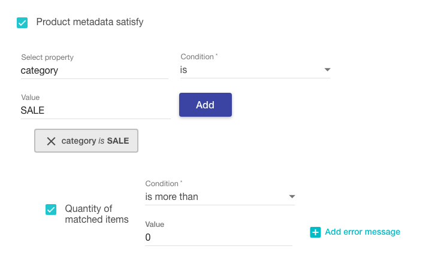

Voucherify allows for launching product-specific promotions. For example, you can make a coupon valid only if a customer purchases a given product or apply a 10% discount if you detect the customer has an iPhone X 64GB in their cart. To start creating product-oriented deals, you should import your product catalog to Voucherify. You can achieve it in two ways, with the Dashboard, and through the API.

> 📘 Object reference
> 
> [Product object reference](ref:get-product)
> 
> [SKU object reference](ref:get-sku)

## Catalog structure

**One product – many variants**

Voucherify supports product → variants relationship by default. This means you can create a parent object (`product`) and attach several variants (`SKUs`). In the [product](ref:get-product) object, you can define `attributes` to distinguish several [SKUs](ref:get-sku). For example:

```json Products
  {
      "id": "prod_yKHc4SyG1agSww",
      "source_id": "internal_erp_id_1477390384",
      "object": "product",
      "name": "Apple iPhone 7",
      "price" : 70000,
      "attributes": [
        "color",
        "memory"
      ],
      "created_at": "2016-10-25T10:12:58Z",
      "skus": {
        "object": "list",
        "total": 0,
        "data": []
      }
    }

    {  
      "id":"sku_0KtP4rvwEECQ2U",
      "source_id":"internal_erp_sku_id_1477475922",
      "sku":"APPLE_IPHONE_7_BLACK_32",
      "attributes":{  
        "color":"black",
        "memory":"32"
      },
      "created_at":"2016-10-26T10:04:52Z",
      "object":"sku",
      "metadata": { 
        "country": "us"
    	}
    }
```

> 👍 Source_id
>
> You can map your internal product id to a product `source_id` in Voucherify.

## Advanced catalog structure

If you want to map more advanced relationships like series, families, brands, etc. you should use `metadata`. By adding custom fields and applying respective validation rules in the metadata schema, you can model the whole structure for your inventory. You can mix the metadata-based relationships with products and SKUs.

```json Product with metadata
{
  "id": "prod_08c5bc59730e324dfb",
  "source_id": null,
  "name": "Headphones",
  "price": 60000,
  "attributes": [
    "series",
    "color"
  ],
  "metadata": {
    "category": 765,
    "free_sample": true
  },
  "image_url": null,
  "created_at": "2021-02-11T07:32:54.349Z",
  "updated_at": "2021-02-11T11:00:03.995Z",
  "object": "product",
  "skus": {
    "object": "list",
    "total": 1,
    "data_ref": "data",
    "data": [
      {
        "id": "sku_08c5bc5abc8ab89468",
        "source_id": null,
        "product_id": "prod_08c5bc59730e324dfb",
        "sku": "Headphones Limited Edition",
        "price": 90000,
        "currency": "USD",
        "attributes": {
          "color": "white",
          "series": "543"
        },
        "image_url": null,
        "metadata": {
          "SALE": false,
          "in_stock": "2021-02-01",
          "free_sample": true
        },
        "created_at": "2021-02-11T07:32:55.666985+00:00",
        "updated_at": "2021-02-11T11:00:04.256114+00:00",
        "object": "sku"
      }
    ]
  }
}
```
```json Product SKU with metadata
{
  "id": "sku_08c5bc5abc8ab89468",
  "source_id": null,
  "product_id": "prod_08c5bc59730e324dfb",
  "sku": "Headphones Limited Edition",
  "price": 90000,
  "currency": "USD",
  "attributes": {
    "color": "white",
    "series": "543"
  },
  "image_url": null,
  "metadata": {
    "SALE": false,
    "in_stock": "2021-02-01",
    "free_sample": true
  },
  "created_at": "2021-02-11T07:32:55.666Z",
  "updated_at": "2021-02-11T11:00:04.256Z",
  "object": "sku"
}
```

### Validation of Product and SKU Metadata

When validating code or promotion, Voucherify treats SKUs as products. It means, that SKU inherits the metadata assigned to the product and combines product and SKU attributes. As a result, the SKUs will be considered in the validation of product-specific rules:
- validation process executes rules built with product metadata against all product SKUs;
- if you define a rule `discount applicable to` **a specific product id**, the discount will be applied to the product and all product SKUs;
- if you define a rule `discount applicable to` based on **product metadata**, the discount will be applied to the product or/and SKU that has a matching attribute in their metadata;

If you use [product metadata](https://support.voucherify.io/article/515-products) in validation rules and pass product SKU in [Validate Voucher](ref:validate-voucher) or [Redeem Voucher](ref:redeem-voucher) request, the app checks if SKU metadata match validation rules. If SKU metadata matches validation rules, validation is succeeded.

<!--  -->


```curl Validate Voucher
POST  https://api.voucherify.io/v1/vouchers/SALE25/validate

{
    "customer": {
        "source_id": "staceyorlando@voucherify.io",
        "name": "Stacey Orlando"
    },
    "order": {
        "amount": 10200,
        "items": [
            {
                "sku_id": "sku_08c5d46d5b5d787ab6",
                "quantity": 1,
                "sku": {
                    "sku": "Headphones Limited Edition",
                    "price": 10200,
                    "metadata": {
                        "category": "SALE"
                    }
                }
            }
        ]
    }
}
```
```json 200 OK Response
{
  "code": "SALE25",
  "discount": {
    "type": "PERCENT",
    "percent_off": 25.0
  },
  "tracking_id": "track_BX9Qc8nH77gbgQAq1OYBlx2yJcYhWIyyfIQXD6s23u0=",
  "metadata": {},
  "order": {
    "amount": 10200,
    "discount_amount": 2550,
    "total_discount_amount": 2550,
    "total_amount": 7650,
    "items": [
      {
        "product_id": "prod_08c5d46d008a4f3e08",
        "sku_id": "sku_08c5d46d5b5d787ab6",
        "quantity": 1,
        "price": 90000,
        "amount": 90000,
        "product": {
          "id": "prod_08c5d46d008a4f3e08",
          "name": "Headphones",
          "price": 60000,
          "metadata": {}
        },
        "sku": {
          "id": "sku_08c5d46d5b5d787ab6",
          "sku": "Headphones Limited Edition",
          "price": 90000,
          "metadata": {
            "category": "SALE"
          }
        }
      }
    ]
  },
  "valid": true,
  "applicable_to": {
    "data": [],
    "object": "list",
    "total": 0
  }
}
```

> 🚧 Important notes
>
> If SKU and product have a different value for the same metadata definition, the **SKU overwrites the product metadata value.**

## Product Collections

Collections group products that share the same attributes (standard and custom ones with metadata). Product collections can be used in validation rules to model product-specific limits. Collections are built using filters in the Products section in the dashboard. There are two types of collections:

- Static collections that remain unchanged after it is saved. Each static collection may contain up to 20 products.
- Dynamic collections that check each incoming order item against collection criteria and update its products list in real-time.

Both static and dynamic collections are built on top of applied filters. You can find the list of available product filters [here](https://support.voucherify.io/article/515-products). Additionally, static collection can be created by manually picking items from the main products' list. 

Product collections can be managed using your dashboard or dedicated [product collections](ref:get-product-collection) API.

**You can create up to 100 product collections in each project. ** 

> 📘 Useful links
> 
> - Learn how to [create Product Collections](https://support.voucherify.io/article/515-products) in your dashboard
> - Learn more about [Product Collections API](ref:list-products-in-collection)
