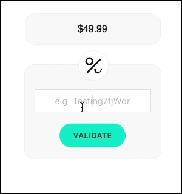

Every time you want to accept a Voucherify promotion, irrespective of the type, you need to invoke the redeem method. This will do two things. Firstly, it checks if a customer profile and its current context (order structure, attributes) are eligible for a discount. Secondly, it stores a redemption object with details about successful or failed redemption trials. There are two things you can redeem, a `voucher` and `promotion tier`.

## Object definition

Redemption is the key operation in the voucher lifecycle. A customer can redeem a voucher once or multiple times depending on the selected limit (quantity). Each redemption is recorded in the voucher history (redemption_entries). There is also an option to cancel a redemption (rollback).

> 📘 Object definition
>
> [Redemption object reference](ref:get-redemption)

## Endpoints

- [Voucher redemption](ref:redeem-voucher)
- [Voucher client-side redemption](ref:redeem-voucher-client-side)
- [Promotion tier redemption](ref:redeem-promotion)

Utilities:
- [List Redemptions](ref:list-redemptions) 
- [Get Voucher's Redemptions](ref:get-voucher-redemptions) 
- [Get Redemption](ref:get-redemption) 

## Stackable discounts

Voucherify API for [stacking discounts](ref:stackable-discounts-api) lets you validate and redeem up to 5 objects using a single API request. You can combine coupons, gift cards, promotion tiers, loyalty, and referral codes.

## Client-side Library & UI widget

To speed up client-side redeem integration, you can use the voucherify.js library. It allows for either invoking the method directly or using the web [widget](https://github.com/rspective/voucherify.js#redeem-widget)

```markdown Example
`Voucherify.redeem("gfct5ZWI1nL", { order: { amount: 5000 } }, **function** callback (response) { })`
```

<!--  -->


**Client-side caution**

In some cases, client-side redemptions might be considered insecure, that's why it's disabled by default. You can turn it on in the Project Settings.


## Rollback

If you want to reverse this operation, use [rollback](ref:rollback-redemption).

## Webhooks

Every redemption, successful or failed, generates an event you can listen to (`redemption succeeded`, `redemption failed`, `redemption rollback succeeded`, `redemption rollback failed`). Go to [webhooks](https://docs.voucherify.io/docs/webhooks) to learn more.
