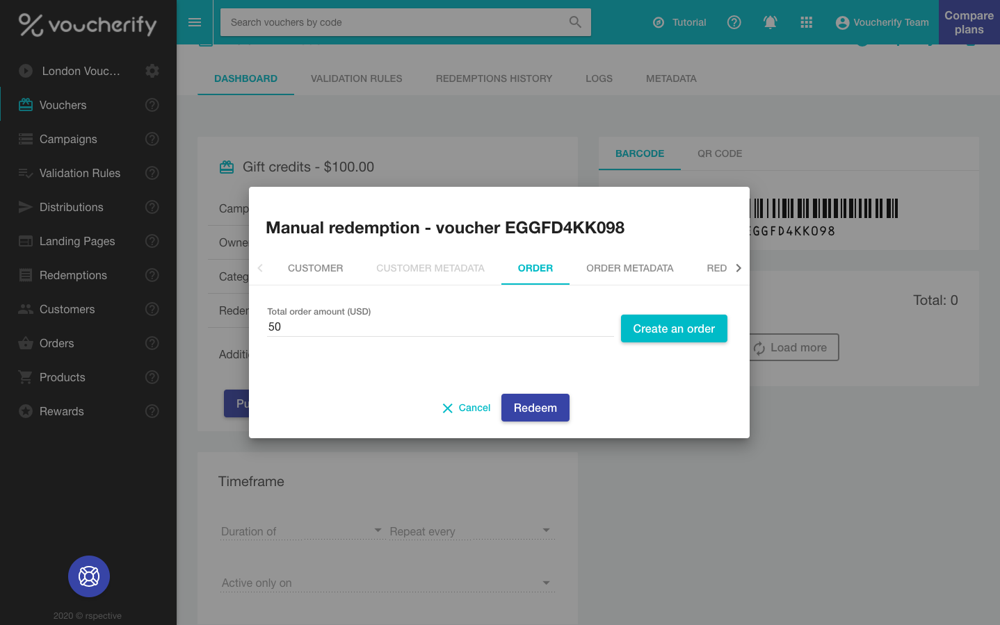

The voucher is an essential resource in Voucherify. Every voucher has a unique code that an end-customer needs to know to make a redemption. Voucherify uses the notion of a voucher to support three types of promotions:

- Discount coupons.
- [Gift cards](doc:prepaid-gift-cards).
- Referral codes.

> 👍 Standalone code
>
> Vouchers can be created as standalone objects.

> 📘 Object definition
>
> [Voucher object reference](ref:get-voucher)

## Format

You can define a code pattern using several parameters:

- Charset (alphanumeric, alphabetic lower & uppercase, numbers, custom)
- Length
- Prefix
- Postfix
- Pattern

On top of that, Voucherify offers an easy way of generating QR and barcodes. This is achieved by placing QR and barcode image links to [get voucher](ref:get-voucher) response.

```json
{
  "assets":{  
    "qr":{  
      "id":"U2FsdGVkX1+VwsADlREDxcAsQVY7l9Byt6cEX2AKBqJmBZvW0pvxGg1UZlsYikCo9nSxUxNXKQ928Ra0el20OJhqi9XyYo3Rv1KTUabg3fgkCBrrPfQVZsYomE6/Yz/KCxK90Ro3o1Cs4fKDmtnnog==",
      "url":"https://dl.voucherify.io/api/v1/assets/qr/U2FsdGVkX1%2BVwsADlREDxcAsQVY7l9Byt6cEX2AKBqJmBZvW0pvxGg1UZlsYikCo9nSxUxNXKQ928Ra0el20OJhqi9XyYo3Rv1KTUabg3fgkCBrrPfQVZsYomE6%2FYz%2FKCxK90Ro3o1Cs4fKDmtnnog%3D%3D"
    },
    "barcode":{  
      "id":"U2FsdGVkX1+pl1abyxraI3S1WSBmsA+U6tkJiTXlEdCBitA9D4W5R46rkMvirKA3CE0tYcSdAgOxQQYD6z8fvs7aG6NSVeq5K7rhNvrGXP+OO+yfA03tgBNcVU89vhu8iyhI58NmzciUIZSfEPdy3w==",
      "url":"https://dl.voucherify.io/api/v1/assets/barcode/U2FsdGVkX1%2Bpl1abyxraI3S1WSBmsA%2BU6tkJiTXlEdCBitA9D4W5R46rkMvirKA3CE0tYcSdAgOxQQYD6z8fvs7aG6NSVeq5K7rhNvrGXP%2BOO%2ByfA03tgBNcVU89vhu8iyhI58NmzciUIZSfEPdy3w%3D%3D"
    }
  }
}
```

> 👍 Configure size and format of QR and barcodes
> 
> You can change the size or/and format of the QR code by using these query string params:
>
> * **Size** (integer) – value from 1 to 100 (default 10).
> * **Format** (string) – png (default) or svg.
>
> You can change the size of the barcode file by using this query string param:
> 
> * **size** (integer) - value from 1 to 100 (default 20)

## Vouchers maintenance

The Voucherify Dashboard gives marketers control over every single voucher code. They can modify the parameters and state of any code at any time. But if you need to run bulk operations on several vouchers, these API endpoints might be useful:

- [Update](ref:update-voucher)
- [Enable](ref:enable-voucher) / [disable](ref:disable-voucher)
- [Import  by JSON](ref:import-vouchers)
- [Import  by CSV](ref:import-vouchers-using-csv)

Read more about [importing codes](doc:import-codes).

## Discount coupons

A discount coupon represents one of five discount types:

- Amount ($10 off)
- Percentage (20% off)
- Unit (a free t-shirt)
- Fixed price
- Free shipping

> 👍 Upper limit
>
> For the percentage type, you can also set the upper dollar value of a discount. You can run a "10% off campaign" and set the upper value of a discount equal to $100. It means that every customer with a code gets the max. $100 discount even if their order is worth more than $1000 (orders above $1000 get less than 10% discount).

## Gift Cards

Apart from discount coupons, Voucherify can process gift cards. Similarly to the discount coupon, the gift card is assigned a value e.g., $100. The difference, however, lies in the redemption step. A discount redemption is a one-off action, whereas gift cards enable partial redemption. As long as the customer has a positive balance, the gift card can still be used. 

> 📘 Dashboard mode
>
> This [tutorial](https://support.voucherify.io/article/47-prepaid-gift-cards-campaign) presents how to achieve this in the UI.

If you want to create this campaign with the API, it boils down to calling `campaigns` endpoint with the following payload.

```curl
curl -X POST \
-H "X-App-Id: c70a6f00-cf91-4756-9df5-47628850002b" \
-H "X-App-Token: 3266b9f8-e246-4f79-bdf0-833929b1380c" \
-H "Content-Type: application/json" \
-d '{
    "name": "Gift cards October",
  	"vouchers_count": 50,
    "voucher": {
        "type": "GIFT_VOUCHER",
        "gift": {
        	"amount": 10000
        },
        "redemption": {
          "quantity": null
      	}
    }
}' "https://api.voucherify.io/v1/campaigns"
```
```json 200 OK Response
{  
  "name":"Gift cards October",
  "type":"STATIC",
  "description":null,
  "start_date":null,
  "expiration_date":null,
  "metadata":null,
  "vouchers_count":50,
  "vouchers_generation_status":"IN_PROGRESS",
  "voucher":{  
    "code_config":{  
      "length":8,
      "charset":"0123456789abcdefghijklmnopqrstuvwxyzABCDEFGHIJKLMNOPQRSTUVWXYZ",
      "pattern":"########"
    },
    "type":"GIFT_VOUCHER",
    "is_referral_code":false,
    "gift":{  
      "amount":10000,
      "balance":10000
    },
    "redemption":{  
      "quantity":null
    }
  },
  "object":"campaign"
}
```

## Redemption

To redeem the gift card voucher you should call the `redeem` request providing the **`amount`** to be spent. In the following example, we decrease the balance by $50 (Voucherify processes decimals by multiplying all amounts by 100).

```curl
curl -X POST -H \
"X-App-Id: c70a6f00-cf91-4756-9df5-47628850002b" \
-H "X-App-Token: 3266b9f8-e246-4f79-bdf0-833929b1380c" \
-H "Content-Type: application/json" \
-d '{
	"order": {
	  "amount": 5000
	}
}
' "https://api.voucherify.io/v1/vouchers/h73YQbhR/redemption"
```
```json 200 OK Response
{  
  "id":"r_J24B5tnDyUbfwEEO5T0Dbhf7",
  "object":"redemption",
  "date":"2017-05-19T09:25:39Z",
  "customer_id":null,
  "tracking_id":"(tracking_id not set)",
  "amount":5000,
  "order":{  
    "object":"order",
    "id":"ord_8prx3NzPrN5GSKWjS6IrePg2",
    "source_id":null,
    "amount":5000,
    "created_at":"2017-05-19T09:25:39Z",
    "updated_at":null,
    "items":null,
    "customer":null,
    "status":"CREATED",
    "metadata":null
  },
  "result":"SUCCESS",
  "voucher":{  
    "code":"h73YQbhR",
    "campaign":"Gift cards October",
    "category":null,
    "type":"GIFT_VOUCHER",
    "discount":null,
    "gift":{  
      "amount":10000,
      "balance":5000
    },
    "start_date":null,
    "expiration_date":null,
    "publish":{  
      "object":"list",
      "count":0,
      "url":"/v1/vouchers/h73YQbhR/publications?page=1&limit=10"
    },
    "redemption":{  
      "object":"list",
      "quantity":null,
      "redeemed_quantity":1,
      "redeemed_amount":5000,
      "url":"/v1/vouchers/h73YQbhR/redemptions?page=1&limit=10"
    },
    "active":true,
    "additional_info":null,
    "metadata":null,
    "is_referral_code":false,
    "updated_at":"2017-05-19T09:25:39Z"
  }
}
```

If we try spending more than the current balance, Voucherify returns an error message.

```json
{  
  "code":400,
  "message":"gift amount exceeded",
  "details":"h73YQbhR",
  "key":"gift_amount_exceeded"
}
```

The voucher can be redeemed using the Dashboard as well. Just go to the voucher details view, press `REDEEM` and provide the amount in the popup. 

<!--  -->


## Recharge

You can recharge cards you've sent out to your customers. With our API, you can edit the balance value by calling [Add Balance](ref:add-gift-voucher-balance) endpoint. From now on, the gift voucher can be redeemed again.

## Export

Vouchers (along with redemptions, publications, and customers) can be downloaded asynchronously with the export mechanism, see the [API reference](ref:create-export).

Voucher attributes you can export: `code`, `voucher_type`, `value`, `discount_type`, `campaign`, `category`, `start_date`, `expiration_date`, `gift_balance`, `redemption_quantity`, `active`, `qr_code`.
