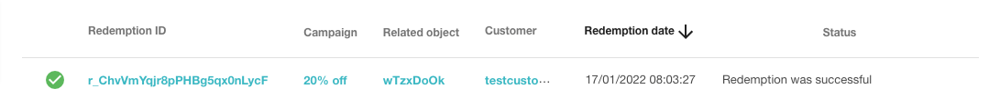

The validation and redemption mechanism always works in a transactional way, therefore the voucher's usage is registered permanently once redemption is successful. By using the session feature, you can temporarily record (lock) the voucher usage after the voucher has been validated.

The established session is released when one of the following events is noted:

  * expiration time passes
  * redemption is being registered for the session
  * manual release using a dedicated API endpoint (for vouchers only: [Release Validation Session](ref:release-validation-session) )
* manual release using the Validations Manager in the Dashboard to unlock sessions. [Read more](https://support.voucherify.io/article/16-dashboard-sections#validations)

Once the session is established, the API returns a unique session key. The key must be used with each of the following validation or redemption requests to clearly identify the session. Multiple requests with the same key will always override existing session values.

Read on to learn step-by-step instructions on how to lock a code usage until its redemption is completed.

## Step 1: Validate code with session key

You can establish the locking session while validating the code. Put the `session` object in your request by following the session object reference.

| **Parameter** | **Description** | **Example** |
|:---|:---|:---|
| session.type<br>`string`<br>required | Type of the session. Required to establish a new session.<br>Supported session types are listed in the table at the end of this guide. | "session":{<br>"type": "LOCK"<br>} |
| session.key<br>`string`<br>optional | Unique session identifier. | "session": {<br>"key": "ssn_yQGMTeKBSw8OOuFPwlBEjzGy8d8VA9Ts",<br>"type": "LOCK"<br>} |
| session.ttl_unit<br>`string`<br>optional<br><br>Default value for session is 7 days | Defines the type of unit for session time. Allowed values: DAYS, HOURS, MICROSECONDS, MILLISECONDS, MINUTES, NANOSECONDS, SECONDS | "session": {<br>"type": "LOCK",<br>"ttl": 7,<br>"ttl_unit": "DAYS"<br>} |
| session.ttl<br>`number`<br>optional<br><br>Default value for session is 7 days | Value for the period of time that the session is active. Units for this paremter are defines by session.ttl_unit | "session": {<br>"type": "LOCK",<br>"ttl": 7,<br>"ttl_unit": "DAYS"<br>} |

To link a request with the given session, always use the same session key for session-related validation and redemption requests. You can use your own session key or the system will generate one for you once the session option is enabled with the request.

#### Example validation request

```json Validation request
{
  "customer": {
    "source_id": "testcustomeremail@voucherify.io"
  },
  "options": {
    "include_orders": true,
    "extended_redemptions": false
  },
  "redeemables": [
    {
      "object": "voucher",
      "id": "dBj56oqJ",
      "gift": {
        "credits": 100
      }
    },
    {
      "object": "voucher",
      "id": "39vnjyS8"
    },
    {
      "object": "promotion_tier",
      "id": "promo_wtS1aPOs3k2majiBJv3yfbSM"
    }
  ],
  "order": {
    "amount": 200000
  },
  "session": {
        "type": "LOCK"
    }
}
```
```json Response
{
    "valid": true,
    "redeemables": [
        {
            "status": "APPLICABLE",
            "id": "wTzxDoOk",
            "object": "voucher",
            "order": {
                "amount": 200000,
                "discount_amount": 40000,
                "total_discount_amount": 40000,
                "total_amount": 160000,
                "applied_discount_amount": 40000,
                "total_applied_discount_amount": 40000,
                "customer_id": null,
                "referrer_id": null,
                "object": "order"
            },
            "applicable_to": {
                "data": [],
                "total": 0,
                "data_ref": "data",
                "object": "list"
            },
            "inapplicable_to": {
                "data": [],
                "total": 0,
                "data_ref": "data",
                "object": "list"
            },
            "result": {
                "discount": {
                    "type": "PERCENT",
                    "effect": "APPLY_TO_ORDER",
                    "percent_off": 20
                }
            }
        }
    ],
    "order": {
        "amount": 200000,
        "discount_amount": 40000,
        "total_discount_amount": 40000,
        "total_amount": 160000,
        "applied_discount_amount": 40000,
        "total_applied_discount_amount": 40000,
        "customer_id": null,
        "referrer_id": null,
        "object": "order"
    },
    "tracking_id": "track_e6YkMFU+7zj7ra2btFgSm1T9pRSZw/LawvdybWhgdmY=",
    "session": {
        "key": "ssn_jSzpiExs0LUPN3NuKFxXsZeKMhUJ01iJ",
        "type": "LOCK",
        "ttl": 7,
        "ttl_unit": "DAYS"
    }
}
```

> 📘 Default session time
> 
> If you won't establish a session timeframe by passing the `session.ttl` and `session.ttl_unit`, it'll be active throughout 7 days.

## Step 2: Redeem the code with the session key

Usage of the code is locked and allowed only with the returned session key that identifies the session. Note that multiple requests with the same key will always override existing session values.

When redeeming the code, the session object needs to define `session.type` and `session.key`.

```json Redemption request
{
    "customer": {
        "source_id": "testcustomeremail@voucherify.io"
    },
    "options": {
        "include_orders": true,
        "extended_redemptions": false
    },
    "redeemables": [
        {
            "object": "voucher",
            "id": "wTzxDoOk"
        }
    ],
    "order": {
        "amount": 200000
    },
    "session": {
        "type": "LOCK",
        "key": "ssn_jSzpiExs0LUPN3NuKFxXsZeKMhUJ01iJ"
    }
}
```
```json Response
{
    "redemptions": [
        {
            "id": "r_ChvVmYqjr8pPHBg5qx0nLycF",
            "customer_id": "cust_FRA887OGB6GMJ6zW6U0QibZV",
            "tracking_id": "track_e6YkMFU+7zj7ra2btFgSm1T9pRSZw/LawvdybWhgdmY=",
            "date": "2022-01-17T08:03:25.029Z",
            "order": {
                "id": "ord_XGcGm0SnaM97urUv12afKucX",
                "source_id": null,
                "status": "PAID",
                "customer_id": "cust_FRA887OGB6GMJ6zW6U0QibZV",
                "referrer_id": null,
                "amount": 200000,
                "discount_amount": 40000,
                "applied_discount_amount": 40000,
                "total_discount_amount": 40000,
                "total_applied_discount_amount": 40000,
                "total_amount": 160000,
                "object": "order"
            },
            "customer": {
                "id": "cust_FRA887OGB6GMJ6zW6U0QibZV",
                "name": null,
                "email": null,
                "source_id": "testcustomeremail@voucherify.io",
                "object": "customer"
            },
            "result": "SUCCESS",
            "voucher": {
                "id": "v_cgZj8kWiKTk12NnEsNN0LILHrUM16due",
                "code": "wTzxDoOk",
                "discount": {
                    "type": "PERCENT",
                    "percent_off": 20,
                    "effect": "APPLY_TO_ORDER"
                },
                "type": "DISCOUNT_VOUCHER",
                "campaign": "20% off",
                "campaign_id": "camp_6IkkrYF2s6Bv8EunjjVT8ETm",
                "is_referral_code": false,
                "holder_id": "cust_DqubjWlroec0v7te2fVBPcby"
            }
        }
    ],
    "order": {
        "id": "ord_XGcGm0SnaM97urUv12afKucX",
        "source_id": null,
        "created_at": "2022-01-17T08:03:24.908Z",
        "updated_at": null,
        "status": "PAID",
        "amount": 200000,
        "discount_amount": 40000,
        "total_discount_amount": 40000,
        "total_amount": 160000,
        "applied_discount_amount": 40000,
        "total_applied_discount_amount": 40000,
        "customer": {
            "id": "cust_FRA887OGB6GMJ6zW6U0QibZV",
            "object": "customer"
        },
        "customer_id": "cust_FRA887OGB6GMJ6zW6U0QibZV",
        "referrer_id": null,
        "object": "order",
        "redemptions": {
            "r_ChvVmYqjr8pPHBg5qx0nLycF": {
                "date": "2022-01-17T08:03:25.029Z",
                "related_object_type": "voucher",
                "related_object_id": "v_cgZj8kWiKTk12NnEsNN0LILHrUM16due",
                "related_object_parent_id": "camp_6IkkrYF2s6Bv8EunjjVT8ETm"
            }
        }
    }
}
```

## Step 3: Track redemption

If the redemption request includes a proper session.key value, the request is validated and the redemption is executed. When Voucherify registers a new redemption for the locked resource, the session is automatically released. 

<!--  -->


In case you'd like to remove an established session manually, use [Release Validation Session](ref:release-validation-session) endpoint.

> 🚧 Locking session in short
> 
> Registering a session will record a temporary usage for the specified timeframe. This means it will influence other incoming validation and redemption requests until the session is released.
> 
> Once redemption is successful the session is removed automatically.

## Session Keys

The following table presents the type of sessions that can be established.

| **Session Type** | **Behaviour** |
|:---|:---|
| LOCK | Locks the following parameters within the session:<br><br>- redemption quantity by 1 <br>- redemption gift credits specified with the requests <br>- redemption loyalty points specified with the request |

You can always release established sessions by calling [Release Validation Session](ref:release-validation-session) endpoint. 

