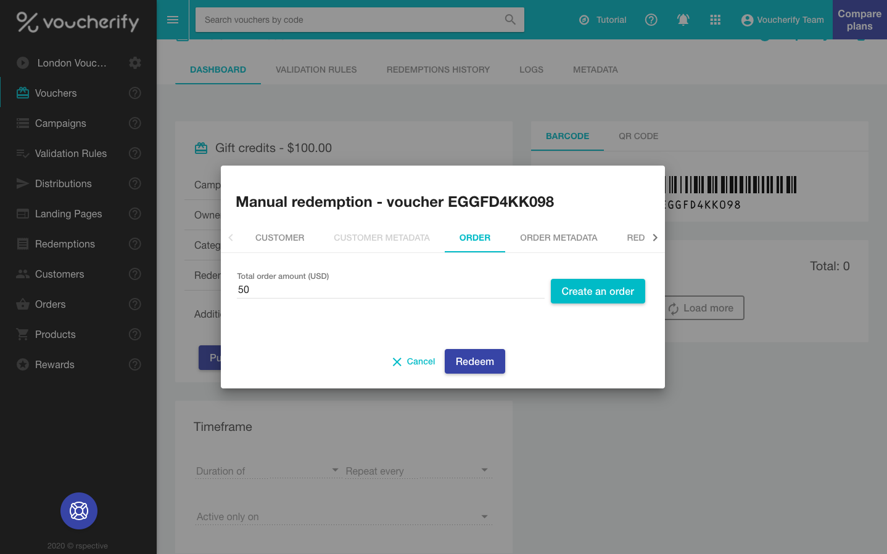

Apart from discount coupons, Voucherify can process gift cards. Similarly to the discount coupon, the gift card is assigned a value. The difference, however, lies in the redemption step. A discount redemption is a one-off action, whereas gift cards enable partial redemption. As long as the customer has a positive balance, the gift card can be used.

> 📘 Dashboard mode
> 
> This [tutorial](https://support.voucherify.io/article/47-prepaid-gift-cards-campaign) presents how to achieve this in the UI.

If you want to create a gift card campaign with the API, it boils down to calling the `campaigns` endpoint with the following payload.

```curl
curl -X POST \
-H "X-App-Id: c70a6f00-cf91-4756-9df5-47628850002b" \
-H "X-App-Token: 3266b9f8-e246-4f79-bdf0-833929b1380c" \
-H "Content-Type: application/json" \
-d '{
    "name": "Gift cards October",
  	"vouchers_count": 50,
    "voucher": {
        "type": "GIFT_VOUCHER",
        "gift": {
        	"amount": 10000
        },
        "redemption": {
          "quantity": null
      	}
    }
}' "https://api.voucherify.io/v1/campaigns"
```
```json 200 OK Response
{  
  "name":"Gift cards October",
  "type":"STATIC",
  "description":null,
  "start_date":null,
  "expiration_date":null,
  "metadata":null,
  "vouchers_count":50,
  "vouchers_generation_status":"IN_PROGRESS",
  "voucher":{  
    "code_config":{  
      "length":8,
      "charset":"0123456789abcdefghijklmnopqrstuvwxyzABCDEFGHIJKLMNOPQRSTUVWXYZ",
      "pattern":"########"
    },
    "type":"GIFT_VOUCHER",
    "is_referral_code":false,
    "gift":{  
      "amount":10000,
      "balance":10000
    },
    "redemption":{  
      "quantity":null
    }
  },
  "object":"campaign"
}
```

## Redemption

To redeem a gift voucher, you should call the `redeem` request providing the **`amount`** to be spent. In the following example, we decrease the balance by $50 (Voucherify processes decimals by multiplying all amounts by 100).

```curl
curl -X POST -H \
"X-App-Id: c70a6f00-cf91-4756-9df5-47628850002b" \
-H "X-App-Token: 3266b9f8-e246-4f79-bdf0-833929b1380c" \
-H "Content-Type: application/json" \
-d '{
	"order": {
	  "amount": 5000
	}
}
' "https://api.voucherify.io/v1/vouchers/h73YQbhR/redemption"
```
```json 200 OK Response
{  
  "id":"r_J24B5tnDyUbfwEEO5T0Dbhf7",
  "object":"redemption",
  "date":"2017-05-19T09:25:39Z",
  "customer_id":null,
  "tracking_id":"(tracking_id not set)",
  "amount":5000,
  "order":{  
    "object":"order",
    "id":"ord_8prx3NzPrN5GSKWjS6IrePg2",
    "source_id":null,
    "amount":5000,
    "created_at":"2017-05-19T09:25:39Z",
    "updated_at":null,
    "items":null,
    "customer":null,
    "status":"CREATED",
    "metadata":null
  },
  "result":"SUCCESS",
  "voucher":{  
    "code":"h73YQbhR",
    "campaign":"Gift cards October",
    "category":null,
    "type":"GIFT_VOUCHER",
    "discount":null,
    "gift":{  
      "amount":10000,
      "balance":5000
    },
    "start_date":null,
    "expiration_date":null,
    "publish":{  
      "object":"list",
      "count":0,
      "url":"/v1/vouchers/h73YQbhR/publications?page=1&limit=10"
    },
    "redemption":{  
      "object":"list",
      "quantity":null,
      "redeemed_quantity":1,
      "redeemed_amount":5000,
      "url":"/v1/vouchers/h73YQbhR/redemptions?page=1&limit=10"
    },
    "active":true,
    "additional_info":null,
    "metadata":null,
    "is_referral_code":false,
    "updated_at":"2017-05-19T09:25:39Z"
  }
}
```

And if we try spending more than the current balance allows for, Voucherify returns an error message.

```json
{  
  "code":400,
  "message":"gift amount exceeded",
  "details":"h73YQbhR",
  "key":"gift_amount_exceeded"
}
```

The voucher can be redeemed using the Dashboard as well. Go to the voucher details view, press `REDEEM` and provide the amount in the popup. 

<!--  -->


## Recharge

You can recharge the cards you've sent to customers. With our API, you can edit the balance value by calling [Add Balance](ref:add-gift-voucher-balance) endpoint.
