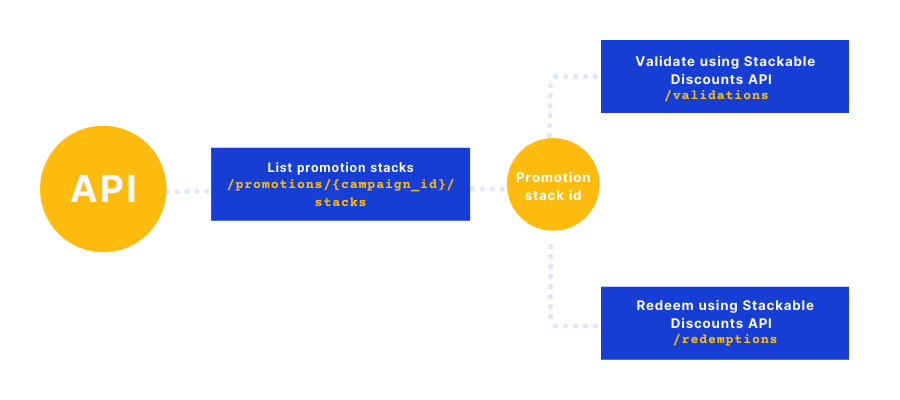

> 👍 Before you start
>
> Make sure you already know key concepts of cart promotions by following the documentation:
> - Read how to [create promotion](https://support.voucherify.io/article/519-create-cart-level-promotions) with stacks using the Dashboard.    
> - Read how to [create promotion campaign](ref:create-campaign) with stacks using the Voucherify API.

## Promotion stacks overview

Cart-level promotions apply discounts to customer's cart without promo codes. Once a customer qualifies for a promotion tier, the discount is automatically added to their cart. 
Cart promotion can have many tiers, each with different discount and rules assigned. Created tiers can be grouped into stacks and validated/redeemed as a single redeemable. 

There are two modes for creating the promotion stacks.
* Dashboard - [go here](https://support.voucherify.io/article/519-create-cart-level-promotions) to learn more
* API - call **POST** URL/{promotion_id}/stacks

```json Stack redeemable
{
  "object": "promotion_stack",
  "id": "stack_3Q4EJpZqg3DI5IRwgBYfsb37"
}
```

## Promotion Stacks API

Dedicated endpoints in [Promotions API](https://docs.voucherify.io/reference/create-promotion-stack) enable you to create, list and edit promotion stacks.

|  Method  |  Endpoint | Description |
| :---------: | ----------| ----------- |
|  POST     | [https://api.voucherify.io/v1/promotions/{campaign_id}/stacks](ref:create-promotion-stack) | Create a stack within a promotion |
|  GET        | [https://api.voucherify.io/v1/promotions/{campaign_id}/stacks](ref:list-promotion-stacks) | List stacks within a promotion |
|  GET        | [https://api.voucherify.io/v1/promotions/{campaign_id}/stacks/{stack_id}](ref:get-promotion-stack) | Return a stack assigned to the given id |
|  PUT        | [https://api.voucherify.io/v1/promotions/{campaign_id}/stacks/{stack_id}](ref:update-promotion-stack) | Update a given stack |
|  DELETE | [https://api.voucherify.io/v1/promotions/{campaign_id}/stacks/{stack_id}](ref:delete-promotion-stack) | Delete a stack |  

## Validation and redemption of promotion stack

> 🚧 Redemption and validation
>
> In order to use stacking feature in your cart promotions and other campaigns, you need to manage validation and redemption by using [Stackable Discounts API](https://docs.voucherify.io/reference/stacking-api-overview).

To redeem or validate the stack, you need to pass its id in API request. Please note that only **one stack** at the time is accepted for these methods. To retrieve the stack id, the first step is to use the GET method on the `/stacks` endpoint; see documentation on [List Promotion Stacks](ref:list-promotion-stacks).

<!--  -->


Here is an example of a promotion stack validation. 

```json Validation Request
{
   "customer": {
        "name": "John Doe",
        "email": "john.doe@rspective.pl"
    },
    "options": {
        "include_orders": true,
        "extended_redemeptions": true
    },
    "redeemables": [
        {
            "object": "promotion_stack",
            "id": "stack_3Q4EJpZqg3DI5IRwgBYfsb37"
        }
    ],
    "order": {
        "items": [
            {
                "price": 200000,
                "product_id": "prod_s3C0nDpr0DuC7",
                "quantity": 1
            },
           {
                "price": 200000,
                "product_id": "prod_f1r5Tpr0DuC7",
                "quantity": 1
            }
        ]
    }
}
```
```json Example Response
{
    "valid": true,
    "redeemables": [
        {
            "status": "APPLICABLE",
            "id": "promo_Vet0vCNyyo5pOddHfu2X3FCB",
            "object": "promotion_tier",
            "order": {
                "amount": 400000,
                "discount_amount": 40000,
                "total_discount_amount": 40000,
                "total_amount": 360000,
                "applied_discount_amount": 40000,
                "total_applied_discount_amount": 40000,
                "items": [
                    {
                        "object": "order_item",
                        "product_id": "prod_s3C0nDpr0DuC7",
                        "quantity": 1,
                        "amount": 200000,
                        "price": 200000,
                        "subtotal_amount": 200000,
                        "product": {
                            "id": "prod_s3C0nDpr0DuC7",
                            "source_id": "test_prod_id_2",
                            "name": "Watchflix"
                        }
                    },
                    {
                        "object": "order_item",
                        "product_id": "prod_f1r5Tpr0DuC7",
                        "quantity": 1,
                        "amount": 200000,
                        "price": 200000,
                        "subtotal_amount": 200000,
                        "product": {
                            "id": "prod_f1r5Tpr0DuC7",
                            "source_id": "test_prod_id_1",
                            "name": "Apple iPhone 8"
                        }
                    }
                ],
                "customer_id": null,
                "referrer_id": null,
                "object": "order"
            },
            "applicable_to": {
                "data": [],
                "total": 0,
                "data_ref": "data",
                "object": "list"
            },
            "inapplicable_to": {
                "data": [],
                "total": 0,
                "data_ref": "data",
                "object": "list"
            },
            "result": {
                "discount": {
                    "type": "PERCENT",
                    "effect": "APPLY_TO_ORDER",
                    "percent_off": 10
                }
            }
        },
        {
            "status": "APPLICABLE",
            "id": "promo_PoIyRVFA5c0Jk514xCpzKHga",
            "object": "promotion_tier",
            "order": {
                "amount": 400000,
                "discount_amount": 40500,
                "total_discount_amount": 40500,
                "total_amount": 359500,
                "applied_discount_amount": 500,
                "total_applied_discount_amount": 500,
                "items": [
                    {
                        "object": "order_item",
                        "product_id": "prod_s3C0nDpr0DuC7",
                        "quantity": 1,
                        "amount": 200000,
                        "price": 200000,
                        "subtotal_amount": 200000,
                        "product": {
                            "id": "prod_s3C0nDpr0DuC7",
                            "source_id": "test_prod_id_2",
                            "name": "Watchflix"
                        }
                    },
                    {
                        "object": "order_item",
                        "product_id": "prod_f1r5Tpr0DuC7",
                        "quantity": 1,
                        "amount": 200000,
                        "price": 200000,
                        "subtotal_amount": 200000,
                        "product": {
                            "id": "prod_f1r5Tpr0DuC7",
                            "source_id": "test_prod_id_1",
                            "name": "Apple iPhone 8"
                        }
                    }
                ],
                "customer_id": null,
                "referrer_id": null,
                "object": "order"
            },
            "applicable_to": {
                "data": [],
                "total": 0,
                "data_ref": "data",
                "object": "list"
            },
            "inapplicable_to": {
                "data": [],
                "total": 0,
                "data_ref": "data",
                "object": "list"
            },
            "result": {
                "discount": {
                    "type": "AMOUNT",
                    "effect": "APPLY_TO_ORDER",
                    "amount_off": 500
                }
            }
        }
    ],
    "order": {
        "amount": 400000,
        "discount_amount": 40500,
        "total_discount_amount": 40500,
        "total_amount": 359500,
        "applied_discount_amount": 40500,
        "total_applied_discount_amount": 40500,
        "items": [
            {
                "object": "order_item",
                "product_id": "prod_s3C0nDpr0DuC7",
                "quantity": 1,
                "amount": 200000,
                "price": 200000,
                "subtotal_amount": 200000,
                "product": {
                    "id": "prod_s3C0nDpr0DuC7",
                    "source_id": "test_prod_id_2",
                    "name": "Watchflix"
                }
            },
            {
                "object": "order_item",
                "product_id": "prod_f1r5Tpr0DuC7",
                "quantity": 1,
                "amount": 200000,
                "price": 200000,
                "subtotal_amount": 200000,
                "product": {
                    "id": "prod_f1r5Tpr0DuC7",
                    "source_id": "test_prod_id_1",
                    "name": "Apple iPhone 8"
                }
            }
        ],
        "customer_id": null,
        "referrer_id": null,
        "object": "order"
    }
}
```

Remember that only one stack can be validated/redeemed in a single API call.

Here is an an example of a promotion stack redemption.

```json Redemption Request
{
   "customer": {
        "name": "John Doe",
        "email": "john.doe@rspective.pl"
    },
    "options": {
        "include_orders": true,
        "extended_redemeptions": true
    },
    "redeemables": [
        {
            "object": "promotion_stack",
            "id": "stack_3Q4EJpZqg3DI5IRwgBYfsb37"
        }
    ],
    "order": {
        "items": [
            {
                "price": 200000,
                "product_id": "prod_s3C0nDpr0DuC7",
                "quantity": 1
            },
           {
                "price": 200000,
                "product_id": "prod_f1r5Tpr0DuC7",
                "quantity": 1
            }
        ]
    }
}
```
```json Example Response
{
    "redemptions": [
        {
            "id": "r_OnX4WGSNp8HmksbXxB6wfxrj",
            "customer_id": "cust_W8n9I8pJDXlM69j49iKJeUYp",
            "date": "2021-12-27T13:13:57.004Z",
            "order": {
                "id": "ord_YAUTnKrQ8pU26c9YU7xU3czI",
                "source_id": null,
                "amount": 400000,
                "discount_amount": 40000,
                "applied_discount_amount": 40000,
                "total_discount_amount": 40000,
                "total_applied_discount_amount": 40000,
                "total_amount": 360000,
                "items": [
                    {
                        "object": "order_item",
                        "product_id": "prod_s3C0nDpr0DuC7",
                        "quantity": 1,
                        "amount": 200000,
                        "price": 200000
                    },
                    {
                        "object": "order_item",
                        "product_id": "prod_f1r5Tpr0DuC7",
                        "quantity": 1,
                        "amount": 200000,
                        "price": 200000
                    }
                ],
                "object": "order"
            },
            "customer": {
                "id": "cust_W8n9I8pJDXlM69j49iKJeUYp",
                "name": "John Doe",
                "email": "john.doe@rspective.pl",
                "source_id": null,
                "object": "customer"
            },
            "result": "SUCCESS",
            "promotion_tier": {
                "id": "promo_Vet0vCNyyo5pOddHfu2X3FCB",
                "name": "Tier 1",
                "banner": "Get Tier 1 Discount 10%",
                "campaign": {
                    "id": "camp_HXsR22VUMC4hN4DR7eAhCalp"
                }
            },
            "redemption": "r_EnlKKBqEGfKodjciTET2pa4o"
        },
        {
            "id": "r_Byagv6Tkju85bZbGY6sw0D0j",
            "customer_id": "cust_W8n9I8pJDXlM69j49iKJeUYp",
            "date": "2021-12-27T13:13:57.005Z",
            "order": {
                "id": "ord_YAUTnKrQ8pU26c9YU7xU3czI",
                "source_id": null,
                "amount": 400000,
                "discount_amount": 40500,
                "applied_discount_amount": 500,
                "total_discount_amount": 40500,
                "total_applied_discount_amount": 500,
                "total_amount": 359500,
                "items": [
                    {
                        "object": "order_item",
                        "product_id": "prod_s3C0nDpr0DuC7",
                        "quantity": 1,
                        "amount": 200000,
                        "price": 200000
                    },
                    {
                        "object": "order_item",
                        "product_id": "prod_f1r5Tpr0DuC7",
                        "quantity": 1,
                        "amount": 200000,
                        "price": 200000
                    }
                ],
                "object": "order"
            },
            "customer": {
                "id": "cust_W8n9I8pJDXlM69j49iKJeUYp",
                "name": "John Doe",
                "email": "john.doe@rspective.pl",
                "source_id": null,
                "object": "customer"
            },
            "result": "SUCCESS",
            "promotion_tier": {
                "id": "promo_PoIyRVFA5c0Jk514xCpzKHga",
                "name": "Tier 2",
                "banner": "Get Tier 2 Discount $5 Off",
                "campaign": {
                    "id": "camp_HXsR22VUMC4hN4DR7eAhCalp"
                }
            },
            "redemption": "r_EnlKKBqEGfKodjciTET2pa4o"
        }
    ],
    "parent_redemption": {
        "id": "r_EnlKKBqEGfKodjciTET2pa4o",
        "customer_id": "cust_W8n9I8pJDXlM69j49iKJeUYp",
        "date": "2021-12-27T13:13:57.006Z",
        "order": {
            "id": "ord_YAUTnKrQ8pU26c9YU7xU3czI",
            "source_id": null,
            "status": "PAID",
            "customer_id": "cust_W8n9I8pJDXlM69j49iKJeUYp",
            "referrer_id": null,
            "amount": 400000,
            "discount_amount": 40500,
            "applied_discount_amount": 40500,
            "total_discount_amount": 40500,
            "total_applied_discount_amount": 40500,
            "total_amount": 359500,
            "items": [
                {
                    "object": "order_item",
                    "product_id": "prod_s3C0nDpr0DuC7",
                    "quantity": 1,
                    "amount": 200000,
                    "price": 200000
                },
                {
                    "object": "order_item",
                    "product_id": "prod_f1r5Tpr0DuC7",
                    "quantity": 1,
                    "amount": 200000,
                    "price": 200000
                }
            ],
            "object": "order"
        },
        "customer": {
            "id": "cust_W8n9I8pJDXlM69j49iKJeUYp",
            "name": "John Doe",
            "email": "john.doe@rspective.pl",
            "source_id": null,
            "object": "customer"
        },
        "result": "SUCCESS"
    },
    "order": {
        "id": "ord_YAUTnKrQ8pU26c9YU7xU3czI",
        "source_id": null,
        "created_at": "2021-12-27T13:13:56.910Z",
        "updated_at": null,
        "status": "PAID",
        "amount": 400000,
        "discount_amount": 40500,
        "total_discount_amount": 40500,
        "total_amount": 359500,
        "applied_discount_amount": 40500,
        "total_applied_discount_amount": 40500,
        "items": [
            {
                "object": "order_item",
                "product_id": "prod_s3C0nDpr0DuC7",
                "quantity": 1,
                "amount": 200000,
                "price": 200000,
                "subtotal_amount": 200000,
                "product": {
                    "id": "prod_s3C0nDpr0DuC7",
                    "source_id": "test_prod_id_2",
                    "name": "Watchflix"
                }
            },
            {
                "object": "order_item",
                "product_id": "prod_f1r5Tpr0DuC7",
                "quantity": 1,
                "amount": 200000,
                "price": 200000,
                "subtotal_amount": 200000,
                "product": {
                    "id": "prod_f1r5Tpr0DuC7",
                    "source_id": "test_prod_id_1",
                    "name": "Apple iPhone 8"
                }
            }
        ],
        "customer": {
            "id": "cust_W8n9I8pJDXlM69j49iKJeUYp",
            "object": "customer"
        },
        "customer_id": "cust_W8n9I8pJDXlM69j49iKJeUYp",
        "referrer_id": null,
        "object": "order",
        "redemptions": {
            "r_EnlKKBqEGfKodjciTET2pa4o": {
                "date": "2021-12-27T13:13:57.006Z",
                "related_object_type": "promotion_stack",
                "related_object_id": "stack_3Q4EJpZqg3DI5IRwgBYfsb37",
                "stacked": [
                    "r_OnX4WGSNp8HmksbXxB6wfxrj",
                    "r_Byagv6Tkju85bZbGY6sw0D0j"
                ]
            }
        }
    }
}
```

In the returned `redemptions` array, you can see child redemptions that show redemptions of particular tiers. Discounts from stack tiers are applied consecutively as defined by the stack hierarchy. The hierarchy defines the sequence in which each of the stacked discounts will be applied to the single transaction.
