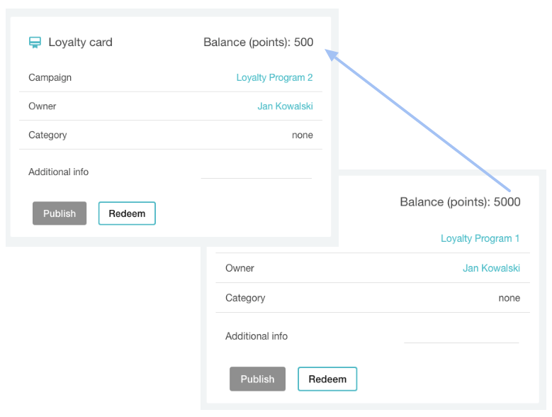
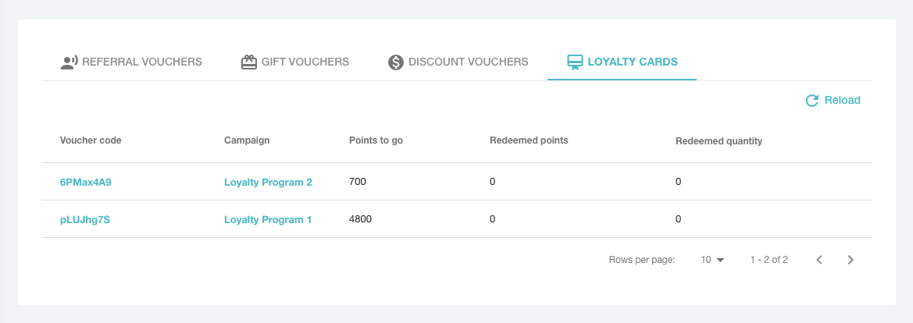
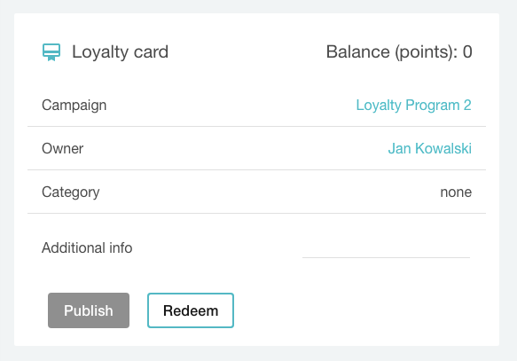

This guide shows a workflow for combining loyalty points from multiple cards. A common use case is to allow a customer to redeem a reward if the number of points on a single card is not enough.

- Points can be transferred between cards in the same and different loyalty campaigns.
- Points can be transferred to the same and different customers.

## Reward qualification

First, we need to call the [qualification endpoint](ref:examine-vouchers-qualification). It returns a list of loyalty cards that can be used for redeeming a reward specified in the request. 

```json Request body
{
    "customer" : {
      "id" : "cust_D01yXiZdzuMl149QpUFBG58E",
      "source_id" : "src_id",
      "name": "Jan Kowalski"
    },
    "reward": {
		"id": "rew_BLeJDzhaNTxpW3tFFhuFM5Wl",
		"assignment_id": "rewa_sxrvjMvQAtip54kV81FBxs2V"
	}
}
```
```json 200 OK
{
    "object": "list",
    "total": 2,
    "data_ref": "data",
    "data": [
        {
            "id": "v_h50cZynXOwLl4L3bCM478kTHdbSau25D",
            "code": "L-CARD-BUHuH6g",
            "campaign": "Postman Test Validtion Rules Campaign - 1571133612128",
            "campaign_id": "camp_f1lr3j8puLtQQil70BFHheOX",
            "category": null,
            "type": "LOYALTY_CARD",
            "discount": null,
            "gift": null,
            "loyalty_card": {
                "points": 10,
                "balance": 10
            },
            "start_date": "2019-01-01T00:00:00Z",
            "expiration_date": null,
            "validity_timeframe": null,
            "validity_day_of_week": null,
            "publish": {
                "object": "list",
                "count": 1,
                "url": "/v1/vouchers/L-CARD-BUHuH6g/publications?page=1&limit=10"
            },
            "redemption": {
                "object": "list",
                "quantity": null,
                "redeemed_quantity": 0,
                "url": "/v1/vouchers/L-CARD-BUHuH6g/redemptions?page=1&limit=10"
            },
            "active": true,
            "additional_info": null,
            "metadata": {
                "test": true
            },
            "is_referral_code": false,
            "holder_id": "cust_A1pTeJEhSDedggst9WjjZouL",
            "updated_at": null,
            "object": "voucher",
            "validation_rules_assignments": {
                "object": "list",
                "total": 0,
                "data_ref": "data",
                "data": []
            }
        },
        {
            "id": "v_d33138hlguqgLO2tU2QHfpqWqGfJHITx",
            "code": "L-CARD-Re0431H",
            "campaign": "Postman Test Validtion Rules Campaign - 1571133612128",
            "campaign_id": "camp_f1lr3j8puLtQQil70BFHheOX",
            "category": null,
            "type": "LOYALTY_CARD",
            "discount": null,
            "gift": null,
            "loyalty_card": {
                "points": 10,
                "balance": 10
            },
            "start_date": "2019-01-01T00:00:00Z",
            "expiration_date": null,
            "validity_timeframe": null,
            "validity_day_of_week": null,
            "publish": {
                "object": "list",
                "count": 1,
                "url": "/v1/vouchers/L-CARD-Re0431H/publications?page=1&limit=10"
            },
            "redemption": {
                "object": "list",
                "quantity": null,
                "redeemed_quantity": 0,
                "url": "/v1/vouchers/L-CARD-Re0431H/redemptions?page=1&limit=10"
            },
            "active": true,
            "additional_info": null,
            "metadata": {
                "test": true
            },
            "is_referral_code": false,
            "holder_id": "cust_A1pTeJEhSDedggst9WjjZouL",
            "updated_at": null,
            "object": "voucher",
            "validation_rules_assignments": {
                "object": "list",
                "total": 0,
                "data_ref": "data",
                "data": []
            }
        }
    ],
    "id": "qfl_5HPcxiJFQ7KyqW8h0AcsaYqa",
    "created_at": "2019-10-15T10:07:56Z"
}
```

The returned cards belong to the given customer but the customer parameter is optional. If you leave it not defined, the method will return all loyalty card codes which can be used to redeem a reward.

## Loyalty card validation

The validation API method should be used to verify whether the customer has enough points for receiving a reward. Here's an endpoint and example request.

POST: {{url}}/vouchers/{code}/validate

- **code** - a code of customer's loyalty card

An example request body and a response:

```json Example request
{
    "customer" : {
      "id" : "cust_D01yXiZdzuMl149QpUFBG58E",
      "source_id" : "src_id",
      "name": "Jan Kowalski"
    },
    "reward": {
		"id": "rew_BLeJDzhaNTxpW3tFFhuFM5Wl",
		"assignment_id": "rewa_sxrvjMvQAtip54kV81FBxs2V"
  	}
}
```
```json 200 OK Response
{
    "reason": "loyalty card points exceeded",
    "code": "6PMax4A9",
    "tracking_id": "track_eWzw13pdCww=",
    "metadata": {},
    "valid": false
}
```

In the response, you can see that the customer doesn't have enough points to get the reward

## The loyalty points transfer

This entity describes loyalty points transfer between Campaigns and Customers. If the customer has two or more assigned loyalty cards, Voucherify gives the opportunity to transfer points from one card to another - e.g., when the customer does not have enough points on the loyalty card to receive the reward. Points can be transferred between cards in the same and different loyalty campaigns and for the same and different customers.

<!--  -->


To transfer points from one card to another ({id}), we need to call the transfer endpoint with the following request body:

POST: https://api.voucherify.io/v1/loyalties/{campaignId}/members/{memberId}/transfers

In the path parameters, you need to include:

- **campaignId** - a unique identifier of the loyalty campaign containing the voucher **to which** the loyalty points are to be sent.
- **memberId** – a unique code identifying the loyalty card **to which** the user wants to transfer loyalty points.

In the body parameters, you need to add the following data:

- **code** – a unique identifier of the loyalty card **from which** you want to transfer points.
- **points** – the number of loyalty points that you want to transfer to another loyalty card. 

> 📘 Note
>
> The number of points in the request body cannot be higher than the current balance on the loyalty card.

**Exemplary path:** https://api.voucherify.io/v1/loyalties/camp_qOrtQUT8sRZ0p6dEAkFpx97p/members/6PMax4A9/transfers

```json Request body
[
   {
      "campaign_id": "camp_dYaLHvcIMdUZ2yINBABKDECE",
      "code": "pLUJhg7S",
      "points": 200
   }
]
```
```json 200 Ok Response
{
    "id": "v_3grX6kmKO8Y4zFDmd441DAzBI81lhjSr",
    "code": "6PMax4A9",
    "campaign": "Loyalty Program 2",
    "campaign_id": "camp_qOrtQUT8sRZ0p6dEAkFpx97p",
    "category": null,
    "type": "LOYALTY_CARD",
    "discount": null,
    "gift": null,
    "loyalty_card": {
        "points": 700,
        "balance": 700
    },
    "start_date": null,
    "expiration_date": null,
    "validity_timeframe": null,
    "validity_day_of_week": null,
    "active": true,
    "additional_info": null,
    "metadata": {},
    "assets": {
        "qr": {
            "id": "U2FsdGVkX1+35occP23L/yglhePqiCkecRPeIdaqfGy9RwojagJEbdkA9jISi4J22JXzMB7K3Yr3Uc6b9/7Y/BTFcEn/5Ne/IC6OdI4VMBCsGKc38s33IXD4fQyNW1BUmX0SscHbGw4dNTi35/0vEQ==",
            "url": "https://dl.voucherify.io/api/v1/assets/qr/U2FsdGVkX1%2B35occP23L%2FyglhePqiCkecRPeIdaqfGy9RwojagJEbdkA9jISi4J22JXzMB7K3Yr3Uc6b9%2F7Y%2FBTFcEn%2F5Ne%2FIC6OdI4VMBCsGKc38s33IXD4fQyNW1BUmX0SscHbGw4dNTi35%2F0vEQ%3D%3D"
        },
        "barcode": {
            "id": "U2FsdGVkX1+11QKTmAxc4j8dcFzwE0TxTVY3bu/HwZ463JPTPUc+Wi4TSkem0hBBWaYge2oTQCT+Ll8ATwTsDcTx1TVI08YgO0Nrman9gB/vns1uqu6A31TA4UZIMCdHLXpW4TRfqYI1DTvHYAD6Kg==",
            "url": "https://dl.voucherify.io/api/v1/assets/barcode/U2FsdGVkX1%2B11QKTmAxc4j8dcFzwE0TxTVY3bu%2FHwZ463JPTPUc%2BWi4TSkem0hBBWaYge2oTQCT%2BLl8ATwTsDcTx1TVI08YgO0Nrman9gB%2Fvns1uqu6A31TA4UZIMCdHLXpW4TRfqYI1DTvHYAD6Kg%3D%3D"
        }
    },
    "is_referral_code": false,
    "created_at": "2020-08-10T09:17:47.059Z",
    "updated_at": "2020-08-12T08:23:00.448Z",
    "holder_id": "cust_D01yXiZdzuMl149QpUFBG58E",
    "publish": {
        "object": "list",
        "count": 1,
        "url": "/v1/vouchers/6PMax4A9/publications?page=1&limit=10"
    },
    "redemption": {
        "object": "list",
        "quantity": null,
        "redeemed_points": 0,
        "url": "/v1/vouchers/6PMax4A9/redemptions?page=1&limit=10"
    },
    "object": "voucher"
}
```

As a result, the balance on both cards has changed.

<!--  -->


## Points redemption

Finally, we can redeem the points from our card.

POST: https://api.voucherify.io/v1/loyalties/{campaignId}/members/{memberId}/redemption

Where campaignId is a unique id of a loyalty campaign and the memberId is a loyalty card code.

```json Request body
{
	"reward": {
		"id": "rew_BLeJDzhaNTxpW3tFFhuFM5Wl"
	}
}
```
```json 200 OK Response
{
    "id": "r_NSwKXZJ4c6vTxSNu3kPIHQVz",
    "object": "redemption",
    "date": "2020-08-12T08:49:48Z",
    "customer_id": "cust_D01yXiZdzuMl149QpUFBG58E",
    "amount": 700,
    "customer": {
        "id": "cust_D01yXiZdzuMl149QpUFBG58E",
        "source_id": "src_id",
        "name": "Jan Kowalski",
        "email": "jan@kowalski.pl",
        "metadata": {},
        "object": "customer"
    },
    "reward": {
        "assignment_id": "rewa_GX8TKRItHlZQ7APDYL9E4RoR",
        "loyalty_tier_id": null,
        "voucher": {
            "id": "v_2tEjwo4VAtcjUdJn5MW389JDtymUl7Hb",
            "code": "Z3YKtBd1",
            "campaign": "Loyalty Reward: 100 GBP Gift Card",
            "campaign_id": "camp_G0pCbugE2QTDr70IuzoXlD8s",
            "category": null,
            "type": "GIFT_VOUCHER",
            "discount": null,
            "gift": {
                "amount": 10000,
                "balance": 10000
            },
            "loyalty_card": null,
            "start_date": null,
            "expiration_date": null,
            "validity_timeframe": null,
            "validity_day_of_week": null,
            "publish": {
                "count": 1,
                "entries": null
            },
            "redemption": {
                "quantity": 1,
                "redeemed_quantity": 0,
                "redeemed_amount": 0,
                "redemption_entries": []
            },
            "active": true,
            "additional_info": null,
            "metadata": {},
            "assets": {
                "qr": {
                    "id": "U2FsdGVkX19kXzzIqUbIkoHJD2yABw+Rs3Fxx7X4LqW/VlOMeB9XP1juPVYEZQarfiVv6rcIdTGfkXElEzokyeScX9uYza0687FB53vRymgSTWXOpUSjECSXGF/2ZlMxOmzS1MkeQx4cMuhAnNhZSA==",
                    "url": "https://dl.voucherify.io/api/v1/assets/qr/U2FsdGVkX19kXzzIqUbIkoHJD2yABw%2BRs3Fxx7X4LqW%2FVlOMeB9XP1juPVYEZQarfiVv6rcIdTGfkXElEzokyeScX9uYza0687FB53vRymgSTWXOpUSjECSXGF%2F2ZlMxOmzS1MkeQx4cMuhAnNhZSA%3D%3D"
                },
                "barcode": {
                    "id": "U2FsdGVkX1+n56O4nzi/ejeJOgcP3/k7hmexhoKPP4cHpMq8sIhycRkQnWcmeH1E5aF14kPoWrGO5rNpIN6/FNYoCPEIuU/lY637p3yrwTul9a2cgnkjCJ9TjiTjHZIZra0x52ARBz5uhDKGAet3Vw==",
                    "url": "https://dl.voucherify.io/api/v1/assets/barcode/U2FsdGVkX1%2Bn56O4nzi%2FejeJOgcP3%2Fk7hmexhoKPP4cHpMq8sIhycRkQnWcmeH1E5aF14kPoWrGO5rNpIN6%2FFNYoCPEIuU%2FlY637p3yrwTul9a2cgnkjCJ9TjiTjHZIZra0x52ARBz5uhDKGAet3Vw%3D%3D"
                }
            },
            "is_referral_code": false,
            "holder_id": "cust_D01yXiZdzuMl149QpUFBG58E",
            "updated_at": "2020-08-12T08:49:48Z"
        },
        "id": "rew_BLeJDzhaNTxpW3tFFhuFM5Wl",
        "name": "100 GBP Gift Card",
        "created_at": "2020-08-12T07:04:35Z",
        "updated_at": null,
        "parameters": {
            "automation_id": null,
            "campaign": {
                "id": "camp_G0pCbugE2QTDr70IuzoXlD8s",
                "balance": 10000
            }
        },
        "type": "CAMPAIGN",
        "object": "reward"
    },
    "result": "SUCCESS",
    "tracking_id": "track_eWzw13pdCww=",
    "voucher": {
        "id": "v_3grX6kmKO8Y4zFDmd441DAzBI81lhjSr",
        "code": "6PMax4A9",
        "campaign": "Loyalty Program 2",
        "campaign_id": "camp_qOrtQUT8sRZ0p6dEAkFpx97p",
        "category": null,
        "type": "LOYALTY_CARD",
        "discount": null,
        "gift": null,
        "loyalty_card": {
            "points": 700,
            "balance": 0
        },
        "start_date": null,
        "expiration_date": null,
        "validity_timeframe": null,
        "validity_day_of_week": null,
        "publish": {
            "object": "list",
            "count": 1,
            "url": "/v1/vouchers/6PMax4A9/publications?page=1&limit=10"
        },
        "redemption": {
            "object": "list",
            "quantity": null,
            "redeemed_quantity": 1,
            "url": "/v1/vouchers/6PMax4A9/redemptions?page=1&limit=10",
            "redeemed_points": 700
        },
        "active": true,
        "additional_info": null,
        "metadata": {},
        "assets": {
            "qr": {
                "id": "U2FsdGVkX1+35occP23L/yglhePqiCkecRPeIdaqfGy9RwojagJEbdkA9jISi4J22JXzMB7K3Yr3Uc6b9/7Y/BTFcEn/5Ne/IC6OdI4VMBCsGKc38s33IXD4fQyNW1BUmX0SscHbGw4dNTi35/0vEQ==",
                "url": "https://dl.voucherify.io/api/v1/assets/qr/U2FsdGVkX1%2B35occP23L%2FyglhePqiCkecRPeIdaqfGy9RwojagJEbdkA9jISi4J22JXzMB7K3Yr3Uc6b9%2F7Y%2FBTFcEn%2F5Ne%2FIC6OdI4VMBCsGKc38s33IXD4fQyNW1BUmX0SscHbGw4dNTi35%2F0vEQ%3D%3D"
            },
            "barcode": {
                "id": "U2FsdGVkX1+11QKTmAxc4j8dcFzwE0TxTVY3bu/HwZ463JPTPUc+Wi4TSkem0hBBWaYge2oTQCT+Ll8ATwTsDcTx1TVI08YgO0Nrman9gB/vns1uqu6A31TA4UZIMCdHLXpW4TRfqYI1DTvHYAD6Kg==",
                "url": "https://dl.voucherify.io/api/v1/assets/barcode/U2FsdGVkX1%2B11QKTmAxc4j8dcFzwE0TxTVY3bu%2FHwZ463JPTPUc%2BWi4TSkem0hBBWaYge2oTQCT%2BLl8ATwTsDcTx1TVI08YgO0Nrman9gB%2Fvns1uqu6A31TA4UZIMCdHLXpW4TRfqYI1DTvHYAD6Kg%3D%3D"
            }
        },
        "is_referral_code": false,
        "holder_id": "cust_D01yXiZdzuMl149QpUFBG58E",
        "updated_at": "2020-08-12T08:49:48Z",
        "holder": {
            "id": "cust_D01yXiZdzuMl149QpUFBG58E",
            "source_id": "src_id",
            "name": "Jan Kowalski",
            "email": "jan@kowalski.pl",
            "metadata": {},
            "object": "customer"
        },
        "object": "voucher",
        "validation_rules_assignments": {
            "data": [],
            "object": "list",
            "total": 0,
            "data_ref": "data"
        }
    }
}
```

In the dashboard, you can see that the points from the loyalty card were spent on the reward and the balance was updated.

<!--  -->

