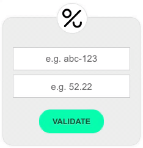
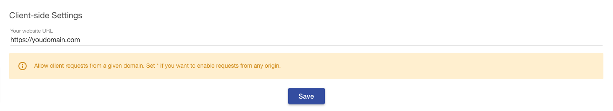
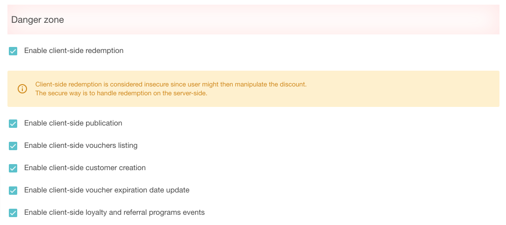

Sometimes it's important to validate a promo code or promotion on the client side, e.g., you want to calculate and display a discounted price on the fly. That's why Voucherify comes with client-side features built into [Voucherify JS SDK](https://github.com/voucherifyio/voucherify-js-sdk) - an open-source JavaScript library that enables you to query the API. 

Among other features, it delivers [Voucherify React Widgets](https://github.com/voucherifyio/voucherify-js-sdk#-voucherify-react-widget)

<!--  -->


Voucherify JS SDK offers many client-side features:
- `validate widget` which enables your customers to validate their codes and check its validity in a given context.
- `redeem widget` which enables your customers to redeem the promo codes.
- `publish widget` which enables your customers to a unique voucher from a given campaign in exchange for providing an email address.
- `subscribe widget` which adds a [customer](ref:get-customer) to Voucherify. You can then use one of the [automatic delivery](doc:automatic-delivery) channels to send him/her a coupon.
[Read more here](https://voucherifyio.github.io/voucherify-js-sdk/#client-side-methods).

## API requests rate limit

To keep your vouchers and promotions safe from fraudulent customer behavior, Voucherify limits the rate of public client requests coming from a single IP address. The current limit can be found at [Limits](doc:limits) section.

When the limit is exceeded, Voucherify returns:

```json Response
{
    "code": 429,
    "message": "Too many requests hit the API too quickly."
}
```

## Installation & reference

Visit :fa-github-alt: [Github repository](https://github.com/voucherifyio/voucherify-js-sdk) to get the current documentation.

> 🚧 Domain white list
> 
> To use Voucherify client-side features you have to white-list your domain in the [Client-side Settings](https://app.voucherify.io/#/app/configuration/proj_f1r5Tpr0J3Ct).

<!--  -->


> 🚧 Enable client-side features
> 
> You have to activate particular client-side options in the [Project Settings](https://app.voucherify.io/#/app/configuration/proj_f1r5Tpr0J3Ct).

<!--  -->

