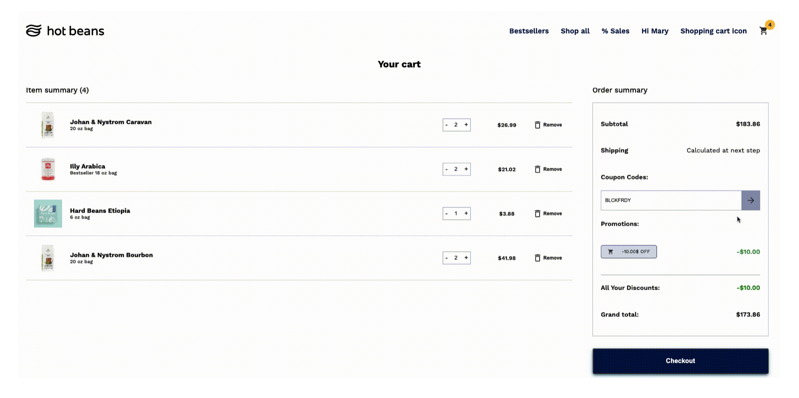
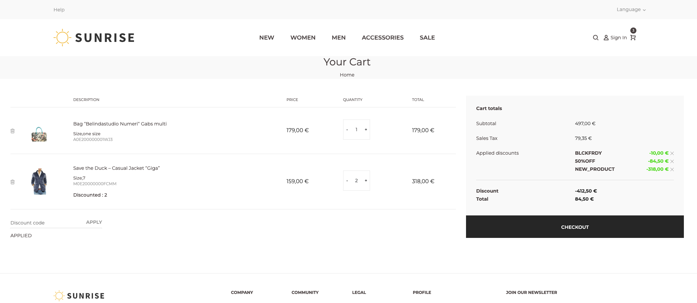
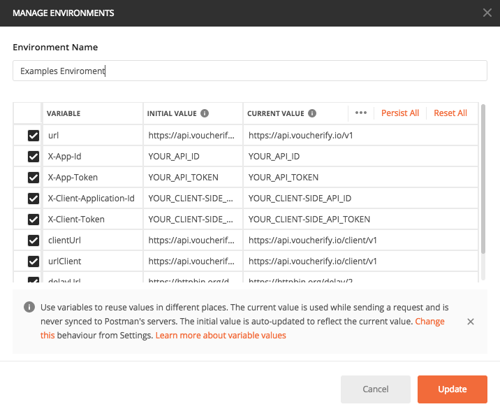
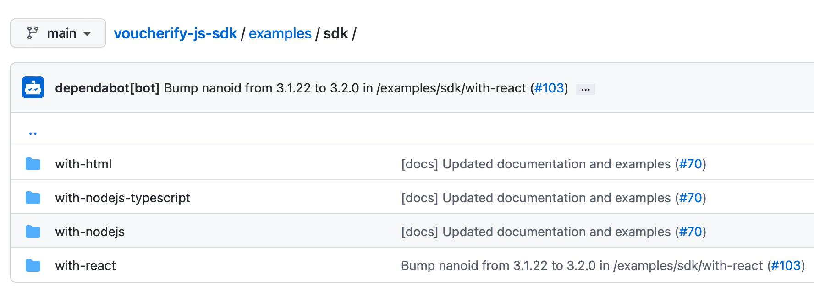
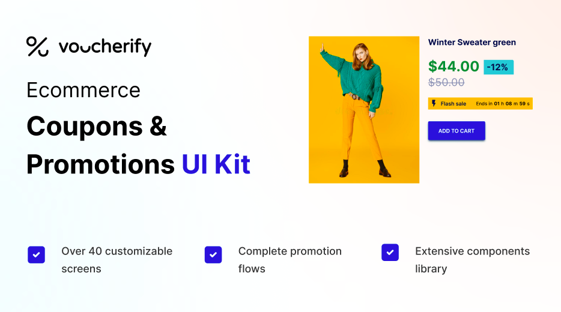

## Sample workflows

[block:tutorial-tile]
{
  "backgroundColor": "#018FF4",
  "emoji": "📗",
  "id": "6374980e181abe0094145ed5",
  "link": "https://docs.voucherify.io/v2018-08-01/recipes/fixed-code-voucher-redeemable-once-per-customer",
  "slug": "fixed-code-voucher-redeemable-once-per-customer",
  "title": "Fixed-code voucher redeemable once per customer"
}
[/block]
[block:tutorial-tile]
{
  "backgroundColor": "#018FF4",
  "emoji": "📗",
  "id": "6375002bf20a2b00339b3ab0",
  "link": "https://docs.voucherify.io/v2018-08-01/recipes/unique-promo-codes-with-discount-for-specific-product",
  "slug": "unique-promo-codes-with-discount-for-specific-product",
  "title": "Unique promo codes with discount for specific product"
}
[/block]
[block:tutorial-tile]
{
  "backgroundColor": "#018FF4",
  "emoji": "📗",
  "id": "6374e8000a86e600176d7034",
  "link": "https://docs.voucherify.io/v2018-08-01/recipes/cart-level-promotion-with-tiers-based-on-total-order-value",
  "slug": "cart-level-promotion-with-tiers-based-on-total-order-value",
  "title": "Cart-level promotion with tiers based on total order value"
}
[/block]
[block:tutorial-tile]
{
  "backgroundColor": "#018FF4",
  "emoji": "📗",
  "id": "637538f067e42a00168fe975",
  "link": "https://docs.voucherify.io/v2018-08-01/recipes/gift-card-campaign-for-vip-customers",
  "slug": "gift-card-campaign-for-vip-customers",
  "title": "Gift card campaign for VIP customers"
}
[/block]
[block:tutorial-tile]
{
  "backgroundColor": "#018FF4",
  "emoji": "📗",
  "id": "63753be05ea05e000fd42ade",
  "link": "https://docs.voucherify.io/v2018-08-01/recipes/retrieving-applicable-vouchers",
  "slug": "retrieving-applicable-vouchers",
  "title": "Retrieving applicable vouchers"
}
[/block]
[block:tutorial-tile]
{
  "backgroundColor": "#018FF4",
  "emoji": "📗",
  "id": "63753c39476278001de69b83",
  "link": "https://docs.voucherify.io/v2018-08-01/recipes/multi-tiered-referral-program",
  "slug": "multi-tiered-referral-program",
  "title": "Multi-tiered referral program"
}
[/block]
[block:tutorial-tile]
{
  "backgroundColor": "#018FF4",
  "emoji": "📗",
  "id": "63754562f9ffcc0017e3d584",
  "link": "https://docs.voucherify.io/v2018-08-01/recipes/multi-tiered-loyalty-program",
  "slug": "multi-tiered-loyalty-program",
  "title": "Multi-tiered loyalty program"
}
[/block]

## Sample integrations build by our team

🧑‍💻Voucherify integrated with the checkout view
* Node.js, Vanilla JS  — [Github](https://github.com/voucherifyio/voucherify-examples) | [Replit](https://replit.com/@Voucherify/Voucherify-Starter-UI)
* Next.js, TypeScript — [Github](https://github.com/voucherifyio/voucherify-examples-next) | [Replit] (https://replit.com/@Voucherify/Voucherify-Starter-UI-with-NEXTjs-and-Typescript)

<!--  -->

🧑‍💻 Voucherify x [commercetools](https://commercetools.com) integration based on [Sunrise SPA (Vue.js)](https://github.com/commercetools/sunrise-spa) frontend — [Github](https://github.com/voucherifyio/sunrise-for-commerce-tools-integration/)

<!--  -->

## Postman test cases

The list of API requests examples, it covers simple calls and more complex promo scenarios.

To run it on your account, you should provide your **[sandbox](doc:testing)** application keys in the environment and enable client-side operations in Project Settings (remember to whitelist the requests with `*` in the client-side settings section).

<!--  -->

## Voucherify.js

To manage promotional activities on the frontend, consider using Voucherify open source web SDK – [JS](https://github.com/voucherifyio/voucherify-js-sdk). Here is a couple of [examples](https://github.com/voucherifyio/voucherify-js-sdk/tree/main/examples) demonstrating its capabilities: 

<!--  -->

## Figma Promo UI Kits

Looking for ready designs for the best promotions experience in your e-commerce store? Check out our 100% customizable UI kit with ready-to-use components based on the best practices for usability:

* [Download Coupon & Promotions UI Kit on Figma](https://www.figma.com/community/file/1100356622702326488)
* [Download Referral UI Kit on Figma](https://www.figma.com/community/file/1039555483777372722)

<!--  -->

