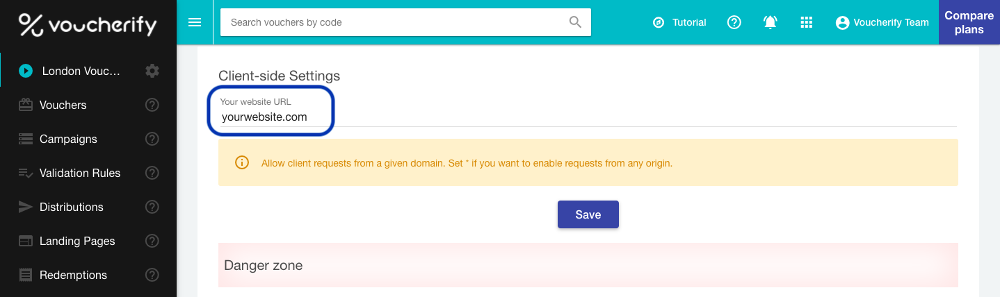

Security is one of the biggest concerns in every aspect of our product. So, we've taken several measures to keep your data safe. 

> 📘 Security Policy
> 
> To understand how we protect your data, visit our [Security](https://www.voucherify.io/legal/security-policy) and [Privacy](https://www.voucherify.io/legal/privacy-policy) Policy

## Secure communication channels

Voucherify provides two modes of API interaction. The first one (private) enables you to access all API endpoints with the use of Application ID and Application Token. To find out more, go to [Authentication](doc:authentication).

The second (public) allows web or mobile clients to access only limited set of API endpoints using publishable keys e.g., ([validate voucher)](ref:validate-voucher) method. [voucherify.js](doc:client-side-api).

## API requests rate limit

To keep your vouchers and promotions safe from fraudulent customer behavior, Voucherify limits the rate of public client requests coming from a single IP address. The current limit can be found at [Limits](doc:limits) section.

When the limit is exceeded, Voucherify returns:

```json JSON
{  
   "type": "error",
   "message": "XHR error happened.",
   "context": {  
      "readyState": 4,
      "responseText": "API calls limit exceeded.",
      "status": 429,
      "statusText": "Too Many Requests"
   }
}
```

## Domain whitelist for public channel

To increase the security of public client operations, Voucherify will accept only requests with `Origin` header that matches the domain(s) specified in `Your website URL` (screenshot below). Use the following pattern:

* .yourdomain.com – this covers your subdomains and all paths within those subdomains. Note: this also covers *www.yourdomain.com*.
* yourdomain.com – this covers any instances of your site called without www and all paths within that domain.
* \* – this allows requests from any domain.

<!--  -->

