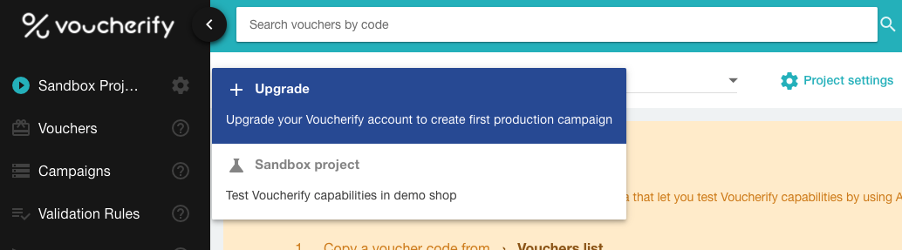
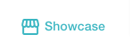
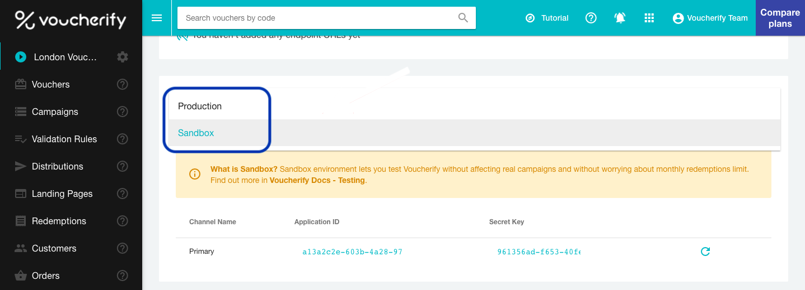

Each Voucherify account has a Sandbox project which is not included in your project limit. You can use it to run your use cases and try out Voucherify capabilities. 

Sandbox projects have their unique API keys for authorization and fixed API calls limit set to 100 calls/h. Sandbox API requests aren't counted into your account limits of API calls.

## How to use Sandbox project

Sandbox is the default project when you create a new Voucherify account. 

If you upgrade to a paid plan, the Sandbox project will be visible in your projects list and it won't be counted to your limit.

<!--  -->

In **Project settings > Application keys** you can see API keys necessary to [authorize](doc:authentication) API requests. 

> 📘 API calls limit
> 
> Note that while using the Sandbox project, you can call Voucherify API 100 times per hour.

### Showcase - test e-store

Each Sandbox project is connected to the showcase store ("Hot Beans"). The showcase presents how the integration between Voucherify and customer touchpoints might look in practice. 

With this setup, you can create campaigns and immediately see how they work at the checkout. For example, you can validate and redeem codes from created campaigns to test different promo scenarios and validation rules. Each redemption will be tracked in the dashboard.

To access test store, go to your Sandbox project and click on the Showcase button in the top bar.

<!--  -->

### Test data

The Sandbox project is populated with test campaigns, **standalone** codes, customers and products, for example:

| **Campaigns:** |  |
|:---|:---|
| 15% off for Illy - Arabica (Discount coupons) | 15% off Illy Arabica (test product) |
| Referral Reward - 15% Discount (Discount coupons) | 15% off applied to whole cart |
| **Standalone codes:** |  |
| 50%UPTO100 | 50% off, the maximum discount amount per order is $100 |
| 15%VISA | 15% off if order is paid with Visa Card (order metadata: card is Visa). |
| 50%OFF | 50% off, no validation rules |
| BLCKFRDY | $10 off, no validation rules |

| **Test Customers** |
|:---|
| Jane Doe |
| John Doe |

## [deprecated] Sandbox for accounts created before 09/08/2021  

If your account was created before Voucherify [version v20210726](https://support.voucherify.io/article/23-whats-new-in-voucherify), released 09/08/2021 you won't see the Sandbox project in your projects list. If you'd like access a new Sandbox project, [send us a request](https://www.voucherify.io/contact-support).

#### Sandbox Keys

To use the Sandbox API you need to obtain Application Keys for the Sandbox Environment. Go to [configuration section](https://app.voucherify.io/#/app/configuration/proj_f1r5Tpr0J3Ct), then in the Application Keys section switch the Environment to Sandbox:

<!--  -->

#### Sandbox vs. Production

The sandbox API includes the same endpoints as the production API, keep in mind these differences:
❗  Vouchers created through the sandbox API are **not visible** in the [web application](https://app.voucherify.io).
❗  Codes of vouchers created through the sandbox API are prefixed with `voucherify.io-`.
❗  Redemptions performed on sandbox vouchers don't count to the monthly [limits](doc:limits).

#### Test data

We have prepared a starting set of test data. You get 5 different single vouchers and 10 vouchers in a campaign:

| **Code** | **Campaign** | **Discount** | **Redemptions** | **Expiration Date** |
|---|---|---|---|---|
| `voucherify.io-10-amount-off` |  | 10 USD/EUR/... off | unlimited | never |
| `voucherify.io-10-percent-off` |  | 10% off | unlimited | never |
| `voucherify.io-10-unit-off` |  | 10 units off | unlimited | never |
| `voucherify.io-expired` |  | 10% off | unlimited | 2015-12-31 |
| `voucherify.io-exceeded` |  | 10 USD/EUR/... off | 1 (already redeemed) | never |
| `voucherify.io-sandbox-01` | voucherify.io-sandbox | 50% off | unlimited | never |
| `voucherify.io-sandbox-02` | voucherify.io-sandbox | 50% off | unlimited | never |
| `voucherify.io-sandbox-03` | voucherify.io-sandbox | 50% off | unlimited | never |
| `voucherify.io-sandbox-04` | voucherify.io-sandbox | 50% off | unlimited | never |
| `voucherify.io-sandbox-05` | voucherify.io-sandbox | 50% off | unlimited | never |
| `voucherify.io-sandbox-06` | voucherify.io-sandbox | 50% off | unlimited | never |
| `voucherify.io-sandbox-07` | voucherify.io-sandbox | 50% off | unlimited | never |
| `voucherify.io-sandbox-08` | voucherify.io-sandbox | 50% off | unlimited | never |
| `voucherify.io-sandbox-09` | voucherify.io-sandbox | 50% off | unlimited | never |
| `voucherify.io-sandbox-10` | voucherify.io-sandbox | 50% off | unlimited | never |

You can create more test vouchers using the [Create Voucher](ref:create-voucher) endpoint.