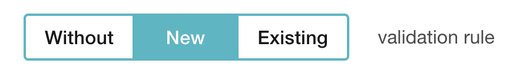

The effect is an optional discount property that is applied to coupon, in-cart, and referral discounts. 

```json Percentage discount object
{
  "percent_off": 10.0,
  "type": "PERCENT",
  "effect": "APPLY_TO_ORDER" 
}
```
```json Amount discount object
{
  "amount_off": 1000,
  "type": "AMOUNT",
  "effect": "APPLY_TO_ITEMS" 
}
```
```json Unit discount object
{
  "type": "UNIT",
  "unit_off": 1.0,
  "unit_type": "prod_08eb194cab0eab36f3",
  "effect": "ADD_MISSING_ITEMS"
}
```
```json Unit discount object - many items
{
  "type": "UNIT",
  "effect": "ADD_MANY_ITEMS",
  "units": [
    {
      "unit_off": 2,
      "unit_type": "prod_0a65b3ff8592d7a5b5",
      "effect": "ADD_MISSING_ITEMS"
    },
    {
      "unit_off": 3,
      "unit_type": "prod_0a493557e21c5dbae9",
      "effect": "ADD_NEW_ITEMS"
    }
  ]
}
```

Here's a list of all effects that you can add to different discount types. 

| Discount Type | **Effects** |
|:---|:---|
| **Amount discount** | “APPLY_TO_ORDER”<br>“APPLY_TO_ITEMS”<br>"APPLY_TO_ITEMS_PROPORTIONALLY”<br>"APPLY_TO_ITEMS_PROPORTIONALLY_BY_QUANTITY"<br>"APPLY_TO_ITEMS_BY_QUANTITY" |
| **Percentage discount** | “APPLY_TO_ORDER”<br>“APPLY_TO_ITEMS” |
| **Unit discount** | “ADD_NEW_ITEMS”<br>“ADD_MISSING_ITEMS”<br>"ADD_MANY_ITEMS" |

---

### Apply to Order

*Discount type: percentage, amount* 

Using this effect, the discount is applied to the total order amount. 

```json Create voucher request
{
    "category": "New Customers",
    "type": "DISCOUNT_VOUCHER",
    "discount": {
        "percent_off": 10.0,
        "type": "PERCENT",
        "effect": "APPLY_TO_ORDER"
    },
    "start_date": "2021-01-01T00:00:00Z",
    "expiration_date": "2025-12-31T23:59:59Z",
    "redemption": {
        "quantity": 1000 
    },
    "metadata": {
      "test": true,
      "locale": "de-en"
    }
  } // POST https://api.voucherify.io/v1/vouchers/SALECODE
  ```
  ```json Redeem request
  {
    "customer": {
        "source_id": "track_+EUcXP8XGf3mYmWxbJvEosmKXi3Aw",
        "name": "Alice Morgan",
        "email": "alice@morgan.com",
        "metadata": {
            "locale": "en-GB",
            "shoeSize": 5,
            "favourite_brands": [
                "Armani",
                "L’Autre Chose",
                "Vicini"
            ]
        }
    },
    "order": {
        "amount": 20050,
        "items": [
            {
                "object": "order_item",
                "product_id": "prod_08ef2e7173d43e4f1d",
                "quantity": 1,
                "amount": 3000,
                "price": 3000,
                "product": {
                    "id": "prod_08ef2e7173d43e4f1d",
                    "name": "T-shirt",
                    "metadata": {},
                    "price": 3000
                }
            },
            {
                "object": "order_item",
                "product_id": "prod_08ef2e82bfd43e4f60",
                "quantity": 1,
                "amount": 2000,
                "price": 2000,
                "product": {
                    "id": "prod_08ef2e82bfd43e4f60",
                    "name": "Pen",
                    "metadata": {},
                    "price": 2000
                }
            },
            {
                "object": "order_item",
                "product_id": "prod_08ef2e94d2543e4fa7",
                "quantity": 2,
                "amount": 1000,
                "price": 1000,
                "product": {
                    "id": "prod_08ef2e94d2543e4fa7",
                    "name": "Mug",
                    "metadata": {},
                    "price": 1000
                }
            }
        ]
    },
    "metadata": {
        "locale": "en-GB"
    }
}
```
```json Redeem response
{
  "id": "r_yXSo8mZYWRDumy6ApECaKa3l",
  "object": "redemption",
  "date": "2021-03-17T08:05:20Z",
  "customer_id": "cust_d775OxTtgAFX0uE94YfthqT3",
  "order": {
    "id": "ord_wAplsnTlh7arusWQrq0SjVjo",
    "status": "PROCESSING",
    "amount": 20050,
    "discount_amount": 2005,
    "total_discount_amount": 2005,
    "total_amount": 18045,
    "items": [
      {
        "product_id": "prod_08ef2e7173d43e4f1d",
        "quantity": 1,
        "price": 3000,
        "amount": 3000,
        "product": {
          "id": "prod_08ef2e7173d43e4f1d",
          "name": "T-shirt",
          "price": 3000,
          "metadata": {}
        }
      },
      {
        "product_id": "prod_08ef2e82bfd43e4f60",
        "quantity": 1,
        "price": 2000,
        "amount": 2000,
        "product": {
          "id": "prod_08ef2e82bfd43e4f60",
          "name": "Pen",
          "price": 2000,
          "metadata": {}
        }
      },
      {
        "product_id": "prod_08ef2e94d2543e4fa7",
        "quantity": 2,
        "price": 1000,
        "amount": 1000,
        "product": {
          "id": "prod_08ef2e94d2543e4fa7",
          "name": "Mug",
          "price": 1000,
          "metadata": {}
        }
      }
    ],
    "created_at": "2021-03-17T08:05:20Z",
    "customer": {
      "id": "cust_d775OxTtgAFX0uE94YfthqT3",
      "object": "customer",
      "referrals": {
        "campaigns": [],
        "total": 0
      }
    }
  },
  "customer": {
    "id": "cust_d775OxTtgAFX0uE94YfthqT3",
    "source_id": "track_+EUcXP8XGf3mYmWxbJvEosmKXi3Aw",
    "name": "Alice Morgan",
    "email": "alice@morgan.com",
    "metadata": {
      "locale": "en-GB",
      "shoeSize": 5,
      "favourite_brands": [
        "Armani",
        "L’Autre Chose",
        "Vicini"
      ]
    },
    "object": "customer"
  },
  "metadata": {
    "locale": "en-GB"
  },
  "result": "SUCCESS",
  "tracking_id": "track_+EUcXP8XGf3mYmWxbJvEosmKXi3Aw",
  "voucher": {
    "id": "v_4e8M59Vx67fdP7RSl8AQAB5pkpSgAGCx",
    "code": "SALECODE",
    "campaign": null,
    "category": "New Customers",
    "type": "DISCOUNT_VOUCHER",
    "discount": {
      "type": "PERCENT",
      "percent_off": 10.0,
      "effect": "APPLY_TO_ORDER"
    },
    "gift": null,
    "loyalty_card": null,
    "start_date": "2021-01-01T00:00:00Z",
    "expiration_date": "2025-12-31T23:59:59Z",
    "validity_timeframe": null,
    "validity_day_of_week": null,
    "publish": {
      "object": "list",
      "count": 0,
      "url": "/v1/vouchers/SALECODE/publications?page=1&limit=10"
    },
    "redemption": {
      "object": "list",
      "quantity": 1000,
      "redeemed_quantity": 1,
      "url": "/v1/vouchers/SALECODE/redemptions?page=1&limit=10"
    },
    "active": true,
    "additional_info": null,
    "metadata": {
      "test": true,
      "locale": "de-en"
    },
    "assets": {
      "qr": {
        "id": "U2FsdGVkX1+zqEmMyhXJSJH/Izws68zhFgjlFSBKwwKzVROD/BmMSrapZdCSGr0CrZliF8ArVsUOiehaLbYQ/zLxH5nvy/I8jP7LFfj81GOwVdVWRwUkKAEgo2nRnHE1cfaL1F3sH2lR/t0J9fCEew==",
        "url": "https://dev.dl.voucherify.io/api/v1/assets/qr/U2FsdGVkX1%2BzqEmMyhXJSJH%2FIzws68zhFgjlFSBKwwKzVROD%2FBmMSrapZdCSGr0CrZliF8ArVsUOiehaLbYQ%2FzLxH5nvy%2FI8jP7LFfj81GOwVdVWRwUkKAEgo2nRnHE1cfaL1F3sH2lR%2Ft0J9fCEew%3D%3D"
      },
      "barcode": {
        "id": "U2FsdGVkX19vpIBorwMefY5zXSwav6QfLt31/GPt7c/K43cUKdeZxNS+0/kB/gV87lblNyIi3u7pEWrPVwxkLk4gbPznOLIJe8LDNq3vr48Pr7XieSm5V45+zDJNvwMxhpzinnoa7mnlsMcs5Z8NvQ==",
        "url": "https://dev.dl.voucherify.io/api/v1/assets/barcode/U2FsdGVkX19vpIBorwMefY5zXSwav6QfLt31%2FGPt7c%2FK43cUKdeZxNS%2B0%2FkB%2FgV87lblNyIi3u7pEWrPVwxkLk4gbPznOLIJe8LDNq3vr48Pr7XieSm5V45%2BzDJNvwMxhpzinnoa7mnlsMcs5Z8NvQ%3D%3D"
      }
    },
    "is_referral_code": false,
    "updated_at": "2021-03-17T08:05:20Z",
    "object": "voucher",
    "validation_rules_assignments": {
      "data": [],
      "object": "list",
      "total": 0,
      "data_ref": "data"
    }
  }
}
```

---

### Apply to Items

_Discount type: percentage, amount_

Using this effect, the discount is applied only to particular items defined by _validation rules_. 

While creating a discount, you need to add the effect to the _discount object_ and define the list of discounted products using _validation rules_. 

You also need to define the _maximum units_ that are allowed to have the discount applied in the validation rule. There are two limits. One defines the maximum units of a particular product that are allowed to be discounted per order line. The other defines the maximum number of units that are allowed to be discounted combined for all order lines matching the constrained item.

As a result, the discount is applied to predefined products, and each of them is discounted equally at most up to the maximum limit allowed. The discount applied to each included item is equal to a discount value defined by _discount.amount_off_ or _discount.percent_off_.

```json $10 discount object
{
  "amount_off": 1000, // discount applied to each discounted item
  "type": "AMOUNT",
  "effect": "APPLY_TO_ITEMS" 
}
```

> 🚧 Creating campaign and validation rules
>
> We highly recommend creating campaigns and validation rules (steps 1-3) using the dashboard. In comparison to the same workflow done via the API, the Campaign Manager in your dashboard reduces the number of steps you need to follow to create a campaign with rules.

**Step 1: Create validation rules**
Create Validation Rules to define discounted items. There are two ways validation rules define qualified items: 
  * If items are added to the Products, you can create validation rules using their names/ internal IDs and static collections.

  * If items are not added to the Products, you can use dynamic product collections and define filters that qualified items need to match. [Read more.](https://support.voucherify.io/article/529-validation-rules-campaign-limits)

> 📘 Product collections
>
> To choose products that qualify for a discount/ gift card, you can select items from your existing products list or build a product collection. Product collections define what criteria items in a customer's cart need to match to qualify for a discount. Likewise, you can use collections to define criteria for excluded items. [Read how to build and use collections](https://support.voucherify.io/article/515-products).

**Step 2: Create discount voucher/campaign**
Create a voucher, campaign, or cart-level promotion with the *apply to items* discount effect.

```json Create Voucher
{
    "category": "Product-specific",
    "type": "DISCOUNT_VOUCHER",
    "discount": {
        "amount_off": 1000,
        "type": "AMOUNT",
        "effect": "APPLY_TO_ITEMS"
    },
    "start_date": "2021-01-01T00:00:00Z",
    "expiration_date": "2025-12-31T23:59:59Z",
    "redemption": {
        "quantity": 1000
    },
    "metadata": {
        "test": true,
        "locale": "de-en"
    }
} // POST https://api.voucherify.io/v1/vouchers/SALE-$10
```

**Step 3: Assign validation rules**
[Create Validation Rules Assignment](ref:create-validation-rule-assignment) to attach validation rules with discounted products to the created discount. If you create a campaign in the dashboard, you can create new rules on the spot or select existing rules from the list. Choosing the rules in the Manager automatically assigns them to the campaign. [Read more about validation rules](https://support.voucherify.io/article/529-validation-rules-campaign-limits)

<!--  -->
[block:image]
{
  "images": [
    {
      "image": [
        "https://files.readme.io/d8c53cc-Screenshot_2022-12-29_at_11.20.52.png",
        null,
        ""
      ],
      "sizing": "400px"
    }
  ]
}
[/block]

**Redemption**
While redeeming the code, each item defined in the validation rules will be discounted. 

```json Example Request
{
    "customer": {
        "source_id": "tracking-id-test"
    },
    "order": {
        "amount": 195000,
        "items": [
            {
                "object": "order_item",
                "product_id": "prod_08f19debbb4715ddda",
                "quantity": 1,
                "amount": 2000,
                "discount_amount": 1000,
                "price": 2000,
                "product": {
                    "id": "prod_08f19debbb4715ddda",
                    "source_id": "mug-2021track98",
                    "name": "Mug Regular",
                    "metadata": {},
                    "price": 2000
                }
            },
            {
                "object": "order_item",
                "product_id": "prod_08f19eba8d0715dde0",
                "quantity": 1,
                "amount": 8000,
                "discount_amount": 1000,
                "price": 8000,
                "product": {
                    "id": "prod_08f19eba8d0715dde0",
                    "source_id": "pen-2021track54",
                    "name": "Pen Limited Gold Edition",
                    "metadata": {},
                    "price": 8000
                }
            },
            {
                "object": "order_item",
                "product_id": "prod_08eb194cab0eab36f3",
                "quantity": 1,
                "amount": 5000,
                "price": 5000,
                "product": {
                    "id": "prod_08eb194cab0eab36f3",
                    "source_id": "5900232130712",
                    "name": "T-SHIRT",
                    "metadata": {},
                    "price": 5000
                }
            },
            {
                "object": "order_item",
                "product_id": "prod_f1r5Tpr0DuC7",
                "quantity": 1,
                "amount": 180000,
                "price": 180000,
                "product": {
                    "id": "prod_f1r5Tpr0DuC7",
                    "source_id": "test_prod_id_1",
                    "name": "Apple iPhone 8",
                    "metadata": {
                        "test": true,
                        "vendor": "Cortland"
                    },
                    "price": null
                }
            }
        ]
    }
} // POST https://api.voucherify.io/v1/vouchers/SALE-$10/redemption
```
```json Example response
{
    "id": "r_kqCA84pwMqm0gshtQpcxFrcH",
    "object": "redemption",
    "date": "2021-03-17T12:59:56Z",
    "customer_id": "cust_ZgdOZOM0fF1zcUIv7tkGoEum",
    "order": {
        "id": "ord_7F2tdbNv3ePbY9UxxzNl1l5D",
        "status": "PROCESSING",
        "amount": 195000,
        "total_discount_amount": 2000,
        "total_amount": 193000,
        "items": [
            {
                "product_id": "prod_08f19debbb4715ddda",
                "quantity": 1,
                "price": 2000,
                "amount": 2000,
                "discount_amount": 1000,
                "product": {
                    "id": "prod_08f19debbb4715ddda",
                    "source_id": "mug-2021track98",
                    "name": "Mug Regular",
                    "price": 2000,
                    "metadata": {}
                }
            },
            {
                "product_id": "prod_08f19eba8d0715dde0",
                "quantity": 1,
                "price": 8000,
                "amount": 8000,
                "discount_amount": 1000,
                "product": {
                    "id": "prod_08f19eba8d0715dde0",
                    "source_id": "pen-2021track54",
                    "name": "Pen Limited Gold Edition",
                    "price": 8000,
                    "metadata": {}
                }
            },
            {
                "product_id": "prod_08eb194cab0eab36f3",
                "quantity": 1,
                "price": 5000,
                "amount": 5000,
                "product": {
                    "id": "prod_08eb194cab0eab36f3",
                    "source_id": "5900232130712",
                    "name": "T-SHIRT",
                    "price": 5000,
                    "metadata": {}
                }
            },
            {
                "product_id": "prod_f1r5Tpr0DuC7",
                "quantity": 1,
                "price": 180000,
                "amount": 180000,
                "product": {
                    "id": "prod_f1r5Tpr0DuC7",
                    "source_id": "test_prod_id_1",
                    "name": "Apple iPhone 8",
                    "metadata": {
                        "test": true,
                        "vendor": "Cortland"
                    }
                }
            }
        ],
        "created_at": "2021-03-17T12:59:56Z",
        "customer": {
            "id": "cust_ZgdOZOM0fF1zcUIv7tkGoEum",
            "object": "customer",
            "referrals": {
                "campaigns": [],
                "total": 0
            }
        }
    },
    "customer": {
        "id": "cust_ZgdOZOM0fF1zcUIv7tkGoEum",
        "source_id": "tracking-id-test",
        "object": "customer"
    },
    "result": "SUCCESS",
    "tracking_id": "track_FQK6k2KUBmtvWT7NfsZYWU5iLuT3KUYD",
    "voucher": {
        "id": "v_qccAiW0j4m7BvS1dwOXFRtVhd5PEhdYM",
        "code": "SALE-$10",
        "campaign": null,
        "category": "Product-specific",
        "type": "DISCOUNT_VOUCHER",
        "discount": {
            "type": "AMOUNT",
            "amount_off": 1000,
            "effect": "APPLY_TO_ITEMS"
        },
        "gift": null,
        "loyalty_card": null,
        "start_date": "2021-01-01T00:00:00Z",
        "expiration_date": "2025-12-31T23:59:59Z",
        "validity_timeframe": null,
        "validity_day_of_week": null,
        "publish": {
            "object": "list",
            "count": 0,
            "url": "/v1/vouchers/SALE-$10/publications?page=1&limit=10"
        },
        "redemption": {
            "object": "list",
            "quantity": 1000,
            "redeemed_quantity": 3,
            "url": "/v1/vouchers/SALE-$10/redemptions?page=1&limit=10"
        },
        "active": true,
        "additional_info": null,
        "metadata": {
            "test": true,
            "locale": "de-en"
        },
        "assets": {
            "qr": {
                "id": "U2FsdGVkX1+5Y2CizWaLhrkcca2uGPuj7cWhN8WVcXVk889pbJinwnLFNf9TqLYvT6WsqHR0+h93yjLjL/jTdkLy/ZZ8t2KY7ElMRVyCA4W9MTTLQxeXTYR6Ho6aDj3cGWqpFlRKsK2OISvy0NC8Cw==",
                "url": "https://dev.dl.voucherify.io/api/v1/assets/qr/U2FsdGVkX1%2B5Y2CizWaLhrkcca2uGPuj7cWhN8WVcXVk889pbJinwnLFNf9TqLYvT6WsqHR0%2Bh93yjLjL%2FjTdkLy%2FZZ8t2KY7ElMRVyCA4W9MTTLQxeXTYR6Ho6aDj3cGWqpFlRKsK2OISvy0NC8Cw%3D%3D"
            },
            "barcode": {
                "id": "U2FsdGVkX18yLYOnK0rO0I5hv0zUEv4qb8UW+HkearNxAJg/8LZgrzdF1MeaEs/Kjc9rexj6GHiKLXMD/hIgOdnl8mZ+hCRPKMda3cx6kJMYy3Xw1c1d00LJ+EYco7uI7zittjNeLnJKvU1OVVKvOg==",
                "url": "https://dev.dl.voucherify.io/api/v1/assets/barcode/U2FsdGVkX18yLYOnK0rO0I5hv0zUEv4qb8UW%2BHkearNxAJg%2F8LZgrzdF1MeaEs%2FKjc9rexj6GHiKLXMD%2FhIgOdnl8mZ%2BhCRPKMda3cx6kJMYy3Xw1c1d00LJ%2BEYco7uI7zittjNeLnJKvU1OVVKvOg%3D%3D"
            }
        },
        "is_referral_code": false,
        "updated_at": "2021-03-17T12:59:56Z",
        "object": "voucher",
        "applicable_to": {
            "data": [
                {
                    "object": "product",
                    "id": "prod_08f19eba8d0715dde0",
                    "source_id": "pen-2021track54"
                },
                {
                    "object": "product",
                    "id": "prod_08f19debbb4715ddda",
                    "source_id": "mug-2021track98"
                }
            ],
            "object": "list",
            "total": 2,
            "data_ref": "data"
        },
        "validation_rules_assignments": {
            "data": [
                {
                    "id": "asgm_kDnIcAqiKzbLNxQx",
                    "rule_id": "val_aW8iKAQkYuC8",
                    "related_object_id": "v_qccAiW0j4m7BvS1dwOXFRtVhd5PEhdYM",
                    "related_object_type": "voucher",
                    "created_at": null,
                    "updated_at": null,
                    "object": "validation_rules_assignment"
                }
            ],
            "object": "list",
            "total": 1,
            "data_ref": "data"
        }
    }
}
```

---

### Apply to Items Proportionally

*Discount type: amount* 

Using this effect, the discount is divided and applied only to particular items defined by validation rules. While creating a discount, you need to add effect to the discount object and define the list of discounted products using validation rules. 

As a result, the discount is applied to chosen products only, and each of them is discounted **proportionally to its share in the total amount of discounted items**. The total discount amount applied to all items equals the discount value defined by *discount.amount_off*.

```json $10 discount object
{
  "amount_off": 1000, // total discount amount applied to all discounted items
  "type": "AMOUNT",
  "effect": "APPLY_TO_ITEMS_PROPORTIONALLY"
}
```

> 🚧 Creating campaigns and validation rules
>
> We highly recommend creating campaigns and validation rules (steps 1-3) using the dashboard. In comparison to the same workflow done via the API, the Campaign Manager in your dashboard reduces the number of API calls (made to create a campaign with rules).

**Step 1: Create validation rules**
[Create Validation Rules](ref:create-validation-rules) to define discounted items as [described here](doc:discount-effects#step-1-create-validation-rules).

**Step 2: Create discount voucher/campaign**
Create a voucher, campaign, or cart-level promotion with the *apply to items proportionally* effect.

```json Create Voucher
{
    "category": "Product-specific",
    "type": "DISCOUNT_VOUCHER",
    "discount": {
        "amount_off": 1000,
        "type": "AMOUNT",
        "effect": "APPLY_TO_ITEMS_PROPORTIONALLY"
    },
    "start_date": "2021-01-01T00:00:00Z",
    "expiration_date": "2025-12-31T23:59:59Z",
    "redemption": {
        "quantity": 1000
    },
    "metadata": {
        "test": true,
        "locale": "de-en"
    }
} // POST https://api.voucherify.io/v1/vouchers/10PROPRTIOANLLY
```

**Step 3: Assign validation rules**
[Create Validation Rules Assignment](ref:create-validation-rule-assignment) to attach validation rule with discounted products to the created discount. 

**Redemption**
While redeeming the code, each item defined in validation rules will be discounted proportionally to its share in the total amount and the sum of item discounts matches the total discount value (discount.amount_off). In the response body, you can also see the applicable_to object that lists all items that qualify for a discount.

```json Example request
{
    "customer": {
        "source_id": "tracking-id-test"
    },
    "order": {
        "amount": 195000,
        "items": [
            {
                "object": "order_item",
                "product_id": "prod_08f19debbb4715ddda",
                "quantity": 1,
                "amount": 2000,
                "price": 2000,
                "product": {
                    "id": "prod_08f19debbb4715ddda",
                    "source_id": "mug-2021track98",
                    "name": "Mug Regular",
                    "metadata": {},
                    "price": 2000
                }
            },
            {
                "object": "order_item",
                "product_id": "prod_08f19eba8d0715dde0",
                "quantity": 1,
                "amount": 8000,
                "price": 8000,
                "product": {
                    "id": "prod_08f19eba8d0715dde0",
                    "source_id": "pen-2021track54",
                    "name": "Pen Limited Gold Edition",
                    "metadata": {},
                    "price": 8000
                }
            },
            {
                "object": "order_item",
                "product_id": "prod_08eb194cab0eab36f3",
                "quantity": 1,
                "amount": 5000,
                "price": 5000,
                "product": {
                    "id": "prod_08eb194cab0eab36f3",
                    "source_id": "5900232130712",
                    "name": "T-SHIRT",
                    "metadata": {},
                    "price": 5000
                }
            },
            {
                "object": "order_item",
                "product_id": "prod_f1r5Tpr0DuC7",
                "quantity": 1,
                "amount": 180000,
                "price": 180000,
                "product": {
                    "id": "prod_f1r5Tpr0DuC7",
                    "source_id": "test_prod_id_1",
                    "name": "Apple iPhone 8",
                    "metadata": {
                        "test": true,
                        "vendor": "Cortland"
                    },
                    "price": null
                }
            }
        ]
    }
}
```
```json Example response
{
    "id": "r_B4CLyTX9SzYdPNmO74Cx4n3k",
    "object": "redemption",
    "date": "2021-03-17T14:05:01Z",
    "customer_id": "cust_ZgdOZOM0fF1zcUIv7tkGoEum",
    "order": {
        "id": "ord_QQRL7VwWz6fKsw2JbEl5t17a",
        "status": "PROCESSING",
        "amount": 195000,
        "total_discount_amount": 1000,
        "total_amount": 194000,
        "items": [
            {
                "product_id": "prod_08f19debbb4715ddda",
                "quantity": 1,
                "price": 2000,
                "amount": 2000,
                "discount_amount": 200,
                "product": {
                    "id": "prod_08f19debbb4715ddda",
                    "source_id": "mug-2021track98",
                    "name": "Mug Regular",
                    "price": 2000,
                    "metadata": {}
                }
            },
            {
                "product_id": "prod_08f19eba8d0715dde0",
                "quantity": 1,
                "price": 8000,
                "amount": 8000,
                "discount_amount": 800,
                "product": {
                    "id": "prod_08f19eba8d0715dde0",
                    "source_id": "pen-2021track54",
                    "name": "Pen Limited Gold Edition",
                    "price": 8000,
                    "metadata": {}
                }
            },
            {
                "product_id": "prod_08eb194cab0eab36f3",
                "quantity": 1,
                "price": 5000,
                "amount": 5000,
                "product": {
                    "id": "prod_08eb194cab0eab36f3",
                    "source_id": "5900232130712",
                    "name": "T-SHIRT",
                    "price": 5000,
                    "metadata": {}
                }
            },
            {
                "product_id": "prod_f1r5Tpr0DuC7",
                "quantity": 1,
                "price": 180000,
                "amount": 180000,
                "product": {
                    "id": "prod_f1r5Tpr0DuC7",
                    "source_id": "test_prod_id_1",
                    "name": "Apple iPhone 8",
                    "metadata": {
                        "test": true,
                        "vendor": "Cortland"
                    }
                }
            }
        ],
        "created_at": "2021-03-17T14:05:01Z",
        "customer": {
            "id": "cust_ZgdOZOM0fF1zcUIv7tkGoEum",
            "object": "customer",
            "referrals": {
                "campaigns": [],
                "total": 0
            }
        }
    },
    "customer": {
        "id": "cust_ZgdOZOM0fF1zcUIv7tkGoEum",
        "source_id": "tracking-id-test",
        "object": "customer"
    },
    "result": "SUCCESS",
    "tracking_id": "track_FQK6k2KUBmtvWT7NfsZYWU5iLuT3KUYD",
    "voucher": {
        "id": "v_MNrtGo0WqqTS45u6wZcGiCzaNJx09QEo",
        "code": "10PROPRTIOANLLY",
        "campaign": null,
        "category": null,
        "type": "DISCOUNT_VOUCHER",
        "discount": {
            "type": "AMOUNT",
            "amount_off": 1000,
            "effect": "APPLY_TO_ITEMS_PROPORTIONALLY"
        },
        "gift": null,
        "loyalty_card": null,
        "start_date": null,
        "expiration_date": null,
        "validity_timeframe": null,
        "validity_day_of_week": null,
        "publish": {
            "object": "list",
            "count": 0,
            "url": "/v1/vouchers/10PROPRTIOANLLY/publications?page=1&limit=10"
        },
        "redemption": {
            "object": "list",
            "quantity": null,
            "redeemed_quantity": 5,
            "url": "/v1/vouchers/10PROPRTIOANLLY/redemptions?page=1&limit=10"
        },
        "active": true,
        "additional_info": null,
        "metadata": {},
        "assets": {
            "qr": {
                "id": "U2FsdGVkX19MFqqkayhlvnIzbdPhqbKpT7uTLmqScqifnR0ukaAwhA4I35GrG8l/vg4tgqDCHaQu1nAfBrddJU5KpOYvLD6YJBDhDt+nGSzapZqjsZMZwYFIBE4K3aIXgGAYZ8VoVrEI3WnTIB3297L6Q0m+OXRbsy8mk3MEDx4=",
                "url": "https://dev.dl.voucherify.io/api/v1/assets/qr/U2FsdGVkX19MFqqkayhlvnIzbdPhqbKpT7uTLmqScqifnR0ukaAwhA4I35GrG8l%2Fvg4tgqDCHaQu1nAfBrddJU5KpOYvLD6YJBDhDt%2BnGSzapZqjsZMZwYFIBE4K3aIXgGAYZ8VoVrEI3WnTIB3297L6Q0m%2BOXRbsy8mk3MEDx4%3D"
            },
            "barcode": {
                "id": "U2FsdGVkX19QZlajVSj9fEB+f6YrkojgP8aIp5hSh/w66sDMBP2nxvaFyGtue25PX2mLEpSCL45on7zkIgXVB5JhkhqGEK3GCq0ybSTnr2aNDhXa/S25iobEv++8ciasxVONgXHTrz8YPHfOmZJ7E7XUW1XfxMjTS2EFT3k6NWA=",
                "url": "https://dev.dl.voucherify.io/api/v1/assets/barcode/U2FsdGVkX19QZlajVSj9fEB%2Bf6YrkojgP8aIp5hSh%2Fw66sDMBP2nxvaFyGtue25PX2mLEpSCL45on7zkIgXVB5JhkhqGEK3GCq0ybSTnr2aNDhXa%2FS25iobEv%2B%2B8ciasxVONgXHTrz8YPHfOmZJ7E7XUW1XfxMjTS2EFT3k6NWA%3D"
            }
        },
        "is_referral_code": false,
        "updated_at": "2021-03-17T14:05:01Z",
        "object": "voucher",
        "applicable_to": { // items that qualify for a discount
            "data": [
                {
                    "object": "product",
                    "id": "prod_08f19eba8d0715dde0",
                    "source_id": "pen-2021track54"
                },
                {
                    "object": "product",
                    "id": "prod_08f19debbb4715ddda",
                    "source_id": "mug-2021track98"
                }
            ],
            "object": "list",
            "total": 2,
            "data_ref": "data"
        },
        "validation_rules_assignments": {
            "data": [
                {
                    "id": "asgm_5RMqyYwwnWjiNvPs",
                    "rule_id": "val_EggQ7p0ZbTbl",
                    "related_object_id": "v_MNrtGo0WqqTS45u6wZcGiCzaNJx09QEo",
                    "related_object_type": "voucher",
                    "created_at": null,
                    "updated_at": null,
                    "object": "validation_rules_assignment"
                }
            ],
            "object": "list",
            "total": 1,
            "data_ref": "data"
        }
    }
}
```

---

### Apply to Items Proportionally by Quantity

*Discount type: amount* 

Likewise, the discount is divided and applied only to particular items defined by validation rules. While creating a discount, you need to add effect to the discount object and define the list of discounted products using validation rules. 

As a result, the discount is applied to chosen products only, and each of them is discounted **proportionally to its share in the total quantity of discounted items.** The total discount amount applied to all items equals the discount value defined by *discount.amount_off*.


```json $10 discount object
{
  "amount_off": 1000, // total discount amount applied to all discounted items
  "type": "AMOUNT",
  "effect": "APPLY_TO_ITEMS_PROPORTIONALLY_BY_QUANTITY"
}
```

---

### Apply to Items to each unit of matched product

*Discount type: amount* 

Likewise, the discount is divided and applied only to particular items defined by validation rules. While creating a discount, you need to add the effect to the discount object and define the list of discounted products using validation rules. You also need to define the maximum units that are allowed to have the discount applied in the validation rule. 

As a result, the discount is applied to chosen products only, and each unit of the product is discounted at most up to the maximum limit allowed. The total discount amount applied to all items equals the number of discounted units multiplied by the discount amount. The discount value defined by *discount.amount_off* is the discount amount that will be applied to each unit.

```json $5 discount object
"discount": {
    "type": "AMOUNT",
    "amount_off": 500,
    "effect": "APPLY_TO_ITEMS_BY_QUANTITY"
}
```

Here is an example of a validation rule that limits the quantity of each product that can be discounted. One product is discounted at most for 1 unit per line item up to a maximum of 1 taking into account all matched order line items. The other product is discounted at most for 2 units per order line item up to a maximum of 3 for all matched order line items.

```json Validation Rule
{
    "id": "val_um5MMBdjQ2Uk",
    "name": "Business Validation Rule - Discount Effect - Amount - Items - each unit of matched product",
    "rules": {
        "logic": ""
    },
    "applicable_to": {
        "excluded": [],
        "included": [
            {
                "object": "product",
                "id": "prod_0b72b0bd64d198e3ae",
                "source_id": null,
                "strict": false,
                "effect": "APPLY_TO_EVERY",
                "quantity_limit": 1,
                "aggregated_quantity_limit": 1
            },
            {
                "object": "product",
                "id": "prod_0b72b00ffed198e344",
                "source_id": null,
                "strict": false,
                "effect": "APPLY_TO_EVERY",
                "quantity_limit": 2,
                "aggregated_quantity_limit": 3
            }
        ],
        "included_all": false
    },
    "created_at": "2022-09-05T08:11:29.497Z",
    "type": "basic",
    "context_type": "campaign.discount_coupons.discount.apply_to_items_by_quantity",
    "object": "validation_rules"
}
```

---

### Add Missing Items

*Discount type: unit* 

This effect adds items to the cart only if a customer has fewer free items than offered by the code. For example, let's assume that the code gives one free t-shirt:  

– If a customer doesn't have the t-shirt already in the cart, then a free t-shirt will be added to the order.  
– If a customer already has this item in the cart, then the number of t-shirts already matches the units count. As a result, after applying the code, a discount will be applied to the item which is already in the cart and no extra items will be added. [Read more](doc:give-item-for-free-unit-discount#redemption-of-the-code-with-discount-effect-add_missing_items).

---

### Add New Items

*Discount type: unit* 

Choosing this effect results in adding items to the cart in the number defined by unit value. For example, if the code gives one free t-shirt, then no matter if a customer has the t-shirt already in the cart or not, a free t-shirt will always be added to the order and discounted. [Read more](doc:give-item-for-free-unit-discount#redemption-of-the-code-with-discount-effect-add_new_items).

---

### Add Many Items

*Discount type: unit* 

The discount gives multiple types of free item(s) to customers. Free item units are always added to the customer's cart based on either the **Add missing items** or **Add new order items** effects. [Read more](doc:give-item-for-free-unit-discount#redemption-of-the-code-with-discount-effect-add_many_items).

> 📘 Unit Discount Effects
>
> Go [here](https://support.voucherify.io/article/511-discount-effects-cheat-sheet) to learn more about unit discounts and their effects.

---

### Default Effect

Here are the default effects that API adds in the case you won't define it in your discounts.

| **Discount Type** | **Default Effect** |
|:---|:---|
| AMOUNT | - If you define included or excluded products: "APPLY_TO_ITEMS"<br>- If you don't define included or excluded products: "APPLY_TO_ORDER" |
| PERCENT | - If you define included or excluded products: "APPLY_TO_ITEMS"<br>- If you don't define included or excluded products: "APPLY_TO_ORDER" |
| UNIT | "ADD_MISSING_ITEMS"<br>"ADD_NEW_ITEMS" |

### Effects and Validation Rules

Discount effects work in parallel with the remaining [Validation rules](doc:validation-rules) that specify included and excluded items, required cart structure and other redemption circumstances.

