Voucherify supports free shipping discount which is a specific use case of a [unit discount](doc:give-item-for-free-unit-discount). In this tutorial, we're going to show you how to specify the shipping charge and use it in your promotional campaigns.

## Define shipping charge

Initially, the price of the shipping is set to 0. 

<!-- 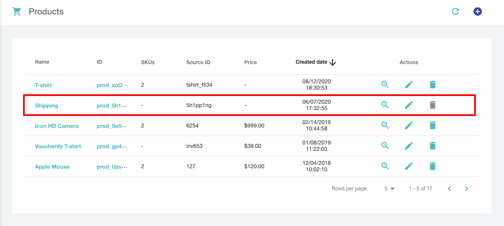 -->


To add a new shipping charge, open the product details, and choose edit (the pencil icon). Then, set up a new price and confirm with Save. 

<!-- 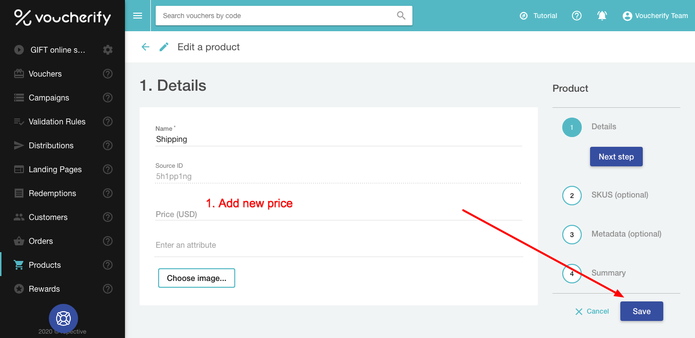 -->


If you want to set up a shipping charge via API, you need to [Update the Product](ref:update-product). To do that, copy the shipping id from the dashboard and specify the new product (shipping) price in the request (remember to multiply the value by 100):

```json Update shipping price
{
  "price": 1900
}

//https://api.voucherify.io/v1/products/prod_5h1pp1ng
```
```json 200 OK Response
{
    "id": "prod_5h1pp1ng",
    "source_id": "5h1pp1ng",
    "object": "product",
    "name": "Shipping",
    "attributes": [],
    "metadata": {},
    "created_at": "2020-06-07T17:32:55Z",
    "updated_at": "2020-09-02T14:51:12Z",
    "skus": {
        "object": "list",
        "total": 0,
        "data": []
    },
    "price": 1900,
    "image_url": null
}
```

Now, you can create a promotion and use free shipping as a discount type. 

## Create a free shipping discount

We're going to create a unique codes campaign and a cart-level promotion, both with the same free shipping discount. 

### Free shipping discount created in UI

> 📘 Prerequisite
>
> If you're not familiar with Vocherify Campaign Manager, please follow [this short guide](https://support.voucherify.io/article/17-how-do-i-create-my-first-campaign) to learn the basics.

Open the Campaign Manager with the Plus.

<!-- 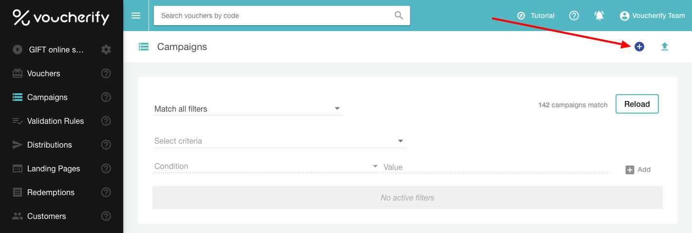 -->


In the next step, you need to choose between discount coupons (codes with free shipping) or promotion (free shipping automatically applied). Let's go with discount coupons first.

- Discount codes

<!-- 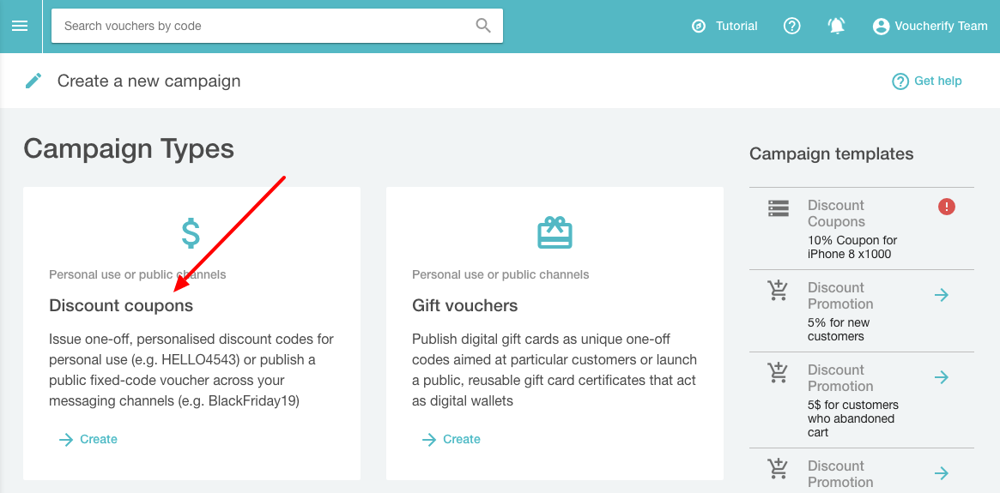 -->


In the first section, add Campaign details:

- Choose between bulk unique codes (campaign) or a single standalone code.
- Add the campaign name.
- Define code redemption limit and code count.

<!-- 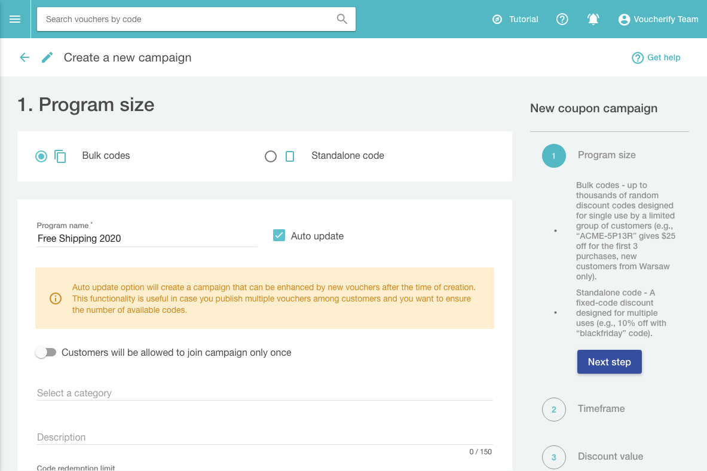 -->


When campaign details are ready, go to the next step and add time limits (optional).

<!-- 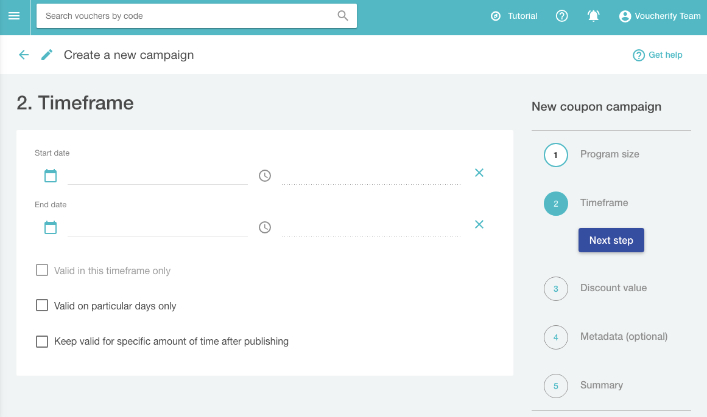 -->


The third step is crucial for setting up a free shipping discount. In this section, you can define a discount type. To offer shipping for free, choose Free Shipping.

<!-- 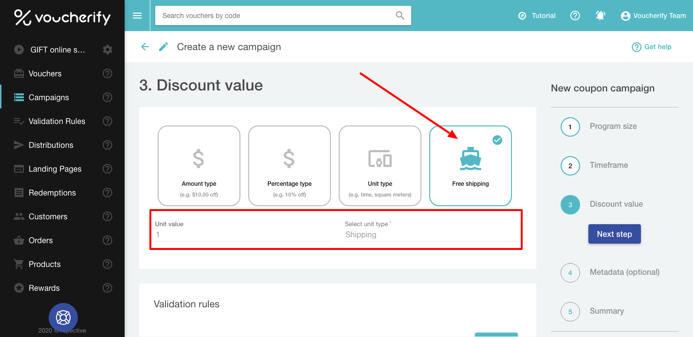 -->


You can attach additional limits and rules to free shipping discounts by adding [validation rules](https://support.voucherify.io/article/53-validation-rules).

<!-- 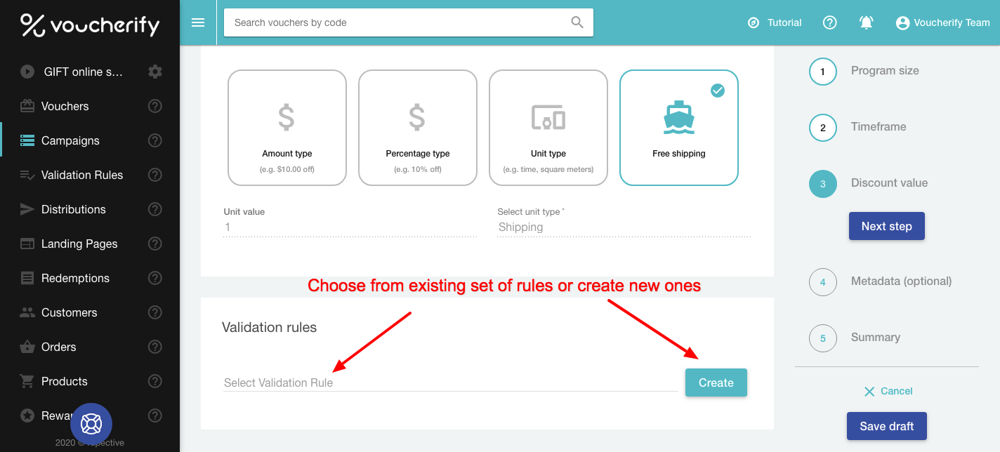 -->


When ready, go to the next step. In the fourth section, you can add [metadata attributes](https://support.voucherify.io/article/99-schema-validation-metadata).

<!-- 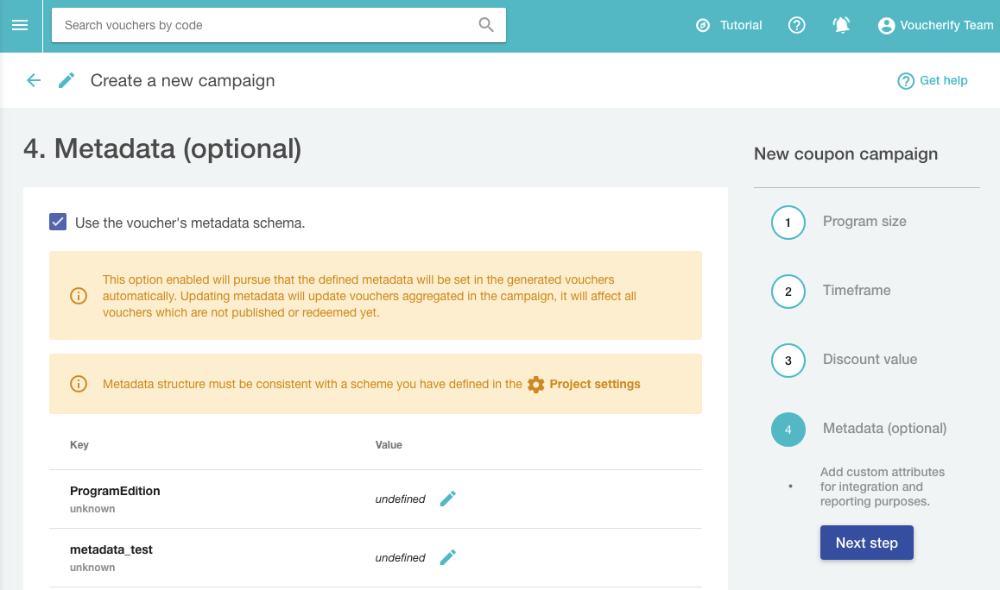 -->


The last section shows a summary of the created campaign, if everything is fine, click Save and it's ready.

- Cart-level promotion

In the case of [cart-level promotion](https://support.voucherify.io/article/519-create-cart-level-promotions), the free shipping discount is defined in the second section of the Campaign Manager, as a part of the level settings. If you want to offer only free shipping in this promotion, then you need only one promotion level.

<!-- >
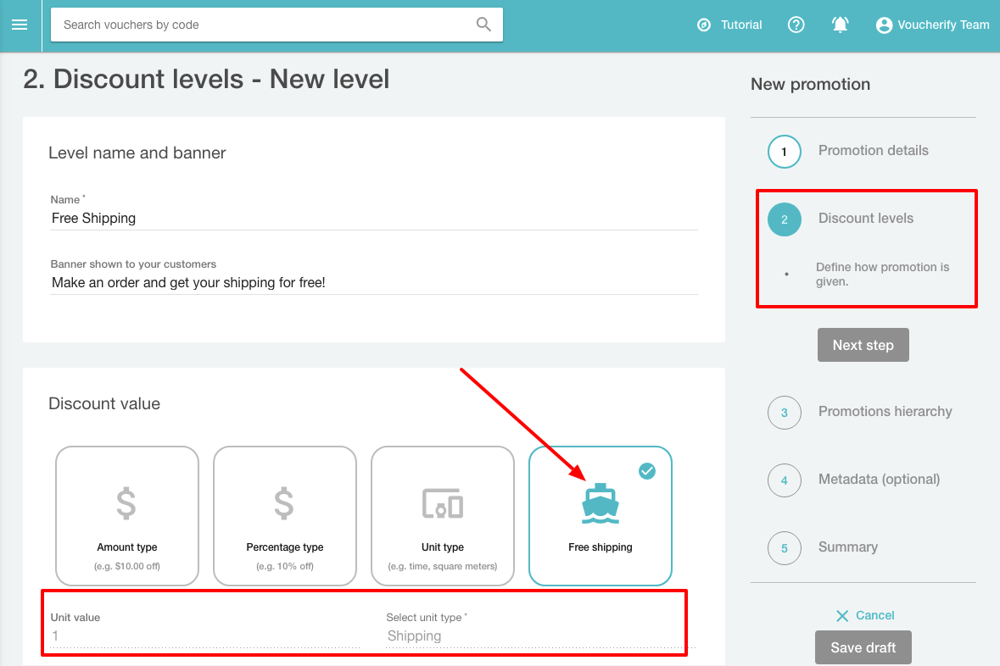 -->


### Free shipping discount created via API

You can achieve the same effect via API and create a unique codes [campaign](https://docs.voucherify.io/reference#create-campaign) and a cart-level promotion, both with the same free shipping discount. 


```json Unique codes campaign
{
  "name": "Free Shipping Campaign",
  "start_date": "2019-10-26T00:00:00Z",
  "expiration_date": "2020-12-26T00:00:00Z",
  "vouchers_count": 10,
  "voucher": {
    "type": "DISCOUNT_VOUCHER",
    "discount": {
        "type": "UNIT",
        "unit_off": 1.0,
        "unit_type": "prod_5h1pp1ng"
    },
    "redemption": {
      "quantity": 1
    },
    "code_config": {
      "pattern": "free-shipping-#######"
    }
  }
}

//https://api.voucherify.io/v1/campaigns
```
```json 200 OK
{
    "id": "camp_BgsCWzUJ4rpXoDhI0IDyHkdY",
    "name": "Free Shipping Campaign",
    "campaign_type": "DISCOUNT_COUPONS",
    "type": "STATIC",
    "description": null,
    "start_date": "2019-10-26T00:00:00Z",
    "expiration_date": "2020-12-26T00:00:00Z",
    "activity_duration_after_publishing": null,
    "validity_timeframe": null,
    "validity_day_of_week": null,
    "metadata": {},
    "vouchers_count": 10,
    "vouchers_generation_status": "IN_PROGRESS",
    "active": true,
    "voucher": {
        "code_config": {
            "charset": "0123456789abcdefghijklmnopqrstuvwxyzABCDEFGHIJKLMNOPQRSTUVWXYZ",
            "pattern": "free-shipping-#######"
        },
        "type": "DISCOUNT_VOUCHER",
        "is_referral_code": false,
        "discount": {
            "type": "UNIT",
            "unit_off": 1.0,
            "unit_type": "prod_5h1pp1ng"
        },
        "loyalty_card": null,
        "start_date": "2019-10-26T00:00:00Z",
        "expiration_date": "2020-12-26T00:00:00Z",
        "redemption": {
            "quantity": 1
        }
    },
    "validation_rules_assignments": {
        "data": null,
        "object": "list",
        "total": 0,
        "data_ref": "data"
    },
    "promotion": {
        "object": "list",
        "data_ref": "tiers",
        "tiers": null,
        "has_more": false
    },
    "referral_program": null,
    "auto_join": false,
    "join_once": false,
    "use_voucher_metadata_schema": true,
    "object": "campaign"
}
```
```json Cart-level promotion
{
    "name": "Auto-applied Free Shipping",
    "campaign_type": "PROMOTION",
    "start_date": "2019-11-24T00:00:00Z",
    "expiration_date": "2020-11-27T23:59:59Z",
    "promotion": {
      "tiers":[{
        "name": "Free Shipping",
        "banner": "Make an order and we will deliver it for free!",
        "action": {
          "discount": {
          "type": "UNIT",
          "unit_off": 1.0,
          "unit_type": "prod_5h1pp1ng"
          }
        }
    }]
    }
}
```
```json 200 OK
{
    "id": "camp_sEXq2c0qPpyxK7jfWNUQfW0X",
    "name": "Auto-applied Free Shipping",
    "campaign_type": "PROMOTION",
    "type": "STATIC",
    "description": null,
    "start_date": "2019-11-24T00:00:00Z",
    "expiration_date": "2020-11-27T23:59:59Z",
    "activity_duration_after_publishing": null,
    "validity_timeframe": null,
    "validity_day_of_week": null,
    "metadata": {},
    "vouchers_generation_status": "DONE",
    "active": true,
    "validation_rules_assignments": {
        "data": null,
        "object": "list",
        "total": 0,
        "data_ref": "data"
    },
    "promotion": {
        "object": "list",
        "data_ref": "tiers",
        "tiers": [
            {
                "id": "promo_x8IedUdUvKHZcGqSQJcyDaKF",
                "object": "promotion_tier",
                "name": "Free Shipping",
                "banner": "Make an order and we will deliver it for free!",
                "campaign": {
                    "id": "camp_sEXq2c0qPpyxK7jfWNUQfW0X",
                    "object": "campaign",
                    "start_date": "2019-11-24T00:00:00Z",
                    "expiration_date": "2020-11-27T23:59:59Z",
                    "active": true
                },
                "action": {
                    "discount": {
                        "type": "UNIT",
                        "unit_off": 1.0,
                        "unit_type": "prod_5h1pp1ng"
                    }
                },
                "metadata": {},
                "hierarchy": 1,
                "validation_rule_assignments": {
                    "data": [],
                    "object": "list",
                    "total": 0,
                    "data_ref": "data"
                }
            }
        ],
        "has_more": false
    },
    "referral_program": null,
    "auto_join": false,
    "join_once": false,
    "use_voucher_metadata_schema": false,
    "object": "campaign"
}
```

Now, let's use one of the unique codes while making an order.

## Validation of a free shipping code

Before we redeem the code, let's use the [Validate Voucher](ref:validate-voucher) method to check if redemption is possible with our exemplary order.

```json Validate voucher
{
    "customer": {
      "source_id": "track_+alMo309",
      "name": "Alice Morgan",
      "email": "alice@morgan.com",
      "metadata": {
        "locale": "en-GB"
      }
    },
    "order": {
       "amount": 44800,
       "items": [
          {
            "price": 4900,
            "amount": 4900,
            "object": "order_item",
            "sku_id": "sku_07f2b3750042b505a9",
            "quantity": 1,
            "product_id": "prod_xoOl0M0AGbmkLp"
          },
          {
            "price": 39900,
            "amount": 39900,
            "object": "order_item",
            "quantity": 1,
            "product_id": "prod_MU4E7fzZlrEUw5"
          }
        ]
    }
   
  }
```
```json 200 OK
{
    "code": "free-shipping-FBayYfY",
    "discount": {
        "type": "UNIT",
        "unit_off": 1.0,
        "unit_type": "prod_5h1pp1ng"
    },
    "tracking_id": "track_+alMo309",
    "metadata": {},
    "order": {
        "items": [
            {
                "object": "order_item",
                "product_id": "prod_xoOl0M0AGbmkLp",
                "sku_id": "sku_07f2b3750042b505a9",
                "quantity": 1,
                "amount": 4900,
                "price": 4900
            },
            {
                "object": "order_item",
                "product_id": "prod_MU4E7fzZlrEUw5",
                "quantity": 1,
                "amount": 39900,
                "price": 39900
            },
            {
                "object": "order_item",
                "product_id": "prod_5h1pp1ng",
                "quantity": 1,
                "amount": 1900,
                "discount_amount": 1900,
                "price": 1900
            }
        ],
        "amount": 44800,
        "object": "order"
    },
    "valid": true,
    "start_date": "2019-10-26T00:00:00Z",
    "expiration_date": "2020-12-26T00:00:00Z"
}
```

## Free shipping code redemption

In the response body, you can see that the shipping was added to the order items list but the total amount didn't change. 

```json Redeem code
{
    "customer": {
      "source_id": "track_+alMo309",
      "name": "Alice Morgan",
      "email": "alice@morgan.com",
      "metadata": {
        "locale": "en-GB"
      }
    },
    "order": {
       "amount": 44800,
       "items": [
          {
            "price": 4900,
            "amount": 4900,
            "object": "order_item",
            "sku_id": "sku_07f2b3750042b505a9",
            "quantity": 1,
            "product_id": "prod_xoOl0M0AGbmkLp"
          },
          {
            "price": 39900,
            "amount": 39900,
            "object": "order_item",
            "quantity": 1,
            "product_id": "prod_MU4E7fzZlrEUw5"
          }
        ]
    }
   
  }
```
```json 200 OK 
{
    "id": "r_Ej3yeDId2rExhDaMOM862IEZ",
    "object": "redemption",
    "date": "2020-09-02T15:59:52Z",
    "customer_id": "cust_6zTbh655r4ho1E3Lj0TeD5hS",
    "order": {
        "status": "PROCESSING",
        "items": [
            {
                "object": "order_item",
                "product_id": "prod_xoOl0M0AGbmkLp",
                "sku_id": "sku_07f2b3750042b505a9",
                "quantity": 1,
                "amount": 4900,
                "price": 4900
            },
            {
                "object": "order_item",
                "product_id": "prod_MU4E7fzZlrEUw5",
                "quantity": 1,
                "amount": 39900,
                "price": 39900
            },
            {
                "object": "order_item",
                "product_id": "prod_5h1pp1ng",
                "quantity": 1,
                "amount": 1900,
                "discount_amount": 1900,
                "price": 1900
            }
        ],
        "customer": {
            "id": "cust_6zTbh655r4ho1E3Lj0TeD5hS",
            "summary": {
                "redemptions": {
                    "total_redeemed": 0,
                    "total_failed": 0,
                    "total_succeeded": 0,
                    "total_rolled_back": 0,
                    "total_rollback_failed": 0,
                    "total_rollback_succeeded": 0,
                    "gift": {
                        "redeemed_amount": 0,
                        "amount_to_go": 0
                    },
                    "loyalty_card": {
                        "redeemed_points": 0,
                        "points_to_go": 0
                    }
                },
                "orders": {
                    "total_amount": 0,
                    "total_count": 0,
                    "average_amount": 0,
                    "last_order_amount": 0,
                    "last_order_date": null
                }
            },
            "loyalty": {
                "points": 0,
                "referred_customers": 0,
                "campaigns": {}
            },
            "object": "customer",
            "referrals": {
                "campaigns": [],
                "total": 0
            }
        },
        "amount": 44800,
        "object": "order",
        "id": "ord_O72ip4Vl8WPr20lphNjlhTVi",
        "created_at": "2020-09-02T15:59:52Z"
    },
    "customer": {
        "id": "cust_6zTbh655r4ho1E3Lj0TeD5hS",
        "source_id": "track_+alMo309",
        "name": "Alice Morgan",
        "email": "alice@morgan.com",
        "metadata": {
            "locale": "en-GB"
        },
        "object": "customer"
    },
    "result": "SUCCESS",
    "tracking_id": "track_+alMo309",
    "voucher": {
        "id": "v_q5x4e9zFuoRlHkJRO6B5I00YmB5RZUmB",
        "code": "free-shipping-vsc9r3r",
        "campaign": "Free Shipping Campaign",
        "campaign_id": "camp_BgsCWzUJ4rpXoDhI0IDyHkdY",
        "category": null,
        "type": "DISCOUNT_VOUCHER",
        "discount": {
            "type": "UNIT",
            "unit_off": 1.0,
            "unit_type": "prod_5h1pp1ng"
        },
        "gift": null,
        "loyalty_card": null,
        "start_date": "2019-10-26T00:00:00Z",
        "expiration_date": "2020-12-26T00:00:00Z",
        "validity_timeframe": null,
        "validity_day_of_week": null,
        "publish": {
            "object": "list",
            "count": 0,
            "url": "/v1/vouchers/free-shipping-vsc9r3r/publications?page=1&limit=10"
        },
        "redemption": {
            "object": "list",
            "quantity": 1,
            "redeemed_quantity": 1,
            "url": "/v1/vouchers/free-shipping-vsc9r3r/redemptions?page=1&limit=10"
        },
        "active": true,
        "additional_info": null,
        "metadata": {},
        "assets": {
            "qr": {
                "id": "U2FsdGVkX19MVu5gUhxybE4ydszHXEwjMDooQ1h5Kv90RYsrYB1xZNJlFGgs5bfc2fij2IDNMCV55smZMVVwF0/yQ3DrhFgexbztI3FzsT1PgKu3LB6yQktUrwOJxbA7J9ebuvJQEGYDNBe/VGL5Mm42dH0uIJi1PzJ6zzF3pfw=",
                "url": "https://dl.voucherify.io/api/v1/assets/qr/U2FsdGVkX19MVu5gUhxybE4ydszHXEwjMDooQ1h5Kv90RYsrYB1xZNJlFGgs5bfc2fij2IDNMCV55smZMVVwF0%2FyQ3DrhFgexbztI3FzsT1PgKu3LB6yQktUrwOJxbA7J9ebuvJQEGYDNBe%2FVGL5Mm42dH0uIJi1PzJ6zzF3pfw%3D"
            },
            "barcode": {
                "id": "U2FsdGVkX189dQyWzAqrqV04z7UqmAq96q63i6RAdsOdbJpXYSR5WJKKE9eChRozUQ+VxqPE/GUpEx89H25JuFbJhR9fg3zqH010e7e69GCOVAKPPB+TUXcHBQo9ZrtqLmXBry6MpaN907yzZiL6AqUnRO9YlUfoXT24HccGEMc=",
                "url": "https://dl.voucherify.io/api/v1/assets/barcode/U2FsdGVkX189dQyWzAqrqV04z7UqmAq96q63i6RAdsOdbJpXYSR5WJKKE9eChRozUQ%2BVxqPE%2FGUpEx89H25JuFbJhR9fg3zqH010e7e69GCOVAKPPB%2BTUXcHBQo9ZrtqLmXBry6MpaN907yzZiL6AqUnRO9YlUfoXT24HccGEMc%3D"
            }
        },
        "is_referral_code": false,
        "updated_at": "2020-09-02T15:59:52Z",
        "object": "voucher",
        "validation_rules_assignments": {
            "data": [],
            "object": "list",
            "total": 0,
            "data_ref": "data"
        }
    }
}
```

The discount amount is equal to the previously added shipping fee.

<!-- 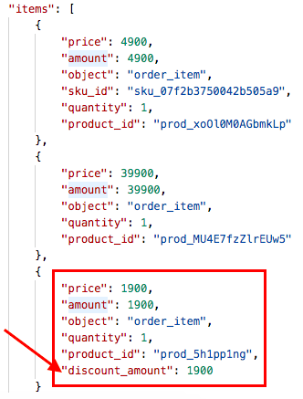 -->

