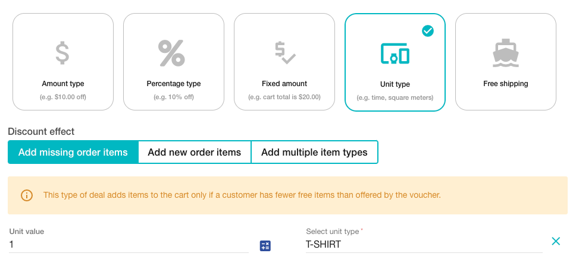
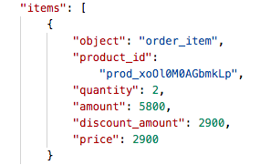
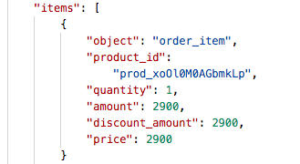
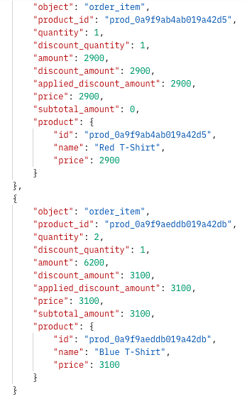

Voucherify enables you to offer products or shipping for free with a unit discount type. While creating a unique codes campaign, you can choose a unit discount type where the unit represents an item(s) that you want to offer for free. 

As a result, when a customer is eligible for a promotion and redeems a code, the item(s) defined by the unit type will be automatically discounted.


## Unit discount overview

To set up a unit discount via the dashboard, you need to provide the following information:

<!--  -->


**Unit value** defines the number of free items attached to the code.
**Unit type **is a product offered for free chosen from your Product Inventory.

> 📘
>
> Please note that this type of discount is based on the Product inventory added to the Products section in your dashboard. If you haven't synced your products yet, please follow [this guide first](https://support.voucherify.io/article/52-product-manager).

**Discount effect** tells Voucherify if it should add items to the cart in quantity equal to the unit value.

There are three discount effects available with unit discount:

 * **Add new order items** – results in adding items to the cart in number defined by unit value.  For example, if the code gives one free t-shirt, then no matter if a customer has the t-shirt already in the cart or not, a free t-shirt will always be added to the order and discounted. 

 * **Add missing order items to match total discount units count** – the second option adds items to the cart only if a customer has fewer free items than offered to the code. For example, let's assume that the code gives one free t-shirt: 

   –  If a customer doesn't have the t-shirt already in the cart, then a free t-shirt will be added to the order. 
    – If a customer already has this item in their cart, then the number of t-shirts already matches the units count. As a result, after applying the code, a discount will be applied to the item which is already in the cart and no items will be added.

* **Add multiple item types** - the third option gives multiple types of free item(s) to customers. Free item units are always added to the customer's cart based on either the **Add missing items** or **Add new order items** effects.

Let's see how it works using the following example:

*We're going to create three unique code campaigns. In each of the examples, each coupon gives a free t-shirt to a customer but the chosen discount effect applied while redeeming the code is different.* 

## Create a unique codes campaign with unit discount

Firstly, we need to create campaigns of unique codes, each code will have the value of one t-shirt.

> 📘 Note
>
> There are many attributes and details you can customize while creating a campaign (start and expiration date, validation rules, and many more). If you're not familiar with all the options, please visit [this guide](https://support.voucherify.io/article/46-bulk-unique-codes-campaign) first.

You can create this campaign in the [dashboard](https://support.voucherify.io/article/46-bulk-unique-codes-campaign) (recommended) or use the [Create Campaign](ref:create-campaign) method to do it via API. 

Below, you can see three campaigns with the same unit discount and different discount effects.

- [Create Campaign](ref:create-campaign) with discount effect **"Add new order items"** 

```json POST Create campaign
{
    "name": "Get free T-shirt v1",
    "start_date": "2020-08-16T00:00:00Z",
  	"expiration_date": "2021-12-26T00:00:00Z",
  	"vouchers_count": 1,
    "voucher": {
        "type": "DISCOUNT_VOUCHER",
        "discount": {
            "type": "UNIT",
            "unit_off": 1.0,
            "unit_type": "prod_xoOl0M0AGbmkLp",
            "effect": "ADD_NEW_ITEMS"
        },
         "redemption": {
          "quantity": 1
       }
    },
      "type": "AUTO_UPDATE"

}
```
```json 200 OK
{
    "id": "camp_ENtf8KXQmnwbLEw4IzHuICy3",
    "name": "Get free T-shirt v1",
    "campaign_type": "DISCOUNT_COUPONS",
    "type": "AUTO_UPDATE",
    "description": null,
    "start_date": "2020-08-16T00:00:00Z",
    "expiration_date": "2021-12-26T00:00:00Z",
    "activity_duration_after_publishing": null,
    "validity_timeframe": null,
    "validity_day_of_week": null,
    "metadata": {},
    "vouchers_count": 1,
    "vouchers_generation_status": "IN_PROGRESS",
    "active": true,
    "voucher": {
        "code_config": {
            "length": 8,
            "charset": "0123456789abcdefghijklmnopqrstuvwxyzABCDEFGHIJKLMNOPQRSTUVWXYZ",
            "pattern": "########",
            "initialCount": 0
        },
        "type": "DISCOUNT_VOUCHER",
        "is_referral_code": false,
        "discount": {
            "type": "UNIT",
            "unit_off": 1.0,
            "unit_type": "prod_xoOl0M0AGbmkLp",
            "effect": "ADD_NEW_ITEMS"
        },
        "loyalty_card": null,
        "start_date": "2020-08-16T00:00:00Z",
        "expiration_date": "2021-12-26T00:00:00Z",
        "redemption": {
            "quantity": 1
        }
    },
    "validation_rules_assignments": {
        "data": null,
        "object": "list",
        "total": 0,
        "data_ref": "data"
    },
    "promotion": {
        "object": "list",
        "data_ref": "tiers",
        "tiers": null,
        "has_more": false
    },
    "referral_program": null,
    "auto_join": false,
    "join_once": false,
    "use_voucher_metadata_schema": true,
    "object": "campaign"
}
```

- [Create Campaign](ref:create-campaign) with discount effect **"Add missing order items"**  to match total discount units count

```json Create campaign
{
    "name": "Get free T-shirt v2",
    "start_date": "2020-08-16T00:00:00Z",
  	"expiration_date": "2021-12-26T00:00:00Z",
  	"vouchers_count": 1,
    "voucher": {
        "type": "DISCOUNT_VOUCHER",
        "discount": {
            "type": "UNIT",
            "unit_off": 1.0,
            "unit_type": "prod_xoOl0M0AGbmkLp",
            "effect": "ADD_MISSING_ITEMS"
        },
         "redemption": {
          "quantity": 1
       }
    },
      "type": "AUTO_UPDATE"

}
```
```json 200 OK
{
    "id": "camp_OiKND2py9nMzKZRjnHL0v1mP",
    "name": "Get free T-shirt v2",
    "campaign_type": "DISCOUNT_COUPONS",
    "type": "AUTO_UPDATE",
    "description": null,
    "start_date": "2020-08-16T00:00:00Z",
    "expiration_date": "2021-12-26T00:00:00Z",
    "activity_duration_after_publishing": null,
    "validity_timeframe": null,
    "validity_day_of_week": null,
    "metadata": {},
    "vouchers_count": 1,
    "vouchers_generation_status": "IN_PROGRESS",
    "active": true,
    "voucher": {
        "code_config": {
            "length": 8,
            "charset": "0123456789abcdefghijklmnopqrstuvwxyzABCDEFGHIJKLMNOPQRSTUVWXYZ",
            "pattern": "########",
            "initialCount": 0
        },
        "type": "DISCOUNT_VOUCHER",
        "is_referral_code": false,
        "discount": {
            "type": "UNIT",
            "unit_off": 1.0,
            "unit_type": "prod_xoOl0M0AGbmkLp",
            "effect": "ADD_MISSING_ITEMS"
        },
        "loyalty_card": null,
        "start_date": "2020-08-16T00:00:00Z",
        "expiration_date": "2021-12-26T00:00:00Z",
        "redemption": {
            "quantity": 1
        }
    },
    "validation_rules_assignments": {
        "data": null,
        "object": "list",
        "total": 0,
        "data_ref": "data"
    },
    "promotion": {
        "object": "list",
        "data_ref": "tiers",
        "tiers": null,
        "has_more": false
    },
    "referral_program": null,
    "auto_join": false,
    "join_once": false,
    "use_voucher_metadata_schema": true,
    "object": "campaign"
}
```

- [Create Campaign](ref:create-campaign) with discount effect **"Add multiple order items"**  with different discount effects for each item type.

```json POST Create campaign
{
    "name": "Get free T-shirt v3",
    "start_date": "2020-08-16T00:00:00Z",
    "expiration_date": "2022-12-26T00:00:00Z",
    "vouchers_count": 1,
    "voucher": {
        "type": "DISCOUNT_VOUCHER",
        "discount": {
            "type": "UNIT",
            "effect": "ADD_MANY_ITEMS",
            "units": [
                {
                    "unit_off": 1,
                    "unit_type": "prod_0a9f9ab4ab019a42d5",
                    "effect": "ADD_MISSING_ITEMS"
                },
                {
                    "unit_off": 1,
                    "unit_type": "prod_0a9f9aeddb019a42db",
                    "effect": "ADD_NEW_ITEMS"
                }
            ]
        }
    },
    "type": "AUTO_UPDATE"
}
```
```json 200 OK
{
    "id": "camp_QYtr90sLpfXz7ZTeJZ5iJWda",
    "name": "Get free T-shirt v3",
    "campaign_type": "DISCOUNT_COUPONS",
    "type": "AUTO_UPDATE",
    "voucher": {
        "type": "DISCOUNT_VOUCHER",
        "discount": {
            "type": "UNIT",
            "effect": "ADD_MANY_ITEMS",
            "units": [
                {
                    "unit_off": 1,
                    "unit_type": "prod_0a9f9ab4ab019a42d5",
                    "effect": "ADD_MISSING_ITEMS"
                },
                {
                    "unit_off": 1,
                    "unit_type": "prod_0a9f9aeddb019a42db",
                    "effect": "ADD_NEW_ITEMS"
                }
            ]
        },
        "redemption": {
            "quantity": null
        },
        "code_config": {
            "length": 8,
            "charset": "0123456789abcdefghijklmnopqrstuvwxyzABCDEFGHIJKLMNOPQRSTUVWXYZ",
            "pattern": "########"
        },
        "is_referral_code": false,
        "start_date": "2020-08-16T00:00:00.000Z",
        "expiration_date": "2022-12-26T00:00:00.000Z"
    },
    "auto_join": false,
    "join_once": false,
    "use_voucher_metadata_schema": true,
    "start_date": "2020-08-16T00:00:00.000Z",
    "expiration_date": "2022-12-26T00:00:00.000Z",
    "vouchers_count": 0,
    "active": true,
    "created_at": "2022-02-14T09:13:19.274Z",
    "creation_status": "IN_PROGRESS",
    "vouchers_generation_status": "IN_PROGRESS",
    "protected": false,
    "validation_rules_assignments": {
        "object": "list",
        "data_ref": "data",
        "data": [],
        "total": 0
    },
    "object": "campaign"
}
```

## Publish voucher to a customer

Let's [publish](ref:create-publication) one of the unique codes from each of the campaigns to a customer.

```json Publish voucher
{
    "campaign": { 
      "name": "Get free T-shirt v1", 
      "count": 1 
    },
    "customer": {
      "source_id": "test-user@voucherify.io",
      "email": "test-user@voucherify.io",
      "name": "John Smith"
    }
}
```
```json 200 OK
{
    "id": "pub_vBuPcbAvX6dIMZSx23Oif7Ct20fEEFqd",
    "object": "publication",
    "created_at": "2020-09-15T19:00:19.677Z",
    "customer_id": "cust_M910OvSOzTMF4tR8Drs7mEeR",
    "tracking_id": "test-user@voucherify.io",
    "metadata": {},
    "channel": "API",
    "source_id": null,
    "result": "SUCCESS",
    "customer": {
        "id": "cust_M910OvSOzTMF4tR8Drs7mEeR",
        "name": "John Smith",
        "email": "test-user@voucherify.io",
        "source_id": "test-user@voucherify.io",
        "metadata": null,
        "object": "customer"
    },
    "voucher": {
        "id": "v_1KvYKAC4I5BZqY5WDKLkSJZAnbk5jTE0",
        "code": "KWdCs1uN",
        "campaign": "Get free T-shirt v1",
        "campaign_id": "camp_ENtf8KXQmnwbLEw4IzHuICy3",
        "category": null,
        "type": "DISCOUNT_VOUCHER",
        "discount": {
            "type": "UNIT",
            "effect": "ADD_NEW_ITEMS",
            "unit_off": 1,
            "unit_type": "prod_xoOl0M0AGbmkLp"
        },
        "gift": null,
        "loyalty_card": null,
        "start_date": "2020-08-16T00:00:00.000Z",
        "expiration_date": "2021-12-26T00:00:00.000Z",
        "validity_timeframe": null,
        "validity_day_of_week": null,
        "active": true,
        "additional_info": null,
        "metadata": {},
        "assets": {
            "qr": {
                "id": "U2FsdGVkX1/Kaz+iXPOpxgWfFxLzpvU9kdMNLRJwB1X7juz/hbCG/vdCmIZ9dXBV9mWo4lsnU7Z0+p7HxGIzyodFeVwYDOk27xBKGnG3ZsHYoDtAfS/oyUHkNK6K6PIuJL16uyfkxlNnBMbu+FKktA==",
                "url": "https://dl.voucherify.io/api/v1/assets/qr/U2FsdGVkX1%2FKaz%2BiXPOpxgWfFxLzpvU9kdMNLRJwB1X7juz%2FhbCG%2FvdCmIZ9dXBV9mWo4lsnU7Z0%2Bp7HxGIzyodFeVwYDOk27xBKGnG3ZsHYoDtAfS%2FoyUHkNK6K6PIuJL16uyfkxlNnBMbu%2BFKktA%3D%3D"
            },
            "barcode": {
                "id": "U2FsdGVkX1+wXSyFzkb00jWi08kwxVFAalFJODvDhOS+BJFx9YhKUfJEAUqU18/LhPDZ7KUlyHmt2l+AE4CAoqsLbLc6nBkwf8+hjEIyawD1ixTFIX+9S5WvB3xTEBtpEo2DOJ1hj4UAFus1g5xesA==",
                "url": "https://dl.voucherify.io/api/v1/assets/barcode/U2FsdGVkX1%2BwXSyFzkb00jWi08kwxVFAalFJODvDhOS%2BBJFx9YhKUfJEAUqU18%2FLhPDZ7KUlyHmt2l%2BAE4CAoqsLbLc6nBkwf8%2BhjEIyawD1ixTFIX%2B9S5WvB3xTEBtpEo2DOJ1hj4UAFus1g5xesA%3D%3D"
            }
        },
        "is_referral_code": false,
        "created_at": "2020-09-15T19:00:19.688Z",
        "updated_at": null,
        "holder_id": "cust_M910OvSOzTMF4tR8Drs7mEeR",
        "object": "voucher",
        "publish": {
            "object": "list",
            "count": 1,
            "url": "/v1/vouchers/KWdCs1uN/publications?page=1&limit=10"
        },
        "redemption": {
            "object": "list",
            "quantity": 1,
            "redeemed_quantity": 0,
            "url": "/v1/vouchers/KWdCs1uN/redemptions?page=1&limit=10"
        }
    }
}
```

### Validate and redeem unit discount codes

Now, let's create an exemplary order to test different discount effects. Before redemption, you should invoke [validate method](ref:validate-voucher) for published vouchers to check if a customer and their cart match the promotion criteria.

```json POST Validate voucher
{
    "customer" : {
      "id" : "cust_Jj3aDTzKJygmdxe20huwpDkn",
      "source_id" : "test-user@voucherify.io",
      "name": "John Smith"
    },
    "order" : {
      "amount" : 2900,
      "items": [
        { "product_id": "prod_xoOl0M0AGbmkLp", "quantity": "1", "price": 2900 }
      ]
    }
  }
```
```json 200 OK
{
    "code": "KWdCs1uN",
    "discount": {
        "type": "UNIT",
        "unit_off": 1.0,
        "unit_type": "prod_xoOl0M0AGbmkLp",
        "effect": "ADD_NEW_ITEMS"
    },
    "tracking_id": "track_OWyBVb1mg1oMY1lADmgwuXCw/qYHp5h0",
    "metadata": {},
    "order": {
        "items": [
            {
                "object": "order_item",
                "product_id": "prod_xoOl0M0AGbmkLp",
                "quantity": 2,
                "amount": 5800,
                "discount_amount": 2900,
                "price": 2900
            }
        ],
        "amount": 2900,
        "object": "order"
    },
    "valid": true,
    "start_date": "2020-08-16T00:00:00Z",
    "expiration_date": "2021-12-26T00:00:00Z"
}
```
```json POST Validate Voucher (multiple items)
{
    "customer": {
        "id": "cust_gN9KgORZECfdhG9qT6n82Zr7",
        "source_id": "test-user@voucherify.io",
        "name": "John Smith"
    },
    "order": {
        "amount": 6000,
        "items": [
            {
                "product_id": "prod_0a9f9ab4ab019a42d5",
                "quantity": "1",
                "price": 2900
            },
            {
                "product_id": "prod_0a9f9aeddb019a42db",
                "quantity": "1",
                "price": 3100
            }
        ]
    }
}
```
```json 200 OK
{
    "valid": true,
    "applicable_to": {
        "data": [],
        "total": 0,
        "data_ref": "data",
        "object": "list"
    },
    "inapplicable_to": {
        "data": [],
        "total": 0,
        "data_ref": "data",
        "object": "list"
    },
    "tracking_id": "track_OWyBVb1mg1oMY1lADmgwuXCw/qYHp5h0",
    "order": {
        "amount": 9100,
        "items_discount_amount": 6000,
        "total_discount_amount": 6000,
        "total_amount": 3100,
        "items_applied_discount_amount": 6000,
        "total_applied_discount_amount": 6000,
        "items": [
            {
                "object": "order_item",
                "product_id": "prod_0a9f9ab4ab019a42d5",
                "quantity": 1,
                "discount_quantity": 1,
                "initial_quantity": 1,
                "amount": 2900,
                "discount_amount": 2900,
                "initial_amount": 2900,
                "applied_discount_amount": 2900,
                "price": 2900,
                "subtotal_amount": 0,
                "product": {
                    "id": "prod_0a9f9ab4ab019a42d5",
                    "name": "Red T-Shirt",
                    "price": 2900
                }
            },
            {
                "object": "order_item",
                "product_id": "prod_0a9f9aeddb019a42db",
                "quantity": 2,
                "discount_quantity": 1,
                "initial_quantity": 1,
                "amount": 6200,
                "discount_amount": 3100,
                "initial_amount": 3100,
                "applied_discount_amount": 3100,
                "price": 3100,
                "subtotal_amount": 3100,
                "product": {
                    "id": "prod_0a9f9aeddb019a42db",
                    "name": "Blue T-Shirt",
                    "price": 3100
                }
            }
        ],
        "customer_id": null,
        "referrer_id": null,
        "object": "order"
    },
    "code": "2laEUA4g",
    "discount": {
        "type": "UNIT",
        "effect": "ADD_MANY_ITEMS",
        "units": [
            {
                "effect": "ADD_MISSING_ITEMS",
                "unit_off": 1,
                "unit_type": "prod_0a9f9ab4ab019a42d5",
                "product": {
                    "id": "prod_0a9f9ab4ab019a42d5",
                    "source_id": null,
                    "name": "Red T-Shirt"
                }
            },
            {
                "effect": "ADD_NEW_ITEMS",
                "unit_off": 1,
                "unit_type": "prod_0a9f9aeddb019a42db",
                "product": {
                    "id": "prod_0a9f9aeddb019a42db",
                    "source_id": null,
                    "name": "Blue T-Shirt"
                }
            }
        ]
    },
    "start_date": "2020-08-16T00:00:00.000Z",
    "expiration_date": "2022-12-26T00:00:00.000Z",
    "metadata": {},
    "campaign": "Get free T-shirt v3",
    "campaign_id": "camp_QYtr90sLpfXz7ZTeJZ5iJWda"
}
```

In the order object, you can see that the customer already has a t-shirt in their cart (it's the same product that our codes offer for free).

```json Order object
    "order" : {
      "amount" : 2900,
      "items": [
        { "product_id": "prod_xoOl0M0AGbmkLp", "quantity": "1", "price": 2900 }
      ]
    }
```
```json Order object - multiple items
    "order": {
        "amount": 6000,
        "items": [
            {
                "product_id": "prod_0a9f9ab4ab019a42d5",
                "quantity": "1",
                "price": 2900
            },
            {
                "product_id": "prod_0a9f9aeddb019a42db",
                "quantity": "1",
                "price": 3100
            }
        ]
    }
```

Let's [Redeem Vouchers](ref:redeem-voucher) from all of the campaigns and test the different discount effects.

## Redemption of the code with discount effect ADD_NEW_ITEMS

In the response body, you can see that despite that one t-shirt is already in the cart, one additional t-shirt was added to the customer order and discounted.

```json Example order
{
    "customer" : {
      "id" : "cust_Jj3aDTzKJygmdxe20huwpDkn",
      "source_id" : "test-user@voucherify.io",
      "name": "John Smith"
    },
    "order" : {
      "amount" : 2900,
      "items": [
        { "product_id": "prod_xoOl0M0AGbmkLp", "quantity": "1", "price": 2900 }
      ]
    }
  }
```
```json Redemption response 200 OK
{
    "id": "r_0o5hjdizrqJF1kg4eOeMT1gq",
    "object": "redemption",
    "date": "2020-09-15T19:15:42Z",
    "customer_id": "cust_M910OvSOzTMF4tR8Drs7mEeR",
    "order": {
        "status": "PROCESSING",
        "customer": {
            "id": "cust_M910OvSOzTMF4tR8Drs7mEeR",
            "summary": {
                "redemptions": {
                    "total_redeemed": 0,
                    "total_failed": 0,
                    "total_succeeded": 0,
                    "total_rolled_back": 0,
                    "total_rollback_failed": 0,
                    "total_rollback_succeeded": 0,
                    "gift": {
                        "redeemed_amount": 0,
                        "amount_to_go": 0
                    },
                    "loyalty_card": {
                        "redeemed_points": 0,
                        "points_to_go": 0
                    }
                },
                "orders": {
                    "total_amount": 0,
                    "total_count": 0,
                    "average_amount": 0,
                    "last_order_amount": 0,
                    "last_order_date": null
                }
            },
            "loyalty": {
                "points": 0,
                "referred_customers": 0,
                "campaigns": {}
            },
            "object": "customer",
            "referrals": {
                "campaigns": [],
                "total": 0
            }
        },
        "items": [
            {
                "object": "order_item",
                "product_id": "prod_xoOl0M0AGbmkLp",
                "quantity": 2,
                "amount": 5800,
                "discount_amount": 2900,
                "price": 2900
            }
        ],
        "amount": 2900,
        "object": "order",
        "id": "ord_rTpYwEEDfLpzwM4HHDpqBOvm",
        "created_at": "2020-09-15T19:15:42Z"
    },
    "customer": {
        "id": "cust_M910OvSOzTMF4tR8Drs7mEeR",
        "source_id": "test-user@voucherify.io",
        "name": "John Smith",
        "email": "test-user@voucherify.io",
        "object": "customer"
    },
    "result": "SUCCESS",
    "tracking_id": "track_OWyBVb1mg1oMY1lADmgwuXCw/qYHp5h0",
    "voucher": {
        "id": "v_1KvYKAC4I5BZqY5WDKLkSJZAnbk5jTE0",
        "code": "KWdCs1uN",
        "campaign": "Get free T-shirt v1",
        "campaign_id": "camp_ENtf8KXQmnwbLEw4IzHuICy3",
        "category": null,
        "type": "DISCOUNT_VOUCHER",
        "discount": {
            "type": "UNIT",
            "unit_off": 1.0,
            "unit_type": "prod_xoOl0M0AGbmkLp",
            "effect": "ADD_NEW_ITEMS"
        },
        "gift": null,
        "loyalty_card": null,
        "start_date": "2020-08-16T00:00:00Z",
        "expiration_date": "2021-12-26T00:00:00Z",
        "validity_timeframe": null,
        "validity_day_of_week": null,
        "publish": {
            "object": "list",
            "count": 1,
            "url": "/v1/vouchers/KWdCs1uN/publications?page=1&limit=10"
        },
        "redemption": {
            "object": "list",
            "quantity": 1,
            "redeemed_quantity": 1,
            "url": "/v1/vouchers/KWdCs1uN/redemptions?page=1&limit=10"
        },
        "active": true,
        "additional_info": null,
        "metadata": {},
        "assets": {
            "qr": {
                "id": "U2FsdGVkX1/Kaz+iXPOpxgWfFxLzpvU9kdMNLRJwB1X7juz/hbCG/vdCmIZ9dXBV9mWo4lsnU7Z0+p7HxGIzyodFeVwYDOk27xBKGnG3ZsHYoDtAfS/oyUHkNK6K6PIuJL16uyfkxlNnBMbu+FKktA==",
                "url": "https://dl.voucherify.io/api/v1/assets/qr/U2FsdGVkX1%2FKaz%2BiXPOpxgWfFxLzpvU9kdMNLRJwB1X7juz%2FhbCG%2FvdCmIZ9dXBV9mWo4lsnU7Z0%2Bp7HxGIzyodFeVwYDOk27xBKGnG3ZsHYoDtAfS%2FoyUHkNK6K6PIuJL16uyfkxlNnBMbu%2BFKktA%3D%3D"
            },
            "barcode": {
                "id": "U2FsdGVkX1+wXSyFzkb00jWi08kwxVFAalFJODvDhOS+BJFx9YhKUfJEAUqU18/LhPDZ7KUlyHmt2l+AE4CAoqsLbLc6nBkwf8+hjEIyawD1ixTFIX+9S5WvB3xTEBtpEo2DOJ1hj4UAFus1g5xesA==",
                "url": "https://dl.voucherify.io/api/v1/assets/barcode/U2FsdGVkX1%2BwXSyFzkb00jWi08kwxVFAalFJODvDhOS%2BBJFx9YhKUfJEAUqU18%2FLhPDZ7KUlyHmt2l%2BAE4CAoqsLbLc6nBkwf8%2BhjEIyawD1ixTFIX%2B9S5WvB3xTEBtpEo2DOJ1hj4UAFus1g5xesA%3D%3D"
            }
        },
        "is_referral_code": false,
        "referrer_id": "cust_M910OvSOzTMF4tR8Drs7mEeR",
        "holder_id": "cust_M910OvSOzTMF4tR8Drs7mEeR",
        "updated_at": "2020-09-15T19:15:42Z",
        "holder": {
            "id": "cust_M910OvSOzTMF4tR8Drs7mEeR",
            "source_id": "test-user@voucherify.io",
            "name": "John Smith",
            "email": "test-user@voucherify.io",
            "object": "customer"
        },
        "object": "voucher",
        "validation_rules_assignments": {
            "data": [],
            "object": "list",
            "total": 0,
            "data_ref": "data"
        }
    }
}
```

In the order items object, you can see that a free item was added to the cart.

<!--  -->


## Redemption of the code with discount effect ADD_MISSING_ITEMS

Now, let's use the same order while redeeming a discount code with the same value and a different discount effect.

```json POST Redeem voucher
{
    "customer" : {
      "id" : "cust_Jj3aDTzKJygmdxe20huwpDkn",
      "source_id" : "test-user@voucherify.io",
      "name": "John Smith"
    },
    "order" : {
      "amount" : 2900,
      "items": [
        { "product_id": "prod_xoOl0M0AGbmkLp", "quantity": "1", "price": 2900 }
      ]
    }
}
```
```json 200 OK
{
    "id": "r_i3aoPZYuD6HSZZx3th4f7yl9",
    "object": "redemption",
    "date": "2020-09-15T19:23:51Z",
    "customer_id": "cust_M910OvSOzTMF4tR8Drs7mEeR",
    "order": {
        "status": "PROCESSING",
        "customer": {
            "id": "cust_M910OvSOzTMF4tR8Drs7mEeR",
            "summary": {
                "redemptions": {
                    "total_redeemed": 0,
                    "total_failed": 0,
                    "total_succeeded": 0,
                    "total_rolled_back": 0,
                    "total_rollback_failed": 0,
                    "total_rollback_succeeded": 0,
                    "gift": {
                        "redeemed_amount": 0,
                        "amount_to_go": 0
                    },
                    "loyalty_card": {
                        "redeemed_points": 0,
                        "points_to_go": 0
                    }
                },
                "orders": {
                    "total_amount": 0,
                    "total_count": 0,
                    "average_amount": 0,
                    "last_order_amount": 0,
                    "last_order_date": null
                }
            },
            "loyalty": {
                "points": 0,
                "referred_customers": 0,
                "campaigns": {}
            },
            "object": "customer",
            "referrals": {
                "campaigns": [],
                "total": 0
            }
        },
        "items": [
            {
                "object": "order_item",
                "product_id": "prod_xoOl0M0AGbmkLp",
                "quantity": 1,
                "amount": 2900,
                "discount_amount": 2900,
                "price": 2900
            }
        ],
        "amount": 2900,
        "object": "order",
        "id": "ord_bURKtmAm3cKHGahlk8RaMjEs",
        "created_at": "2020-09-15T19:23:51Z"
    },
    "customer": {
        "id": "cust_M910OvSOzTMF4tR8Drs7mEeR",
        "source_id": "test-user@voucherify.io",
        "name": "John Smith",
        "email": "test-user@voucherify.io",
        "object": "customer"
    },
    "result": "SUCCESS",
    "tracking_id": "track_OWyBVb1mg1oMY1lADmgwuXCw/qYHp5h0",
    "voucher": {
        "id": "v_09l0SgL2vWL4K6dS9Wxs0VO0uU6fP3oO",
        "code": "10rfmNHj",
        "campaign": "Get free T-shirt v2",
        "campaign_id": "camp_OiKND2py9nMzKZRjnHL0v1mP",
        "category": null,
        "type": "DISCOUNT_VOUCHER",
        "discount": {
            "type": "UNIT",
            "unit_off": 1.0,
            "unit_type": "prod_xoOl0M0AGbmkLp",
            "effect": "ADD_MISSING_ITEMS"
        },
        "gift": null,
        "loyalty_card": null,
        "start_date": "2020-08-16T00:00:00Z",
        "expiration_date": "2021-12-26T00:00:00Z",
        "validity_timeframe": null,
        "validity_day_of_week": null,
        "publish": {
            "object": "list",
            "count": 0,
            "url": "/v1/vouchers/10rfmNHj/publications?page=1&limit=10"
        },
        "redemption": {
            "object": "list",
            "quantity": 1,
            "redeemed_quantity": 1,
            "url": "/v1/vouchers/10rfmNHj/redemptions?page=1&limit=10"
        },
        "active": true,
        "additional_info": null,
        "metadata": {},
        "assets": {
            "qr": {
                "id": "U2FsdGVkX19pCxGoLyltUsaGeCT5rEACaDzG4tOC2+0T2dum03wi1DsPNRgNNr44PKNyIWDzgEwq8blmi4qiaP2F20dGX6zDnL9TUgKfDNouCKzC21/VqTRDlu8lJbmECTuHVCrTicRDJw5b/l6r0Q==",
                "url": "https://dl.voucherify.io/api/v1/assets/qr/U2FsdGVkX19pCxGoLyltUsaGeCT5rEACaDzG4tOC2%2B0T2dum03wi1DsPNRgNNr44PKNyIWDzgEwq8blmi4qiaP2F20dGX6zDnL9TUgKfDNouCKzC21%2FVqTRDlu8lJbmECTuHVCrTicRDJw5b%2Fl6r0Q%3D%3D"
            },
            "barcode": {
                "id": "U2FsdGVkX1/QHU3CWq119LxkwgjCQjM4+w0kqhw9fgxp6nS5PCMzvTNIHNBG2kRJl4S9oy1kbZdZVzW1z5gGb7NhBtvGiVnNAhSt3nBSi/DlrAs9QkfWBB6sVCVu/1BRTfSdbm9glp3kBtehdVH5kA==",
                "url": "https://dl.voucherify.io/api/v1/assets/barcode/U2FsdGVkX1%2FQHU3CWq119LxkwgjCQjM4%2Bw0kqhw9fgxp6nS5PCMzvTNIHNBG2kRJl4S9oy1kbZdZVzW1z5gGb7NhBtvGiVnNAhSt3nBSi%2FDlrAs9QkfWBB6sVCVu%2F1BRTfSdbm9glp3kBtehdVH5kA%3D%3D"
            }
        },
        "is_referral_code": false,
        "updated_at": "2020-09-15T19:23:51Z",
        "object": "voucher",
        "validation_rules_assignments": {
            "data": [],
            "object": "list",
            "total": 0,
            "data_ref": "data"
        }
    }
}
```

As you can see in the response body, the discount was applied to the product already added to the cart by a customer. The number of items in the cart matched the number of free units from the code so there were no additional items added by Voucherify.

<!--  -->


## Redemption of the code with discount effect ADD_MANY_ITEMS

Finally, let's redeem a discount code for multiple free item types.

```json POST Redeem voucher
{
    "customer": {
        "id": "cust_gN9KgORZECfdhG9qT6n82Zr7",
        "source_id": "test-user@voucherify.io",
        "name": "John Smith"
    },
    "order": {
        "amount": 6000,
        "items": [
            {
                "product_id": "prod_0a9f9ab4ab019a42d5",
                "quantity": "1",
                "price": 2900
            },
            {
                "product_id": "prod_0a9f9aeddb019a42db",
                "quantity": "1",
                "price": 3100
            }
        ]
    }
}
```
```json 200 OK
{
    "id": "r_e7NUEs62d1SMDNazeZU4InwL",
    "object": "redemption",
    "date": "2022-02-14T09:44:21.584Z",
    "customer_id": "cust_gN9KgORZECfdhG9qT6n82Zr7",
    "tracking_id": "track_OWyBVb1mg1oMY1lADmgwuXCw/qYHp5h0",
    "metadata": null,
    "result": "SUCCESS",
    "order": {
        "id": "ord_A7jCsWJISF3BML0cw1LT8W7A",
        "source_id": null,
        "created_at": "2022-02-14T09:44:21.401Z",
        "updated_at": null,
        "status": "PAID",
        "amount": 9100,
        "items_discount_amount": 6000,
        "total_discount_amount": 6000,
        "total_amount": 3100,
        "items_applied_discount_amount": 6000,
        "total_applied_discount_amount": 6000,
        "items": [
            {
                "object": "order_item",
                "product_id": "prod_0a9f9ab4ab019a42d5",
                "quantity": 1,
                "discount_quantity": 1,
                "amount": 2900,
                "discount_amount": 2900,
                "applied_discount_amount": 2900,
                "price": 2900,
                "subtotal_amount": 0,
                "product": {
                    "id": "prod_0a9f9ab4ab019a42d5",
                    "name": "Red T-Shirt",
                    "price": 2900
                }
            },
            {
                "object": "order_item",
                "product_id": "prod_0a9f9aeddb019a42db",
                "quantity": 2,
                "discount_quantity": 1,
                "amount": 6200,
                "discount_amount": 3100,
                "applied_discount_amount": 3100,
                "price": 3100,
                "subtotal_amount": 3100,
                "product": {
                    "id": "prod_0a9f9aeddb019a42db",
                    "name": "Blue T-Shirt",
                    "price": 3100
                }
            }
        ],
        "customer": {
            "id": "cust_gN9KgORZECfdhG9qT6n82Zr7",
            "object": "customer"
        },
        "customer_id": "cust_gN9KgORZECfdhG9qT6n82Zr7",
        "referrer_id": null,
        "object": "order",
        "redemptions": {
            "r_e7NUEs62d1SMDNazeZU4InwL": {
                "date": "2022-02-14T09:44:21.584Z",
                "related_object_type": "voucher",
                "related_object_id": "v_dgdf7n5WKqkXce5Y4445hWzqe7EgfPHE",
                "related_object_parent_id": "camp_QYtr90sLpfXz7ZTeJZ5iJWda"
            }
        }
    },
    "customer": {
        "id": "cust_gN9KgORZECfdhG9qT6n82Zr7",
        "name": "John Smith",
        "email": "test-user@voucherify.io",
        "source_id": "test-user@voucherify.io",
        "object": "customer"
    },
    "related_object_type": "voucher",
    "related_object_id": "v_dgdf7n5WKqkXce5Y4445hWzqe7EgfPHE",
    "voucher": {
        "id": "v_dgdf7n5WKqkXce5Y4445hWzqe7EgfPHE",
        "code": "2laEUA4g",
        "campaign": "Get free T-shirt v3",
        "campaign_id": "camp_QYtr90sLpfXz7ZTeJZ5iJWda",
        "category": null,
        "type": "DISCOUNT_VOUCHER",
        "discount": {
            "type": "UNIT",
            "effect": "ADD_MANY_ITEMS",
            "units": [
                {
                    "unit_off": 1,
                    "unit_type": "prod_0a9f9ab4ab019a42d5",
                    "effect": "ADD_MISSING_ITEMS"
                },
                {
                    "unit_off": 1,
                    "unit_type": "prod_0a9f9aeddb019a42db",
                    "effect": "ADD_NEW_ITEMS"
                }
            ]
        },
        "gift": null,
        "loyalty_card": null,
        "start_date": "2020-08-16T00:00:00.000Z",
        "expiration_date": "2022-12-26T00:00:00.000Z",
        "validity_timeframe": null,
        "validity_day_of_week": null,
        "active": true,
        "additional_info": null,
        "metadata": {},
        "assets": {
            "qr": {
                "id": "U2FsdGVkX19nAzuBZ2/aTf7QEM8yQ6ImlU8aYumTNBZxA4JIyRluEQjYMwLfw/fVgFMDkQ5fGkijARm5mSmBE6xiuHwFsTcYq4xhvHgH0b5hvpuea0ixIo8Jeuy2rRrx7mEqh5YsN5hoD8THiH2gpw==",
                "url": "https://dev.dl.voucherify.io/api/v1/assets/qr/U2FsdGVkX19nAzuBZ2%2FaTf7QEM8yQ6ImlU8aYumTNBZxA4JIyRluEQjYMwLfw%2FfVgFMDkQ5fGkijARm5mSmBE6xiuHwFsTcYq4xhvHgH0b5hvpuea0ixIo8Jeuy2rRrx7mEqh5YsN5hoD8THiH2gpw%3D%3D"
            },
            "barcode": {
                "id": "U2FsdGVkX19UoIDdkgdUQhtuVhGslqdoI5vfhVg+IJem8vZSTPYMGWIfw5afYJYtck4G+/Dj3qCih15g92MipJ1rSux/QOYZ39Mr/+6w3SPr5xOH224VM4PHVn7Xu/5TuYeoIev+J6G7DzdQU7eVkw==",
                "url": "https://dev.dl.voucherify.io/api/v1/assets/barcode/U2FsdGVkX19UoIDdkgdUQhtuVhGslqdoI5vfhVg%2BIJem8vZSTPYMGWIfw5afYJYtck4G%2B%2FDj3qCih15g92MipJ1rSux%2FQOYZ39Mr%2F%2B6w3SPr5xOH224VM4PHVn7Xu%2F5TuYeoIev%2BJ6G7DzdQU7eVkw%3D%3D"
            }
        },
        "is_referral_code": false,
        "created_at": "2022-02-14T09:13:20.883Z",
        "updated_at": "2022-02-14T09:44:21.587Z",
        "holder_id": "cust_gN9KgORZECfdhG9qT6n82Zr7",
        "holder": {
            "id": "cust_gN9KgORZECfdhG9qT6n82Zr7",
            "name": "John Smith",
            "source_id": "test-user@voucherify.io",
            "object": "customer"
        },
        "validation_rules_assignments": {
            "object": "list",
            "data_ref": "data",
            "data": [],
            "total": 0
        },
        "redemption": {
            "quantity": null,
            "redeemed_quantity": 1,
            "object": "list",
            "url": "/v1/vouchers/2laEUA4g/redemptions?page=1&limit=10"
        },
        "publish": {
            "object": "list",
            "count": 1,
            "url": "/v1/vouchers/2laEUA4g/publications?page=1&limit=10"
        },
        "object": "voucher",
        "applicable_to": {
            "data": [],
            "total": 0,
            "data_ref": "data",
            "object": "list"
        },
        "inapplicable_to": {
            "data": [],
            "total": 0,
            "data_ref": "data",
            "object": "list"
        }
    }
}
```

As you can see in the response body, the discount was applied to the products in the cart. Each item type was added according the discount effect defined for that particular item type.

<!--  -->

