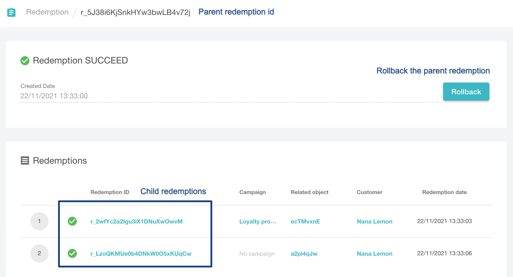

Voucherify API for stackable discounts lets you validate and redeem up to 5 objects using a single API request. You can combine coupons, gift cards, promotion tiers, loyalty, and referral codes. 

In the redemption request, you need to provide a list of redeemables that define what discounts or codes will be redeemed/validated. 

> 📘 API reference
> 
> Go to [here](ref:stackable-discounts-api) to see all endpoints for stackable discounts API.

| **The workflow** | **API Endpoint** |
|---|---|
| VALIDATION<br>Validation checks if all redeemables provided in the request can be applied in the given context (checks customer and order details against validation rules and other attached limits). Only if all redeemables can be applied, the validation returns `valid: true`. | **POST** `base_URL/v1/validations` _for server-side_<br>**POST** `base_URL/client/v1/validations` _for client-side_ |
| REDEMPTION<br>You can pass up to 5 redeemables that will be redeemed during the request. Only if all redeemables can be applied (each redeemable is validated before the redemption), the redemption is successful. | **POST** `base_URL/v1/redemptions` _for server-side_<br>**POST** `base_URL/client/v1/redemptions` _for client-side_ |
| ROLLBACK<br>In the case of unwanted redemption, you can roll it back. Note that if you call this endpoint, all applied discounts will be rolled back too. There is no way to roll back a redemption of a single redeemable. | **POST** `base_URL/redemptions/parent_redemption_id/rollbacks` |

## Redeemables reference

Redeemables array can gather up to 5 objects. Each element represents an object that will be validated/redeemed when calling the API. In the reference below, you can learn how to pass each type of redeemable in the payload.
**Redeemables array can gather up to 5 objects or 1 promotion stack with 5 tiers included.** Each array element represents an object that will be redeemed when calling the API. In the reference below, you can learn how to pass each type of redeemable in the payload.

| Redeemable type | Payload | Reference |
|---|---|---|
| Coupon code (discount voucher) | {<br>"object": "voucher",<br>"id": "VOUCHER_CODE"<br>} | object (string) required<br>id (string) required is a voucher code or a unique internal identifier of a voucher code,<br>example "id":<br>- when using voucher code: blackFriday20<br>- when using voucher id: v_Vt0mOlx2OWBmFe9f3e3ElgWSbYsEPTbJ |
| Gift card (gift voucher) | {<br>"object": "voucher",<br>"id": "GIFT_VOUCHER_CODE",<br>"gift": {<br>"credits": 2000<br>}<br>} | object (string) required<br><br>id (string) required is a gift card code or unique internal identifier of a voucher code,<br>example "id":<br>- when using voucher code: gift-87lta6<br>- when using voucher id: v_Vt0mOlx2OWBmFe9f3e3ElgWSbYsEPTbJ<br><br>gift (object) required<br><br>gift.credits (integer) define the amount that will be deducted from the card balance and applied to the order. You need to multiply the credits amount by 100 in the payload (for example $20 is 2000 in the gift.credits valu). |
| Promotion tier | {<br>"object": "promotion_tier",<br>"id": "PROMOTION_TIER_ID"<br>} | object (string) required<br><br>id (string) required is a unique internal identifier of a promotion tier,<br>example "id": promo_DkBL24GWmNZ1A75bhEiBTNWO |
| Promotion stack<br><br>**Important!**<br>Note that you can pass only one promotion stack in a single validation/redemption call. Each stack can include up to 5 promotion tiers. | {<br>"object": "promotion_stack",<br>"id": "STACK_ID"<br>} | object (string) required<br><br>id (string) required is a unique internal identifier of a promotion stack,<br>example "id": stack_3Q4EJpZqg3DI5IRwgBYfsb37 |
| Loyalty card<br><br>This endpoint allows you to redeem loyalty **pay with points reward** and pay for the order using loyalty credits. For redeeming other loyalty rewards call Redeem Reward endpoint. | {<br>"object": "voucher",<br>"id": "LOYALTY_CARD_CODE",<br>"reward": {<br>"id": "REWARD_ID",<br>"points": 200<br>}<br>} | object (string) required<br><br>id (string) required is a loyalty card code or a unique internal identifier of a loyalty card, example:<br>- when using voucher code: card-87lta6<br>- when using voucher id: v_Vt0mOlx2OWBmFe9f3e3ElgWSbYsEPTbJ<br><br>reward (object) required is required to redeem loyalty card.<br><br>reward.id (string) required is a unique reward identifier.<br><br>reward.points (intiger) defines how many points will be used to pay for the order (required for redeeming pay with points reward). |
| Referral code | {<br>"object": "voucher",<br>"id": "REFERRAL_CODE"<br>} | object (string) required<br><br>id (string) required is a referral code or a unique internal identifier of a referral code,<br>example "id":<br>- when using voucher code: card-87lta6<br>- when using voucher id: v_Vt0mOlx2OWBmFe9f3e3ElgWSbYsEPTbJ |

As a result, the API returns the parent redemption id and child redemptions ids. parent_redemption refers to the redemption of all redeemables, whereas child_redemption represents the redemption of a single redeemable.

## Validation

Validation checks if all redeemables provided in the request can be applied in the given context (checks customer and order details against validation rules and other attached limits). Only if all redeemables can be applied, the validation returns **valid: true**.

POST https://URL/v1/validations

```json Example Request
{
  "customer": {
    "source_id": "testcustomeremail@voucherify.io"
  },
  "redeemables": [
    {
      "object": "voucher",
      "id": "dBj56oqJ",
      "gift": {
        "credits": 100
      }
    },
    {
      "object": "voucher",
      "id": "39vnjyS8"
    },
    {
      "object": "promotion_tier",
      "id": "promo_wtS1aPOs3k2majiBJv3yfbSM"
    }
  ],
  "order": {
    "amount": 200000
  }
}
```
```json 200 OK Response
{
  "valid": true,
  "redeemables": [
    {
      "status": "APPLICABLE",
      "id": "dBj56oqJ",
      "object": "voucher",
      "order": {
        "amount": 200000,
        "discount_amount": 100,
        "total_discount_amount": 100,
        "total_amount": 199900,
        "applied_discount_amount": 100,
        "total_applied_discount_amount": 100,
        "customer_id": null,
        "referrer_id": null,
        "object": "order"
      },
      "applicable_to": {
        "data": [],
        "total": 0,
        "data_ref": "data",
        "object": "list"
      },
      "inapplicable_to": {
        "data": [],
        "total": 0,
        "data_ref": "data",
        "object": "list"
      },
      "result": {
        "gift": {
          "credits": 100
        }
      }
    },
    {
      "status": "APPLICABLE",
      "id": "39vnjyS8",
      "object": "voucher",
      "order": {
        "amount": 200000,
        "discount_amount": 40080,
        "total_discount_amount": 40080,
        "total_amount": 159920,
        "applied_discount_amount": 39980,
        "total_applied_discount_amount": 39980,
        "customer_id": null,
        "referrer_id": null,
        "object": "order"
      },
      "applicable_to": {
        "data": [],
        "total": 0,
        "data_ref": "data",
        "object": "list"
      },
      "inapplicable_to": {
        "data": [],
        "total": 0,
        "data_ref": "data",
        "object": "list"
      },
      "result": {
        "discount": {
          "type": "PERCENT",
          "effect": "APPLY_TO_ORDER",
          "percent_off": 20
        }
      }
    },
    {
      "status": "APPLICABLE",
      "id": "promo_wtS1aPOs3k2majiBJv3yfbSM",
      "object": "promotion_tier",
      "order": {
        "amount": 200000,
        "discount_amount": 48080,
        "total_discount_amount": 48080,
        "total_amount": 151920,
        "applied_discount_amount": 8000,
        "total_applied_discount_amount": 8000,
        "customer_id": null,
        "referrer_id": null,
        "object": "order"
      },
      "applicable_to": {
        "data": [],
        "total": 0,
        "data_ref": "data",
        "object": "list"
      },
      "inapplicable_to": {
        "data": [],
        "total": 0,
        "data_ref": "data",
        "object": "list"
      },
      "result": {
        "discount": {
          "type": "AMOUNT",
          "effect": "APPLY_TO_ORDER",
          "amount_off": 8000
        }
      }
    }
  ],
  "order": {
    "amount": 200000,
    "discount_amount": 48080,
    "total_discount_amount": 48080,
    "total_amount": 151920,
    "applied_discount_amount": 48080,
    "total_applied_discount_amount": 48080,
    "customer_id": null,
    "referrer_id": null,
    "object": "order"
  },
  "tracking_id": "track_e6YkMFU+7zj7ra2btFgSm1T9pRSZw/LawvdybWhgdmY="
}
```

## Redemption

You can pass up to 5 redeemables that will be redeemed during the request. Only if all redeemables can be redeemed (each redeemable is validated before the redemption), the redemption is successful.

POST https://URL/v1/redemptions 

```json Example request
{
  "customer": {
    "source_id": "testcustomeremail@voucherify.io"
  },
  "redeemables": [
    {
      "object": "voucher",
      "id": "dBj56oqJ",
      "gift": {
        "credits": 100
      }
    },
    {
      "object": "voucher",
      "id": "39vnjyS8"
    },
    {
      "object": "promotion_tier",
      "id": "promo_wtS1aPOs3k2majiBJv3yfbSM"
    }
  ],
  "order": {
    "amount": 200000
  }
}
```
```json 200 OK Response
{
  "redemptions": [
    {
      "id": "r_crCvZItrD1MaGdF2p4K0fu7m",
      "customer_id": "cust_pA9oUjPk9JlcShBSmsmA9wL8",
      "tracking_id": "track_e6YkMFU+7zj7ra2btFgSm1T9pRSZw/LawvdybWhgdmY=",
      "date": "2021-11-29T08:37:16.114Z",
      "amount": 100,
      "order": {
        "id": "ord_4HcLKcWCLWIEKQQG3v3wCumw",
        "source_id": null,
        "amount": 200000,
        "discount_amount": 100,
        "applied_discount_amount": 100,
        "total_discount_amount": 100,
        "total_applied_discount_amount": 100,
        "total_amount": 199900,
        "object": "order"
      },
      "customer": {
        "id": "cust_pA9oUjPk9JlcShBSmsmA9wL8",
        "name": null,
        "email": null,
        "source_id": "testcustomeremail@voucherify.io",
        "metadata": {},
        "object": "customer"
      },
      "result": "SUCCESS",
      "voucher": {
        "id": "v_1ss2DTDeLrj4rPUc042cwdHx0KQTxI44",
        "code": "dBj56oqJ",
        "gift": {
          "amount": 20500,
          "balance": 20300,
          "effect": "APPLY_TO_ORDER"
        },
        "type": "GIFT_VOUCHER",
        "campaign": "test unique codes no rules",
        "campaign_id": "camp_VhBw9geogZ2bCsvcG4FERJst",
        "is_referral_code": false
      },
      "redemption": "r_iElJ2dgR8F391krF8DyBWB8v"
    },
    {
      "id": "r_NjMdVVsOfslDUYkhpvwCBdHq",
      "customer_id": "cust_pA9oUjPk9JlcShBSmsmA9wL8",
      "tracking_id": "track_e6YkMFU+7zj7ra2btFgSm1T9pRSZw/LawvdybWhgdmY=",
      "date": "2021-11-29T08:37:16.123Z",
      "order": {
        "id": "ord_4HcLKcWCLWIEKQQG3v3wCumw",
        "source_id": null,
        "amount": 200000,
        "discount_amount": 40080,
        "applied_discount_amount": 39980,
        "total_discount_amount": 40080,
        "total_applied_discount_amount": 39980,
        "total_amount": 159920,
        "object": "order"
      },
      "customer": {
        "id": "cust_pA9oUjPk9JlcShBSmsmA9wL8",
        "name": null,
        "email": null,
        "source_id": "testcustomeremail@voucherify.io",
        "metadata": {},
        "object": "customer"
      },
      "result": "SUCCESS",
      "voucher": {
        "id": "v_jc96WzJINI72l9WxPZYAUjwD90v5hu6Z",
        "code": "39vnjyS8",
        "discount": {
          "type": "PERCENT",
          "percent_off": 20,
          "effect": "APPLY_TO_ORDER"
        },
        "type": "DISCOUNT_VOUCHER",
        "campaign": "test unique coupons no rules",
        "campaign_id": "camp_SqmtD3m28tnxIxWYLZsdzOle",
        "is_referral_code": false
      },
      "redemption": "r_iElJ2dgR8F391krF8DyBWB8v"
    },
    {
      "id": "r_qGB0eV3jiOpFZXE4GX1rcduw",
      "customer_id": "cust_pA9oUjPk9JlcShBSmsmA9wL8",
      "tracking_id": "track_e6YkMFU+7zj7ra2btFgSm1T9pRSZw/LawvdybWhgdmY=",
      "date": "2021-11-29T08:37:16.127Z",
      "order": {
        "id": "ord_4HcLKcWCLWIEKQQG3v3wCumw",
        "source_id": null,
        "amount": 200000,
        "discount_amount": 48080,
        "applied_discount_amount": 8000,
        "total_discount_amount": 48080,
        "total_applied_discount_amount": 8000,
        "total_amount": 151920,
        "object": "order"
      },
      "customer": {
        "id": "cust_pA9oUjPk9JlcShBSmsmA9wL8",
        "name": null,
        "email": null,
        "source_id": "testcustomeremail@voucherify.io",
        "metadata": {},
        "object": "customer"
      },
      "result": "SUCCESS",
      "promotion_tier": {
        "id": "promo_wtS1aPOs3k2majiBJv3yfbSM",
        "name": "timeframe test 3",
        "banner": null,
        "campaign": {
          "id": "camp_til84ieTIeZ8Iy7sxV4dmoI5"
        }
      },
      "redemption": "r_iElJ2dgR8F391krF8DyBWB8v"
    }
  ],
  "parent_redemption": {
    "id": "r_iElJ2dgR8F391krF8DyBWB8v",
    "customer_id": "cust_pA9oUjPk9JlcShBSmsmA9wL8",
    "tracking_id": "track_e6YkMFU+7zj7ra2btFgSm1T9pRSZw/LawvdybWhgdmY=",
    "date": "2021-11-29T08:37:16.129Z",
    "order": {
      "id": "ord_4HcLKcWCLWIEKQQG3v3wCumw",
      "source_id": null,
      "status": "PAID",
      "customer_id": "cust_pA9oUjPk9JlcShBSmsmA9wL8",
      "referrer_id": null,
      "amount": 200000,
      "discount_amount": 48080,
      "applied_discount_amount": 48080,
      "total_discount_amount": 48080,
      "total_applied_discount_amount": 48080,
      "total_amount": 151920,
      "object": "order"
    },
    "customer": {
      "id": "cust_pA9oUjPk9JlcShBSmsmA9wL8",
      "name": null,
      "email": null,
      "source_id": "testcustomeremail@voucherify.io",
      "metadata": {},
      "object": "customer"
    },
    "result": "SUCCESS"
  },
  "order": {
    "id": "ord_4HcLKcWCLWIEKQQG3v3wCumw",
    "source_id": null,
    "created_at": "2021-11-29T08:37:15.927Z",
    "updated_at": null,
    "status": "PAID",
    "amount": 200000,
    "discount_amount": 48080,
    "total_discount_amount": 48080,
    "total_amount": 151920,
    "applied_discount_amount": 48080,
    "total_applied_discount_amount": 48080,
    "customer": {
      "id": "cust_pA9oUjPk9JlcShBSmsmA9wL8",
      "object": "customer"
    },
    "customer_id": "cust_pA9oUjPk9JlcShBSmsmA9wL8",
    "referrer_id": null,
    "object": "order",
    "redemptions": {
      "r_iElJ2dgR8F391krF8DyBWB8v": {
        "date": "2021-11-29T08:37:16.129Z",
        "related_object_type": "redemption",
        "related_object_id": "r_iElJ2dgR8F391krF8DyBWB8v",
        "stacked": [
          "r_crCvZItrD1MaGdF2p4K0fu7m",
          "r_NjMdVVsOfslDUYkhpvwCBdHq",
          "r_qGB0eV3jiOpFZXE4GX1rcduw"
        ]
      }
    }
  }
}
```

## Rollback

You can always roll back any unwanted redemption. Note that if you call this endpoint, all discounts applied to the order during the redemption will be rolled back. There is no way to roll back a redemption of a single redeemable.

POST https://URL/v1/redemptions/{ParentRedemptionId}/rollbacks

```markdown Example 
POST https://URL/v1/redemptions/r_5J38i6KjSnkHYw3bwLB4v72j/rollbacks
```
```json 200 OK Response
{
  "rollbacks": [
    {
      "id": "rr_MT3J5Dm4u3cmss4nUPzRi72s",
      "customer_id": "cust_2FJk3ugCZ1sevAFNAWDwW5dv",
      "tracking_id": "track_otz3irNtDcvoZO+7uwUGiSTTeJ0BnNFq",
      "date": "2021-11-23T07:40:34.771Z",
      "amount": -20,
      "order": {
        "amount": 10000,
        "total_amount": 10000,
        "object": "order"
      },
      "reward": {
        "customer": {
          "id": "cust_2FJk3ugCZ1sevAFNAWDwW5dv",
          "name": "Nana Lemon",
          "email": "nanalemon@voucherify.io",
          "source_id": "nanalemon@voucherify.io",
          "metadata": {},
          "object": "customer"
        },
        "assignment_id": "rewa_tk8ezDrqekA6i7IHW0lR3wB7",
        "voucher": {
          "id": "v_vlGc0emRC9eFmcbPoxD9NNHq5cuV8S2L",
          "code": "BhBzAW07",
          "discount": {
            "type": "UNIT",
            "unit_off": 1,
            "unit_type": "prod_5h1pp1ng",
            "effect": "ADD_MISSING_ITEMS"
          },
          "type": "DISCOUNT_VOUCHER",
          "campaign": "Free Shipping - Loyalty Rewards",
          "campaign_id": "camp_NlJzHlN3MHllLMwOX5uCqN6f",
          "is_referral_code": false,
          "holder_id": "cust_2FJk3ugCZ1sevAFNAWDwW5dv"
        },
        "id": "rew_BYEeyV9Vz4uqumkTEYgWPW5K",
        "object": "reward",
        "name": "Free Shipping",
        "created_at": "2021-02-03T13:55:26.808Z",
        "updated_at": null,
        "parameters": {
          "campaign": {
            "id": "camp_NlJzHlN3MHllLMwOX5uCqN6f",
            "type": "DISCOUNT_COUPONS"
          }
        },
        "type": "CAMPAIGN"
      },
      "customer": {
        "id": "cust_2FJk3ugCZ1sevAFNAWDwW5dv",
        "source_id": "nanalemon@voucherify.io",
        "metadata": {},
        "object": "customer"
      },
      "result": "SUCCESS",
      "voucher": {
        "id": "v_Cjpo2hvbV6DU4thDWPBYyGnVX8vVnnGb",
        "code": "ecTMvxnE",
        "loyalty_card": {
          "points": 8800,
          "balance": 8740
        },
        "type": "LOYALTY_CARD",
        "campaign": "Loyalty program test v20211006",
        "campaign_id": "camp_ulhPTbgM0L8GXkq4Xy4pnUPM",
        "is_referral_code": false,
        "holder_id": "cust_2FJk3ugCZ1sevAFNAWDwW5dv"
      },
      "redemption": "r_2wfYc2a2Igu3iX1DNuXwOwvM"
    },
    {
      "id": "rr_h9chHZFx410qxH6YsgRxPLq2",
      "customer_id": "cust_2FJk3ugCZ1sevAFNAWDwW5dv",
      "tracking_id": "track_otz3irNtDcvoZO+7uwUGiSTTeJ0BnNFq",
      "date": "2021-11-23T07:40:34.772Z",
      "order": {
        "amount": 10000,
        "total_amount": 10000,
        "object": "order"
      },
      "customer": {
        "id": "cust_2FJk3ugCZ1sevAFNAWDwW5dv",
        "source_id": "nanalemon@voucherify.io",
        "metadata": {},
        "object": "customer"
      },
      "result": "SUCCESS",
      "voucher": {
        "id": "v_azzY5QHgq75cmuzuCshZ1gklDAxuNqKQ",
        "code": "a2pl4qJw",
        "discount": {
          "type": "AMOUNT",
          "amount_off": 1000,
          "effect": "APPLY_TO_ORDER"
        },
        "type": "DISCOUNT_VOUCHER",
        "campaign": null,
        "campaign_id": null,
        "is_referral_code": false
      },
      "redemption": "r_LzoQKMUe0b4DNkW0O5xKUqCw"
    }
  ],
  "parent_rollback": {
    "id": "rr_qMVd5eAdWFgxwl7yjGKqotCi",
    "customer_id": "cust_2FJk3ugCZ1sevAFNAWDwW5dv",
    "tracking_id": "track_otz3irNtDcvoZO+7uwUGiSTTeJ0BnNFq",
    "date": "2021-11-23T07:40:34.672Z",
    "order": {
      "id": "ord_EFHJ63S5C8gODkMQbSuCN054",
      "source_id": null,
      "status": "CANCELED",
      "customer_id": "cust_2FJk3ugCZ1sevAFNAWDwW5dv",
      "referrer_id": null,
      "amount": 10000,
      "total_amount": 10000,
      "object": "order"
    },
    "customer": {
      "id": "cust_2FJk3ugCZ1sevAFNAWDwW5dv",
      "source_id": "nanalemon@voucherify.io",
      "metadata": {},
      "object": "customer"
    },
    "result": "SUCCESS",
    "redemption": "r_5J38i6KjSnkHYw3bwLB4v72j"
  },
  "order": {
    "id": "ord_EFHJ63S5C8gODkMQbSuCN054",
    "source_id": null,
    "created_at": "2021-11-22T13:32:57.917Z",
    "updated_at": "2021-11-23T07:40:34.962Z",
    "status": "CANCELED",
    "amount": 10000,
    "total_amount": 10000,
    "customer": {
      "id": "cust_2FJk3ugCZ1sevAFNAWDwW5dv",
      "object": "customer"
    },
    "customer_id": "cust_2FJk3ugCZ1sevAFNAWDwW5dv",
    "referrer_id": null,
    "object": "order",
    "redemptions": {
      "r_5J38i6KjSnkHYw3bwLB4v72j": {
        "date": "2021-11-22T13:32:58.047Z",
        "rollback_id": "rr_qMVd5eAdWFgxwl7yjGKqotCi",
        "rollback_date": "2021-11-23T07:40:34.672Z",
        "related_object_type": "redemption",
        "related_object_id": "r_5J38i6KjSnkHYw3bwLB4v72j",
        "stacked": [
          "r_2wfYc2a2Igu3iX1DNuXwOwvM",
          "r_LzoQKMUe0b4DNkW0O5xKUqCw"
        ],
        "rollback_stacked": [
          "rr_MT3J5Dm4u3cmss4nUPzRi72s",
          "rr_h9chHZFx410qxH6YsgRxPLq2"
        ]
      }
    }
  }
}
```

## Dashboard tracking

Redemption of more than one redeemable can be only called via API. In your dashboard, you have an overview of all redemptions including stacked discounts. You can see child redemptions of single redeemables and parent redemptions that gather details of all child redemptions executed within the same API request. 

<!--  -->


## Apply discount to the already created order

If you want to apply another promotion tier or code to the order that was already created, then pass the related order id in the request body and call redemption API.

The same bahaviour is noted for the [Redeem Voucher](ref:redeem-voucher), [Redeem Promotion](ref:redeem-promotion) and [Redeem stackable discounts API](ref:redeem-stacked-discounts). 

> 🚧 Order ID
>
> Note that you should pass only the order.id in the order object. Passing order details is useful if you want to overwrite the data saved under the given order id.

```json Example redemption request
// POST https://URL/v1/redemptions
{
    "redeemables": [
        {
            "object": "voucher",
            "id": "a2pl4qJw"
        }
    ],
    "order": {
        "id": "ord_jxeV165BzB4u9956eBP4eqVf" // id of the order to which the former discount was applied to
    }
}
```
```json 200 OK Response
{
  "redemptions": [
    {
      "id": "r_mu43RGjvdDgxFtpvCq5QFEuu",
      "customer_id": "cust_gvOnwTO7rH8ZRiM9jywdmuiY",
      "date": "2021-11-23T08:49:37.229Z",
      "order": {
        "id": "ord_jxeV165BzB4u9956eBP4eqVf",
        "source_id": null,
        "status": "PAID",
        "customer_id": "cust_gvOnwTO7rH8ZRiM9jywdmuiY",
        "referrer_id": null,
        "amount": 10000,
        "discount_amount": 10000,
        "applied_discount_amount": 800,
        "total_discount_amount": 10000,
        "total_applied_discount_amount": 800,
        "total_amount": 0,
        "object": "order"
      },
      "customer": {
        "id": "cust_gvOnwTO7rH8ZRiM9jywdmuiY",
        "name": "John Doe",
        "email": "john.doe@rspective.pl",
        "source_id": null,
        "object": "customer"
      },
      "result": "SUCCESS",
      "voucher": {
        "id": "v_azzY5QHgq75cmuzuCshZ1gklDAxuNqKQ",
        "code": "a2pl4qJw",
        "discount": {
          "type": "AMOUNT",
          "amount_off": 1000,
          "effect": "APPLY_TO_ORDER"
        },
        "type": "DISCOUNT_VOUCHER",
        "campaign": null,
        "campaign_id": null,
        "is_referral_code": false
      }
    }
  ],
  "order": {
    "id": "ord_jxeV165BzB4u9956eBP4eqVf",
    "source_id": null,
    "created_at": "2021-11-22T11:05:29.824Z",
    "updated_at": "2021-11-23T08:49:37.127Z",
    "status": "PAID",
    "amount": 10000,
    "discount_amount": 10000,
    "total_discount_amount": 10000,
    "total_amount": 0,
    "applied_discount_amount": 800,
    "total_applied_discount_amount": 800,
    "customer": {
      "id": "cust_gvOnwTO7rH8ZRiM9jywdmuiY",
      "object": "customer"
    },
    "customer_id": "cust_gvOnwTO7rH8ZRiM9jywdmuiY",
    "referrer_id": null,
    "object": "order",
    "redemptions": {
      "r_B84hwB7K23zfXInYCnX2ac05": {
        "date": "2021-11-22T11:05:29.928Z",
        "related_object_type": "redemption",
        "related_object_id": "r_B84hwB7K23zfXInYCnX2ac05",
        "stacked": [
          "r_gS4h3cEMjftBqMHElH1VAmtE",
          "r_qPsFG7HE1fOTHCP80DVJomXb",
          "r_36XcjH2xL43swROsYLKjwEi1"
        ]
      },
      "r_mu43RGjvdDgxFtpvCq5QFEuu": {
        "date": "2021-11-23T08:49:37.229Z",
        "related_object_type": "voucher",
        "related_object_id": "v_azzY5QHgq75cmuzuCshZ1gklDAxuNqKQ"
      }
    }
  }
}
```

## Order session

Each time you use a particular order in your requests, the API will automatically trigger a new session linked to the order id. The session is active during the request and ends asynchronously after the request is completed. The session mechanism ensures that the particular order id can be used in one API request at once.
