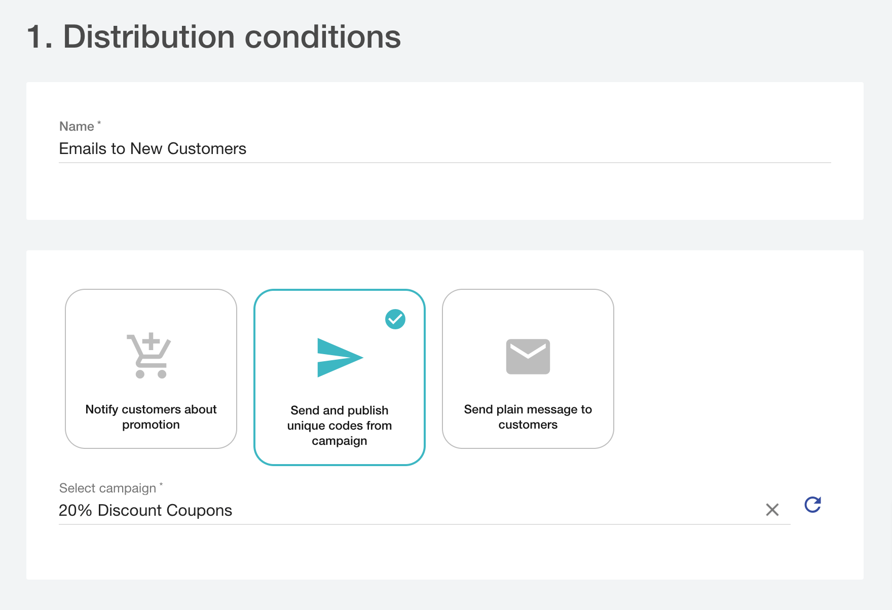
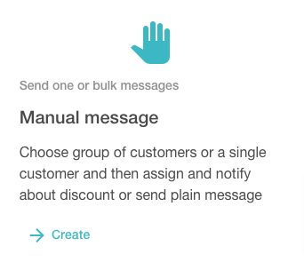

In this tutorial, you will learn how to set up an automatic promo code distribution. Imagine the following scenario – your marketing team wants to have the ability to define `who`, `when`, and by `which channel` gets a specific promo code. 

> 🚧 Dashboard-only feature
>
> Distributions are available only through the Dashboard and cannot be configured using API.

## Add and segment customers

The first thing is to map customers from your CRM. The best way to achieve this is to use [the customer object](ref:get-customer).

### Adding customers

There are three ways of adding a new customer to Voucherify:

* [Programmatic with the API](doc:import-customers). 
* With the [import tool](https://support.voucherify.io/article/67-how-to-import-my-customers).
* Manually in the dashboard.

Before you make an import, you might sit together with the marketing team to figure out which customer data should be kept in Voucherify. This is crucial for building customer segments later on. Voucherify already provides standard fields like email, address, or phone number, but it also allows for storing custom fields through `metadata`. Check [the customer object](ref:get-customer) reference to learn more. 

### Segments

There are two types of segments – manual and automatic. Manual segments always consist of the same customers. On the other hand, the size of a dynamic segment will constantly change – when you [update a customer](ref:update-customer), all segments are automatically rebuilt. 

The marketing team can create segments in the Customers view, but you can do it through API as well (see [the segment object](ref:get-segment)). Once the first segment is created, you can test it by modifying the field the segment is built on. Again, you can do this through the UI and through [the update customer](ref:update-customer) API method.

You can learn how to create segments in this [tutorial](https://support.voucherify.io/article/51-customer-segments).

## Create a campaign

The second step is straightforward. You just have to come up with a bulk unique code campaign. Whether you do it using API or with the Dashboard, consider enabling the `auto-update` option. If set, the campaign will auto-generate new codes when the initial pool is already used. The auto-update option will create new coupons and add them to the campaign. Otherwise, the distribution will be stopped and you will be informed about it via email.

Also, while creating the campaign, remember to add the following validation rule in the 4th stage: `Customer segment is YOUR_SEGMENT_NAME`. This is to ensure that the coupons can be redeemed only by the members of this segment. 

## Launch distribution

The last step is to create a distribution. Before you open the Distribution Manager, run through these sections to learn what possibilities you have.

### How does it work?

Creating a distribution in the Distribution Manager is a 4-step process:

  * Choose a trigger to send messages automatically or manual mode to send a message(s) right away.
  * Define distribution conditions (name, purpose, audience).
  * Use marketing consents to group your audience (optional).
  * Choose a channel and design your template.

### Purpose

You can choose between the following distribution purposes:

<!--  -->

  * Notify customers about promotion – share details of the particular in-cart promotion (promotion tier).
  * Send and publish unique codes from the campaign – each receiver gets a unique code from the chosen campaign assigned (published) automatically to their profile.
  * Send a plain message to customers – plain message with no promo codes included. 

### Audience

If you send a manual message, your audience can be a customer segment or a single customer. In automatic distribution, the audience is determined by a message trigger:

#### Customer entered or left the segment

In the case of segment-based distribution, chosen segment operates as your audience. 

When you send unique codes from a campaign that is limited to a particular segment by validation rules, you'll see that segment in the Manager. Mark the checkbox if you want to send messages in response to changes in the segment used in the campaign validation rules.

#### Voucher-based triggers (gift credits added, loyalty points added, voucher redeemed, voucher redemption rollback, reward redemption)

The audience is limited to customers who perform the triggering action using the codes from the chosen campaign. For example, if the trigger is *voucher redeemed*, a customer gets a message once he/she redeems code from a campaign added to the distribution setup.

#### Order status changes

Changes in the order status determine the audience. Every customer whose order status changes as defined in the distribution gets the message. 

#### Successful code publication

The message gets to a customer in response to a code publication. The audience is limited to customers who will get the unique code published to their account (code from a particular campaign). 

### Channels

Voucherify supports multi-channel delivery. While setting up distribution, you can choose the following integrations and built-in channels:

  * Email using Voucherify as your email provider
  * Email using external provider (SendGrid, Mandrill, Mailgun)
  * SMS (Twilio, CM Telecom, Textlocal)
  * ActiveCampaign
  * Braze
  * MailChimp
  * Intercom
  * Webhooks

Note that not all channels entail sending a message to customers. It's up to you if the Voucherify messages will be sent directly to the end-customers or the 3rd party applications of your choice. For example, after choosing MailChimp or Braze channel, messages won't be sent to the customers. Distribution transfers codes to customer profiles in the respective external application, and then you can forward them to your end-users.

### Message editor

Voucherify is equipped with a messages editor to customize your emails and text messages. You can choose between a simple template or a configurable flyer that gives you a much wider scope for personalization. 

Here are email customization options:

  * A text editor (font effects, font size, links, text layout). 
  * Variables (e.g., customer name, QR code, loyalty score, referral reward, customer cockpit, reward value, and many more).
  * Images (image size, alt text, link, gif files, alignment).
  * Buttons (CTA size, color, alignment, corners, and link).
  * Dividers (width, color).
  * Social media buttons (LinkedIn, Facebook, Instagram, Twitter, YouTube). 
  * Background (header with your logo, colors, content space, borders, and alignment).
  * Footer (custom information, text, colors).
  * Email Designer

## Distribution Setup

Setting up the distribution starts from running the Manager. Go to the Distributions and click the plus. 

<!--  -->

### Manual Distribution

Manual distribution delivers messages once you confirm its settings with **Save and send**. Please note that each manual distribution is sent with a 10-minute delay, so you can introduce edits or stop the message delivery within this time.

<!--  -->

If you chose a customer segment as your audience, 10 minutes countdown starts when the segment is fully synced. Syncing ends once all customers were validated against segment criteria. Syncing status is displayed next to the segment name so you can monitor if the segment is already synced or if syncing is in progress.

In Distribution conditions, set the name, define the purpose and choose your audience. Manual distribution delivers messages to a single customer or all customers from the chosen segment. 

### Automatic Distribution

Automatic distribution can trigger a message in response to one of the following actions:

1. Changes in a chosen customer segment:

  * Customer entered segment 
  * Customer left segment

2. Voucher-related activity:

  * Gift credits added 
  * Loyalty points added
  * Voucher redeemed
  * Voucher redemption rollback
  * Reward redemption

3. Cart-related activity (once your order data are synchronized with Voucherify, distribution can respond to changes in customers' orders):

  * Order created
  * Order update  
  * Order has been paid
  * Order canceled

4. Successful code publication – the message is sent once the code from a campaign is assigned to a customer.

After choosing the trigger, the Manager directs you to the Distribution Conditions. You can name distribution, choose the message purpose and audience. 

Whether you choose manual or automatic mode, you can set up Marketing Consents when Distribution conditions are ready.  

### Consents

Using Consents, you can set which marketing permissions are required to send messages or disable consents' verification.

### Channels choice & messages

The next step is about channel(s) configuration. First, enable channel settings as in the screen below. Note that you can enable many channels within a single distribution.

<!--  -->

The detailed message setup depends on the chosen channel. Please follow the [dedicated tutorial](https://support.voucherify.io/category/396-distribution-manager) to see how to configure the message.

After you confirm distribution, manual messages will be sent with a 10-minute delay, whereas automatic distribution will be triggered every time a customer performs the required action. 

> 📘 Read more
>
> Follow [this guide](https://support.voucherify.io/article/19-how-does-the-distribution-manager-work) to learn more about Distributions setup.
