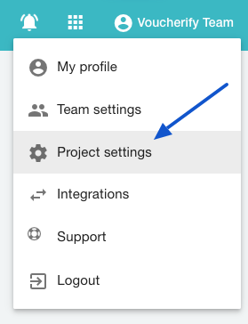
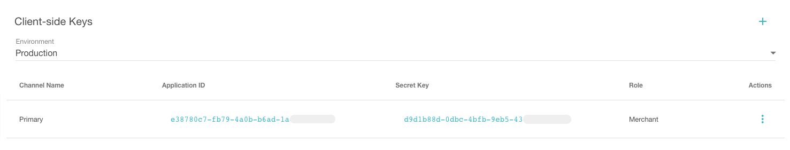

## Authorization overview

We use two pairs of keys — one for server applications (*back-end*) and one for publicly available client applications (*mobile apps* and *web applications*).

Voucherify uses *OAuth 2.0* to authorize requests to the platform. It is published under the [RFC 6749](https://datatracker.ietf.org/doc/html/rfc6749).

## Application authentication

To get access to the Voucherify API, the client application needs to pass `Application ID` and `Application Secret Key`. You can get (and reset) these tokens in the *Project settings*.



By default, there are two pairs of authentication keys. The first, Application Keys, are meant to authorize your requests to Voucherify API. You can create more Application Keys for each user.


A generated pair of `Application ID` and `Application Secret Key` must be attached to every HTTP request as custom headers: `X-App-Id`, `X-App-Token`.

```markdown App Keys
X-App-Id: 2f7075c7-201d-471f-a249-3XXXX8092e70    
X-App-Token: 7ccb680d-107e-XXXX-8466-1f15048e34f4
```

Most likely you do not need to send your keys manually. We provide a growing number of [SDKs](doc:sdks) that know how to handle it, so no extra code is needed.

> ❗ Security threat
> 
> It is essential that you keep your keys secure and not share them with others. Treat it as your *application's password* for Voucherify.

## Client-side authentication

The second authentication mechanism uses publishable keys. It is meant to be used by the public (web and mobile) clients to access a subset of the API (labeled with `(client-side)` in the [API reference](doc:api-reference)).

See [voucherify.js](https://docs.voucherify.io/docs/client-side-api) as an example.



> 🚧 Domain whitelist
> 
> Remember to whitelist your domain/mobile app origin in the Project settings > Client-side Settings to allow client-side connections.


### Client-side request headers

```curl Client-side request headers
  -H "X-Client-Application-Id: YOUR-CLIENT-SIDE-APPLICATION-ID" \
  -H "X-Client-Token: YOUR-CLIENT-SIDE-TOKEN" \
  -H "Content-Type: application/json" \
  -H "origin: yourdomain.com" \ 
```

Here is an example of a client-side request ([Validate Voucher (client-side)](ref:vouchers-validate)) authorized using client-side API keys.

```curl Client-side redemption
curl -X GET \
  -H "X-Client-Application-Id: YOUR-CLIENT-SIDE-APPLICATION-ID" \
  -H "X-Client-Token: YOUR-CLIENT-SIDE-TOKEN" \
  -H "Content-Type: application/json" \
  -H "origin: yourdomain.com" \
  -d '{
    "order" : {
        "amount" : 20000
    }
  }' \
  "https://api.voucherify.io/client/v1/validate?code=BLCKFRDY"
```