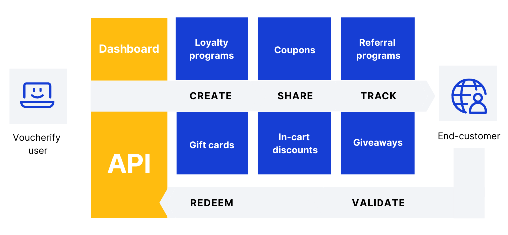

Voucherify makes launching and tracking digital promotions easy. Get the documentation, sample code, and developer tools you need to build exactly what you want, fast. We will handle the complexity of promotions delivery and validation. Let’s get building!

## What is Voucherify?

Voucherify is an API-first Promotion Engine for digital teams. With our programmable building blocks, you can launch and manage promotions personalized with customer and session data. This includes coupons, gift cards, in-cart promotions, giveaways, referrals, and loyalty programs. 

Voucherify offers a REST-based API and a web dashboard to create and manage promotional campaigns. Our dedicated endpoints help you deliver personalized incentives to any channel, device, and e-commerce solution while keeping your data in secure, highly available environments. This is achieved with real-time data synchronization with CRM, product inventory, distribution channels, and any customer touchpoints. 

<!--  -->

The majority of development work is required at the beginning: 
* Connecting the Promotion Engine to the checkout.
* Synchronizing customer data.
* Connecting distribution channels.
* Integrating with BI tools. 

When the integration is done, you can use API to automate and scale campaigns. 

The easiest way to create campaigns is to use the [Campaign Manager](https://support.voucherify.io/article/17-how-do-i-create-my-first-campaign). However, some advanced workflows may require you to use the API and develop your integration over time.

This is why the crucial part is to align your implementation priorities with your business goals.
[This guide](https://success.voucherify.io/article/373-overview) will help you plan this process with your developers and estimate the expected delivery time.

> 📘 Help and Support
> We offer a team of dedicated developers who have experience with both Voucherify and popular ecommerce platforms to integrate Voucherify with your existing technology stack.[Learn more](https://www.voucherify.io/professional-services).
> 
> Our team is always ready to support you on your journey with Voucherify. [Reach out to us](doc:support) if you have any questions and [join our Community on Slack](https://www.voucherify.io/community). We're happy to help!

## What can I do in Voucherify?

One of the Voucherify principles is giving your team flexibility. You can start small with a simple coupon campaign and iterate on adding more advanced promotional workflows as you go.

The following examples are meant to give you an overview of what is possible. Keep in mind that there are more options and each workflow can be customized to fit your business logic. 

| **Building block** | **Use cases and features** |
|:---|:---|
| **Coupon campaigns** with:  - Percentage  - Amount  - Unit (free items)  - Free shipping  - Fixed price on item/order | - 10% off if you spend at least $50.  - Buy product A and get product B for free.  - Each three-pack from category A is now $29.90.  - The first order is shipped for free.  - Automatic welcome messages with a coupon sent to every new customer. |
| **Gift card campaigns** with prepaid credits | - Automatic email with a Happy Birthday gift card, sent a day before the customer's birthday.  - $10 credits on the customer's digital wallet for the first review.  - $50 gift card for every 1000 loyalty points. |
| Double and single-sided **referral programs** | - Reward advocates and invited friends  - Advocate rewards triggered in response to referral code redemption or custom event logged in your application.  - Digital wallets, sign-up forms, and referral links. |
| **Loyalty programs** | - Earning rules based on purchase history, customer's activity, and custom metadata attributes.  - Rewards catalog with digital and material rewards.  - Tiers dividing loyalty members into levels with dedicated rewarding schemas.  - Customer cockpits (digital wallets). |
| **Auto-applied cart promotions** | - Buy two products from category A and get 10% off at the checkout.   - Spend $100 and get $10 off, spend $200 and get $30 off. |
| **Giveaways** | - Fill the form and join the lottery, every 100th registered user wins. |
| **Budget rules applicable to every campaign type** | - Secure your campaign budget and prevent any misuses with redemption limits.  - Create discounts/rewards on specific payment methods or purchase frequency.  - Offer discounts/rewards applicable to items from a specific category.  - Exclude items above $600 from applying the discount/reward. |

## Get Started

Trying to build a PoC? Grasp the basics and start building:

- Get to know our API with a [Quickstart](doc:quickstart) guide.
- Understand Voucherify [basic building blocks ](doc:key-concepts) and the API calls [Limits](doc:limits).
- Learn how to navigate [Voucherify Dashboard](https://support.voucherify.io/article/16-dashboard-sections).
- Read the [Complete User Guide](https://support.voucherify.io/article/162-voucherify-complete-user-guide) to feel comfortable Voucherify workflows.
- Start building with our pre-built libraries and developer documentation:

|  |
|---|
| [SDKs](doc:sdks) — integrate faster with client- and server-side libraries |
| [Authentication](doc:authentication) & [Security](doc:security) — learn about access management and secure data flow |
| [Error codes](ref:errors) — find what it means when Voucherify returns an error |
| [Fetching data](ref:listing) — understand how to retrieve Voucherify data, including helpful shortcuts and filters |
| [Session locking](doc:locking-validation-session) —  ensure data integrity when validating and redeeming coupons |
| [Testing](doc:testing) & [debugging](https://support.voucherify.io/article/524-project-logs) —  learn how to play around with the API before going to production |
| [Examples](doc:examples) —  analyze the step-by-step API guides to find common promotional scenarios and get inspired with our UI-based demos |
| [API reference](ref:introduction-1) — see all Voucherify endpoints explained |

## Get the job done

Assuming your integration allows for a [basic coupon redemption](doc:quickstart), you can now wrap your head around more advanced Voucherify entities and features. These will help you understand how to design a robust promotion system and how to integrate it with your e-commerce & CRM infrastructure.

  * Check out Voucherify [data import](doc:import-codes) capabilities.
  * Learn how to use validation rules based on the data you want to import/sync:
      - [Customer segments](doc:customers#segments) 
      - [Products](doc:products) 
      - [Order structure](doc:orders) 
  * Get familiar with [metadata](doc:metadata-custom-fields). Every object in Voucherify can be extended with custom fields. You can use them for customer segment filters, validation rules, and reporting purposes.  
  * Once you have validation rules configured, learn how to define a discount or incentive with the [Campaign Manager](https://support.voucherify.io/article/511-discount-effects-cheat-sheet).
  * [Deliver](https://support.voucherify.io/article/19-how-does-the-distribution-manager-work) your promotions to customers. Learn how you can share the promotion and what channels are available.
  * Decide what redemption endpoint you prefer to use. Voucherify API supports the [Redeem Voucher](ref:redeem-voucher) of a single promo code and [Stacking discounts](doc:manage-stackable-discounts) for up to 5 incentives per API call.
 

For advanced customization, you should read about how Voucherify: 
  * [Handles webhooks](doc:webhooks).
  * [Integrates](https://www.voucherify.io/integrations) with other tools from ecommerce/CRM landscape.
  * [Organizes team structure and roles](https://support.voucherify.io/article/40-how-does-the-access-control-work-in-voucherify).

## What's next 
* Join our [Community Slack](https://community.voucherify.io/) to get help and inspiration.
* Browse through Campaign, Discount, Distribution recipes to learn how to get a particular job done.
* Visit our [roadmap](https://roadmap.voucherify.io/) to find out what we’ll release in the next cycle; suggest improvements and vote for features you want to see in the platform.
