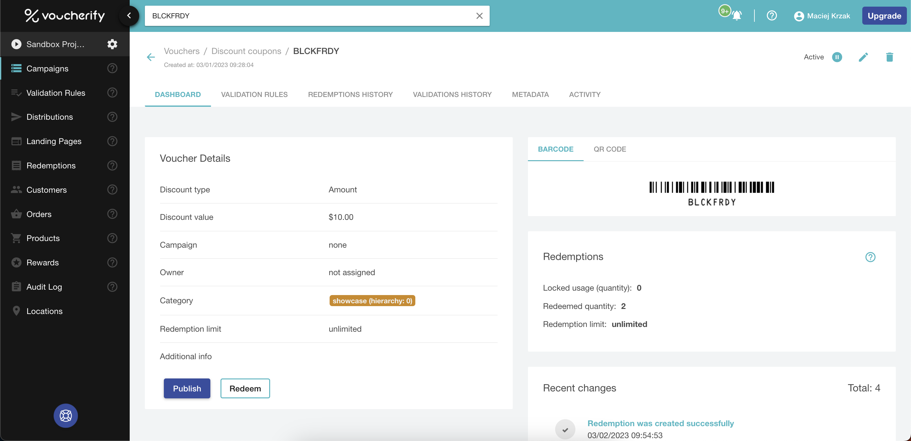
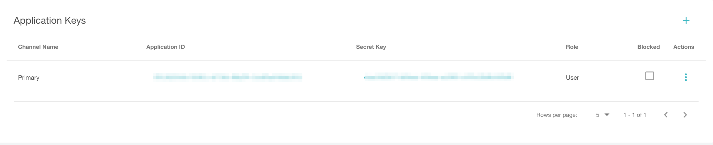
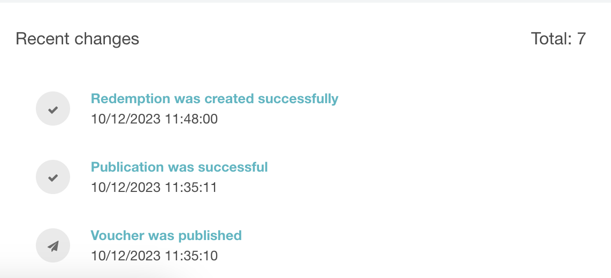
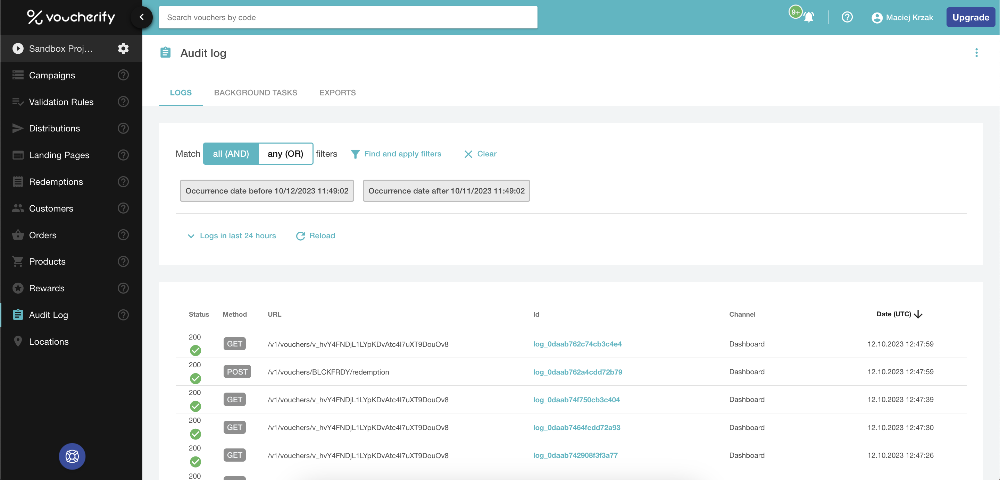
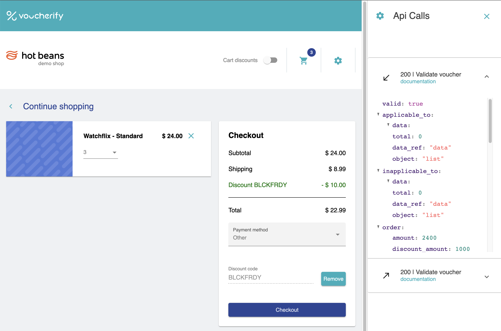

With Voucherify, you can build a future-proof Promotion Engine. In this article, you will start with a simple use case — applying a $10 off BLCKFRDY coupon to the cart — to learn how Voucherify works.

> 👍 Creating an account
> 
> If you do not have a Voucherify account yet, go to 

[block:html]
{
  "html": "<div>\n<iframe src=\"https://player.vimeo.com/video/685819484?h=5332d0408e\" width=\"640\" height=\"360\" frameborder=\"0\" allow=\"autoplay; fullscreen; picture-in-picture\" allowfullscreen></iframe>\n</div>"
}
[/block]

## Join the dashboard

After you create your account, you get access to the Sandbox dashboard. Sandbox comes with a set of predefined campaigns. That’s why when you browse through the views, you can see several objects already created. One of the essential objects in Voucherify is a [voucher](doc:vouchers). In a nutshell, it represents a code that serves as an identifier for promotions supported by Voucherify, including a coupon, referral code, or gift card.

Type **BLCKFRDY** in the search bar and Voucherify will **redirect** you to the voucher page, which displays the basic information about the discount it carries. Let’s redeem the code with the API.

<!--  -->


## Get your API keys

The Sandbox Project Dashboard is already showing your default API keys for the Sandbox project. You can also navigate to Project Settings to find the Authentication section. 

<!--  -->


## Make a test API request

Within the Sandbox, you get 100 API calls per hour. Visit [Limits](doc:limits) to learn how to monitor your usage. With the first API request, we’ll [redeem](doc:redemption) our coupon. This function is essential to Voucherify workflow as it takes care of:

1. Checking if the code is recognizable with your account.
2. Validating if it satisfies the business rules.
3. Calculating and returning the discount value.
4. Marking the code as used.

**Note:** while calling the [redemption endpoint](ref:redeem-stacked-discounts) is enough to satisfy a basic promo code flow, it's useful to add [validation](ref:validate-stacked-discounts) to the flow every time the promo code or cart changes. Validation performs 1-3 points, but it doesn't mark the code as used.
**Note:** Voucherify API supports the redemption of a single promo code and [Stackable discounts API](doc:manage-stackable-discounts), which lets you redeem up to 5 incentives per call. Before integrating Voucherify, choose which redemption endpoint you prefer to use. 

<!--  -->


Let’s call a test redemption. Use the following snippet with the keys copied from the Project Settings. Make sure you choose the correct [API endpoint](doc:api-endpoints) for the region you selected when creating your account.

You can also check out our [SDKs](doc:sdks) and call our API right from your development environment.

```curl cURL
curl -X POST \
-H "X-App-Id: ID" \
-H "X-App-Token: SECRET KEY" \
-H "Content-Type: application/json" \
-d '{"order": {"amount": 12000} }' "https://api.voucherify.io/v1/vouchers/BLCKFRDY/redemption"
```
```javascript JavaScript
const { VoucherifyServerSide } = require('@voucherify/sdk')

const client = VoucherifyServerSide({
	applicationId: 'ID',
	secretKey: 'TOKEN',
	// apiUrl: 'https://<region>.api.voucherify.io'
})

client.redemptions.redeem("BLCKFRDY", {"order" : {"amount": 12000}}).then(console.log)
```

Voucherify should reply with the [redemption](ref:get-redemption) details as in the screenshot below. If Voucherify doesn’t reply with a 20x status, check the [error code](ref:errors) to find the reason.

```json 200 OK
{
    "redemptions": [
        {
            "id": "r_0dafc21888c79c80bf",
            "customer_id": "cust_ANjd4MFsUPXDoHeoCQXmqgCJ",
            "tracking_id": "track_9xvOJH7gshn2dlEaRSUyeQ==",
            "date": "2023-10-16T10:47:11.651Z",
            "order": {
                "id": "ord_OdtFaTU2aw6fNCzy6XvXYs51",
                "source_id": null,
                "status": "PAID",
                "customer_id": "cust_ANjd4MFsUPXDoHeoCQXmqgCJ",
                "referrer_id": null,
                "amount": 12000,
                "discount_amount": 1000,
                "applied_discount_amount": 1000,
                "total_discount_amount": 1000,
                "total_applied_discount_amount": 1000,
                "total_amount": 11000,
                "items": [
                    {
                        "object": "order_item",
                        "source_id": "t-shirt_white",
                        "related_object": "product",
                        "quantity": 1,
                        "amount": 2500,
                        "price": 2500
                    },
                    {
                        "object": "order_item",
                        "source_id": "t-shirt_red",
                        "related_object": "product",
                        "quantity": 2,
                        "amount": 3000,
                        "price": 1500
                    },
                    {
                        "object": "order_item",
                        "source_id": "jeans_blue",
                        "related_object": "product",
                        "quantity": 1,
                        "amount": 6500,
                        "price": 6500
                    }
                ],
                "metadata": {},
                "object": "order"
            },
            "customer": {
                "id": "cust_ANjd4MFsUPXDoHeoCQXmqgCJ",
                "name": "Jack Jack",
                "email": "maciej.krzak+Jack@voucherify.io",
                "source_id": "16102023",
                "metadata": {
                    "metadata_key": "metadata_value",
                    "customer_location": "geo:37.786971,-122.399677"
                },
                "object": "customer"
            },
            "result": "SUCCESS",
            "voucher": {
                "id": "v_hvY4FNDjL1LYpKDvAtc4I7uXT9DouOv8",
                "code": "BLCKFRDY",
                "discount": {
                    "type": "AMOUNT",
                    "amount_off": 1000
                },
                "type": "DISCOUNT_VOUCHER",
                "campaign": null,
                "campaign_id": null,
                "is_referral_code": false,
                "holder_id": "cust_iXUTMbFO3QdLFHH8WLKBLyA1",
                "created_at": "2023-03-01T10:28:04.759Z",
                "object": "voucher"
            },
            "object": "redemption"
        }
    ],
    "order": {
        "id": "ord_OdtFaTU2aw6fNCzy6XvXYs51",
        "source_id": null,
        "created_at": "2023-10-16T10:47:11.616Z",
        "updated_at": null,
        "status": "PAID",
        "amount": 12000,
        "discount_amount": 1000,
        "total_discount_amount": 1000,
        "total_amount": 11000,
        "applied_discount_amount": 1000,
        "total_applied_discount_amount": 1000,
        "items": [
            {
                "object": "order_item",
                "source_id": "t-shirt_white",
                "related_object": "product",
                "quantity": 1,
                "amount": 2500,
                "price": 2500,
                "subtotal_amount": 2500,
                "product": {
                    "metadata": {
                        "color": "white",
                        "any_key": "any_value",
                        "category": "t-shirt",
                        "condition": "NEW",
                        "manufacturing_date_time": "2021-08-13T08:00:00.000Z"
                    }
                }
            },
            {
                "object": "order_item",
                "source_id": "t-shirt_red",
                "related_object": "product",
                "quantity": 2,
                "amount": 3000,
                "price": 1500,
                "subtotal_amount": 3000,
                "product": {
                    "metadata": {
                        "color": "red",
                        "any_key": "any_value",
                        "category": "t-shirt",
                        "condition": "NEW",
                        "manufacturing_date_time": "2021-08-13T08:00:00.000Z"
                    }
                }
            },
            {
                "object": "order_item",
                "source_id": "jeans_blue",
                "related_object": "product",
                "quantity": 1,
                "amount": 6500,
                "price": 6500,
                "subtotal_amount": 6500,
                "product": {
                    "metadata": {
                        "color": "blue",
                        "any_key": "any_value",
                        "category": "jeans",
                        "condition": "NEW",
                        "manufacturing_date_time": "2021-08-13T08:00:00.000Z"
                    }
                }
            }
        ],
        "metadata": {},
        "customer": {
            "id": "cust_ANjd4MFsUPXDoHeoCQXmqgCJ",
            "object": "customer"
        },
        "customer_id": "cust_ANjd4MFsUPXDoHeoCQXmqgCJ",
        "referrer_id": null,
        "object": "order",
        "redemptions": {
            "r_0dafc21888c79c80bf": {
                "date": "2023-10-16T10:47:11.651Z",
                "related_object_type": "voucher",
                "related_object_id": "v_hvY4FNDjL1LYpKDvAtc4I7uXT9DouOv8"
            }
        }
    },
    "inapplicable_redeemables": [],
    "skipped_redeemables": []
}
```

Because BLCKFRDY doesn’t have any redemption limits, you can use it multiple times. 

## Review logs in the dashboard

Every redemption can be [listed](ref:list-redemptions) with the API or in the dashboard. When you go to the voucher view, in “Recent changes”, you’ll see operations performed on the object. You can switch to the REDEMPTIONS HISTORY tab to track all redemptions.  

<!--  -->

[block:image]
{
  "images": [
    {
      "image": [
       "https://files.readme.io/95e3dba-guides_getting_started_Quickstart_review_logs.png",
        1004
      ],
      "sizing": "80"
    }
  ]
}
[/block]

To monitor and filter the list of all API calls for your project, you can go to the [Audit log](https://app.voucherify.io/#/app/core/logs):

<!--  -->


## Test promo scenarios with "Hot Beans" demo store

Hot Beans simulates an ecommerce engine allowing your team to verify the look and feel of the promotion customer journey. It supports coupons (including “BLCKFRDY”) and cart-level promotions; the full list of supported scenarios can be found in the [Testing](doc:testing#test-data) section.

You can access Hot Beans directly from your Voucherify dashboard. Checkout is automatically connected to your Voucherify account, and the side panel shows all the requests sent to Voucherify API. 

Try redeeming BLCKFRDY to go through the coupon flow end-to-end (make sure “cart discounts” is disabled to unlock the coupon input).

<!--  -->


## What's next?

The BLCKFRDY coupon redemption uses only the minimum business context (order amount). To enable advanced promotional rules, go to the [integration checklist](doc:welcome) and explore the Voucherify building blocks to learn what data you can share with Voucherify.
