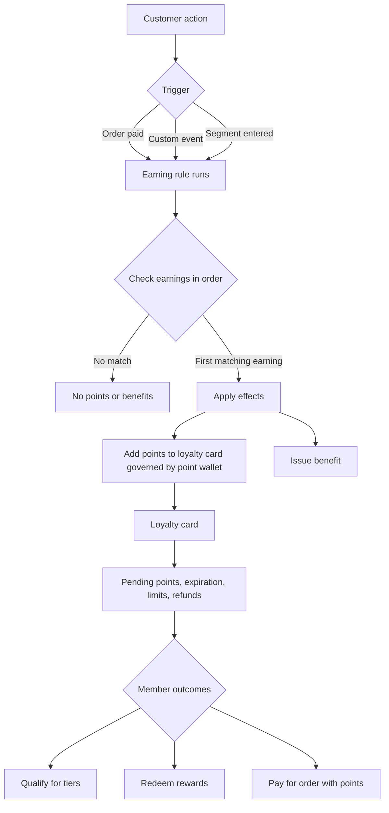

This article explains how the main loyalty concepts work together.

Use these concepts to define:
- What customer actions you reward
- How points are stored and managed
- What customers can receive or redeem

For a high-level introduction to the new loyalty program model, its rollout roadmap, and how it differs from existing loyalty campaigns, see [Loyalty program overview](/build/loyalty-overview).

For API orientation and the member journey, see [Loyalty v2 developer overview](/guides/loyalty-v2-overview). For the `/v2/loyalties` API map, see [Loyalty v2: Overview](/api-reference/loyalty-v2-api-overview).

## Loyalty Hub

**Loyalty hub** is the module where you build and manage loyalty programs.

Use **Loyalty hub** to:
- Create loyalty programs
- Configure how customers earn points
- Define how points behave
- Connect point wallets, earning rules, rewards, tiers, and benefits

## Loyalty program

A loyalty program is a configured loyalty setup.

To run a points-based loyalty program, you need:
- Point wallet
- Earning rules

A loyalty program can also include:
- Rewards
- Tier structures
- Benefits

A single loyalty program can include multiple point wallets.

## Loyalty member

A loyalty member is a Voucherify customer enrolled in a loyalty program.

Loyalty membership is program-specific. The same customer can be a member of multiple loyalty programs.

## Designer

The Designer is where you configure and connect the building blocks of a loyalty program.

You use the Designer to combine:
- Earning rules
- Point wallets
- Tier structures
- Rewards
- Benefits

## Program building blocks

The main building blocks define how customers earn, store, spend, and redeem points.

### Point wallet

A point wallet manages how points work on member loyalty cards.

It controls how points are stored, activated, expired, earned, spent, refunded, and used for order payments or reward redemption.

A loyalty program can include up to 10 point wallets, which lets you run different point balances or point currencies inside one program.

<Info>

    Currently, point wallets support only an individual membership model.

    We plan to support different two additional membership models:
    - Household wallets: Support private point pooling by several members.
    - Team wallets: Support public group participation.
    
    For household and team wallets, earning and spending limits will be tracked at the member level.
    
</Info>

<AccordionGroup>

<Accordion title="Pending points">

Pending points define when earned points become available to a loyalty member.

Points can be available immediately, after a defined period, on fixed activation dates, or after a selected activation event.

</Accordion>

<Accordion title="Point expiration">

Point expiration defines how long points remain valid.

You can configure no expiration, expiration after a rolling period, expiration on specific calendar dates, or expiration after inactivity.

</Accordion>

<Accordion title="Earning limits">

Earning limits control how many points a loyalty member can collect.

You can define global limits for a period of time or per-transaction limits for a single transaction.

</Accordion>

<Accordion title="Spending limits">

Spending limits control how many points a loyalty member can use.

You can define global limits for a period of time or per-transaction limits for a single transaction.

</Accordion>

<Accordion title="Refunds">

Refunds define what happens to points when an order is refunded or canceled.

Refund settings can remove points earned from a refunded transaction or return points spent on a refunded transaction. Partial refund handling by item or amount is not supported yet and is listed on the Loyalty v2 roadmap.

</Accordion>

<Accordion title="Pay with points">

Pay with points lets loyalty members use points to pay for orders.

When enabled, members can pay with points based on an exchange ratio formula.

</Accordion>

</AccordionGroup>

### Earning rule

An earning rule defines when customers receive points or another configured result for their actions.

Each earning rule includes a trigger, optional conditions, and one or more effects. An earning rule can include multiple earnings applied sequentially – Voucherify applies the first matching earning configuration.

<AccordionGroup>

<Accordion title="Trigger">

A trigger defines when an earning rule runs:
- **Order paid** – triggers the earning rule after an order is successfully paid.
- **Custom event** – triggers the earning rule when a selected custom event is sent to Voucherify.
- **Segment entered** – triggers the earning rule when a member enters a selected segment.

</Accordion>

<Accordion title="Conditions: Tier">

The "Tier" condition defines that an earning rule applies when the member belongs to a specific loyalty tier.

For example, the earning will trigger if the member belongs to the gold tier.

</Accordion>

<Accordion title="Conditions: When">

The "when" condition defines when an earning rule applies.

For example, a rule can apply only when an order meets specific criteria.

</Accordion>

<Accordion title="Effects">

Effects define what happens when an earning rule runs.

For example, an effect can add points to a point wallet or issue a benefit.

</Accordion>

<Accordion title="Earnings">

Earnings define the conditions and effects for earning points.

For example, an earning can grant fixed points, proportional points, or a benefit.

</Accordion>

<Accordion title="Trigger limits">

Earning frequency controls how often an earning rule can run through cooldown and frequency settings.

You can configure the rule to run every time the trigger occurs or only within defined limits or time periods.

</Accordion>

<Accordion title="Earnings: Point expiration">

Earnings can override the point expiration settings of the point wallet. Point expiration defines how long points earned with this earning remain valid.

You can configure no expiration, expiration after a rolling period, expiration on specific calendar dates, or expiration after inactivity.

</Accordion>

</AccordionGroup>

### Tier structure

A tier structure groups loyalty members into levels within a point wallet.

You can base tiers on criteria such as current point balance or total points earned. Tier structures can control qualification rules, expiration, grace periods, downgrade behavior, and tier-specific behavior.

Currently, a loyalty program can include one tier structure. Tier mappings let you adjust selected program rules for members in a specific tier.

Tier structures are optional.

<AccordionGroup>

<Accordion title="Tier">

A tier is a level in a loyalty program, for example Bronze, Silver, or Gold.

</Accordion>

<Accordion title="Tier expiration">

Tier expiration defines how long a loyalty member keeps a tier.

</Accordion>

<Accordion title="Tier downgrade">

Tier downgrade happens when a loyalty member no longer meets tier requirements.

</Accordion>

<Accordion title="Tiers: Point expiration">

Tiers can override the point expiration settings of the point wallet. Point expiration defines how long points earned while the member is in this tier remain valid.

You can configure no expiration, expiration after a rolling period, expiration on specific calendar dates, or expiration after inactivity.

</Accordion>

</AccordionGroup>

### Benefits

A benefit is value granted automatically when the defined conditions of an earning rule are met. For example, instead of earning points on a loyalty card, members can receive gift credits, discount coupons, or products.

Members do not need to redeem benefits manually; they receive a benefit once they fulfill the earning rule conditions.

Benefits are optional.

### Rewards

A reward is what loyalty members redeem using points.

Reward types include digital rewards and material rewards. Digital rewards can issue discount coupons or gift cards, while material rewards represent physical products or SKUs.

Rewards use spendings, which define when members can redeem the reward, which point wallet is used, and how many points the reward costs. One reward can be connected to multiple point wallets with different prices.

Rewards are optional.

## How it works

A simplified loyalty flow looks as follows.

